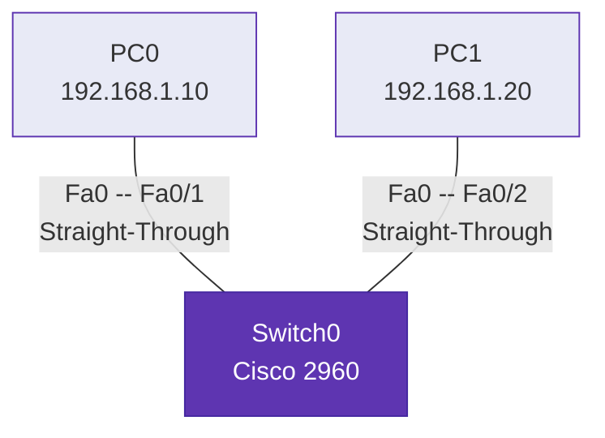
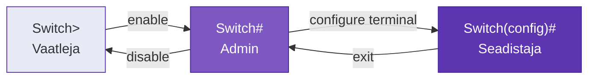

---
tags:
  - Praktikum
---

# Praktikum 1: Packet Tracer ja esimene võrk

!!! abstract "Eesmärgid"
    Selle praktikumi lõpuks oskad:

    - Installeerida ja käivitada Cisco Packet Tracer tarkvara
    - Navigeerida *Logical* ja *Physical* töövaadetes
    - Luua lihtsa võrgu, kasutades kommutaatorit ja arvuteid
    - Konfigureerida arvutitele IP-aadresse
    - Testida ühenduvust `ping` käsuga
    - Jälgida võrguliiklust *Simulation* režiimis
    - Teha esimesed sammud CLI käsureaga

!!! warning "Eeldused"
    Enne seda praktikumi pead olema läbinud [Peatükk 0: Sissejuhatus](../teooria/00_sissejuhatus.md) — võrgu komponendid, [topoloogiad](../teooria/00b_topoloogiad.md) ja [võrgutüübid](../teooria/00c_vorgutuubid.md).

Selles praktikumis ehitad oma esimese [tähetopoloogia](../teooria/00b_topoloogiad.md) (*star*) võrgu Cisco Packet Traceris — kaks arvutit, üks kommutaator ja kaablid nende vahel. Lihtne, aga täpselt nii algavadki kõik võrgud. Seadmetest ja nende rollidest loe lähemalt [Peatükk 0a: Võrguseadmed](../teooria/00a_vorguseadmed.md).

---

## Topoloogia



## Adresseerimistabel

| Seade | Liides | IP-aadress | Alamvõrgumask | Vaikelüüs |
|---|---|---|---|---|
| PC0 | FastEthernet0 | 192.168.1.10 | 255.255.255.0 | 192.168.1.1 |
| PC1 | FastEthernet0 | 192.168.1.20 | 255.255.255.0 | 192.168.1.1 |

*Tabel P1.1. Praktikumi adresseerimistabel*

!!! info "Ära muretse numbrite pärast!"
    Praegu sisesta need numbrid täpselt nii, nagu tabelis. Mõtle neist kui telefoninumbritest: igal arvutil peab olema oma unikaalne number. Mis need numbrid tähendavad, õpid [Peatükk 8: IPv4 adresseerimine](../teooria/08_ipv4.md).

## Vajalikud vahendid

- Arvuti (Windows 10/11, macOS või Linux)
- Internetiühendus (Packet Tracer allalaadimiseks)
- Cisco Networking Academy konto
- Ligikaudu 1 GB vaba kettaruumi

---

## Osa 1: Packet Tracer installeerimine ja tutvustus

### Samm 1: Allalaadimine ja installeerimine

Packet Tracer on tasuta saadaval Cisco Networking Academy kaudu.

1. Mine aadressile [netacad.com/courses/packet-tracer](https://www.netacad.com/courses/packet-tracer)
2. Logi sisse oma NetAcad kontoga (küsi õppejõult, kui kontot veel pole)
3. Navigeeri **Resources** → **Download Packet Tracer**
4. Vali oma operatsioonisüsteemile sobiv versioon
5. Käivita installer ja järgi juhiseid
6. Esimesel käivitamisel logi sisse oma NetAcad kontoga

### Samm 2: Logical Workspace — igapäevane tööala

Packet Tracer avaneb vaikimisi **Logical** vaates. See on skemaatiline tööala, kus ehitad ja konfigureerid võrke.

Tutvu ekraani elementidega:

- **Seadmete palett** (all vasakul) — siit lisad seadmeid tööalale
- **Tööriistade riba** (üleval) — salvestamine, tagasivõtmine jm
- **Tööala** (keskmine osa) — siin ehitad võrgu topoloogia

Seadmete paletis on mitu kategooriat:

| Kategooria | Sisu | Näited |
|---|---|---|
| **Routers** | Ruuterid | 4321, 2911, 1941 |
| **Switches** | Kommutaatorid | 2960, 3560 |
| **End Devices** | Lõppseadmed | PC, Laptop, Server |
| **Connections** | Kaablid | Straight-Through, Cross-Over, Console |
| **WAN Emulation** | WAN-ühendused | DSL, Cable Modem |
| **Wireless Devices** | Juhtmevabad seadmed | Access Point, WiFi ruuter |

*Tabel P1.2. Packet Tracer seadmete kategooriad*

### Samm 3: Physical Workspace — realistlik vaade

1. Kliki **Physical** sakil (üleval vasakul)
2. Näed realistlikku 3D-vaadet — hooned, ruumid, riiulid
3. Uuri tasemeid: **Intercity** → **City** → **Building** → **Floor**
4. Lülitu tagasi **Logical** vaatesse

!!! info "Logical vs Physical"
    **Logical** vaade on igapäevane töövahend — kiire ja skemaatiline. **Physical** vaade näitab seadmeid realistlikus keskkonnas ja on hea visualiseerimiseks. Enamiku tööd teed Logical vaates.

---

## Osa 2: Lihtsa võrgu loomine

### Samm 1: Seadmete lisamine

**Lisa kaks arvutit:**

1. Kliki seadmete paletis **End Devices** ikoonil
2. Vali **PC** (Generic PC)
3. Kliki tööalal kahte eri kohta — tekivad **PC0** ja **PC1**

**Lisa kommutaator:**

1. Kliki **Switches** ikoonil
2. Vali **2960** (Cisco Catalyst 2960)
3. Kliki tööala keskele — tekib **Switch0**

### Samm 2: Seadmete ühendamine

Arvutid ja kommutaator tuleb ühendada **sirge vaskkaabliga** (*Straight-Through*). Seda kaablitüüpi kasutatakse erinevat tüüpi seadmete ühendamiseks (arvuti ↔ kommutaator). Erinevaid kaablitüüpe õpid [Peatükk 2: Füüsiline kiht](../teooria/02_fuusiline_kiht.md).

1. Kliki **Connections** ikoonil (välgusümbol)
2. Vali **Copper Straight-Through** (sirge vaskkaabel)
3. Ühenda **PC0**:
    - Kliki PC0 peal → vali **FastEthernet0**
    - Kliki Switch0 peal → vali **FastEthernet0/1**
4. Ühenda **PC1**:
    - Kliki PC1 peal → vali **FastEthernet0**
    - Kliki Switch0 peal → vali **FastEthernet0/2**

!!! warning "Ühenduse olek"
    Ühenduste indikaatorid on alguses **oranžid**. Oota **30-60 sekundit**, kuni need muutuvad **roheliseks** — kommutaator kontrollib ühendust enne, kui pordi aktiivseks muudab.

### Samm 3: IP-aadresside konfigureerimine

**PC0 seadistamine:**

1. Kliki PC0 peal → vali **Desktop** → **IP Configuration**
2. Vali **Static** (käsitsi määramine)
3. Sisesta:
    - **IP Address:** `192.168.1.10`
    - **Subnet Mask:** `255.255.255.0`
    - **Default Gateway:** `192.168.1.1`
4. Sulge aken

**PC1 seadistamine:**

1. Kliki PC1 peal → **Desktop** → **IP Configuration**
2. Vali **Static**
3. Sisesta:
    - **IP Address:** `192.168.1.20`
    - **Subnet Mask:** `255.255.255.0`
    - **Default Gateway:** `192.168.1.1`
4. Sulge aken

---

## Osa 3: Ühenduvuse testimine

### Samm 1: Ping test

`ping` saadab teisele arvutile küsimuse "oled sa seal?" ja ootab vastust.

1. Kliki PC0 peal → **Desktop** → **Command Prompt**
2. Sisesta käsk:

```text
ping 192.168.1.20
```

Oodatav tulemus:

```text
C:\>ping 192.168.1.20

Pinging 192.168.1.20 with 32 bytes of data:

Reply from 192.168.1.20: bytes=32 time<1ms TTL=128
Reply from 192.168.1.20: bytes=32 time<1ms TTL=128
Reply from 192.168.1.20: bytes=32 time<1ms TTL=128
Reply from 192.168.1.20: bytes=32 time<1ms TTL=128

Ping statistics for 192.168.1.20:
    Packets: Sent = 4, Received = 4, Lost = 0 (0% loss),
```

Kui näed `Reply from...` — **su esimene võrk töötab!**

!!! tip "Kas esimene ping ebaõnnestus?"
    See on normaalne! Enne esimest paketti teeb arvuti ARP päringu — "hei, kellel on see aadress?" See võtab lisaaega. Proovi `ping` uuesti. ARP-ist lähemalt [Peatükk 5: ARP](../teooria/05_arp.md).

### Samm 2: Simulation Mode — vaata kuidas andmed liiguvad

Simulation Mode näitab samm-sammult, kuidas paketid läbi võrgu liiguvad.

1. Kliki paremas alanurgas **Simulation** nupule (stopperi ikoon)
2. Kliki tööriistaribal **Add Simple PDU** (ümbriku ikoon)
3. Kliki kõigepealt **PC0** peal, siis **PC1** peal
4. Vajuta **Play** ja jälgi animatsiooni

Kliki liikuval paketil, et näha selle sisu — näed erinevaid "kihte" (Ethernet, IP, andmed). Seda nimetatakse **kapseldamiseks** ja seda käsitleb [Peatükk 1: Protokollid ja mudelid](../teooria/01_protokollid_mudelid.md).

---

## Osa 4: Esimesed CLI käsud

Päris võrguseadmete haldamine toimub **käsurealt** (CLI). Alguses tundub see ehk hirmutav, aga iga käsk on nagu lause: sa ütled seadmele, mida teha.

### Samm 1: CLI avamine

1. Kliki **Switch0** peal
2. Vali **CLI** sakk
3. Vajuta **Enter**

### Samm 2: Režiimide tutvustus

Cisco seadmetel on kolm peamist režiimi. Lähemalt [Praktikumis 2](praktikum_02.md).



| Režiim | Käsuviip | Mida saad teha |
|---|---|---|
| Kasutajarežiim | `Switch>` | Ainult vaadata infot |
| Privilegeeritud | `Switch#` | Vaadata + hallata seadet |
| Konfigureerimis- | `Switch(config)#` | Muuta seadistusi |

*Tabel P1.3. Cisco IOS põhirežiimid*

### Samm 3: Kommutaatori nime muutmine

```text
Switch>enable
Switch#configure terminal
Switch(config)#hostname Lab1-SW
Lab1-SW(config)#exit
Lab1-SW#
```

### Samm 4: Salvestamine

```text
Lab1-SW#copy running-config startup-config
```

!!! danger "Salvesta alati!"
    Ilma selle käsuta lähevad **kõik muudatused kaduma** taaskäivitamisel! `copy running-config startup-config` salvestab seadistuse püsimällu.

---

## Osa 5: Faili salvestamine ja esitamine

1. Vajuta **Ctrl+S** või **File** → **Save As**
2. Failinimi: `Praktikum1_Eesnimi_Perenimi.pkt`
3. Kontrolli, et fail on `.pkt` laiendiga

!!! tip "Lisaülesanne"
    Lisa võrku kolmas arvuti **PC2** (IP: `192.168.1.30`, mask: `255.255.255.0`, gateway: `192.168.1.1`) ja testi ühenduvust kõigi kolme arvuti vahel.

---

## Tõrkeotsing

| Probleem | Põhjus | Lahendus |
|---|---|---|
| Kaablid jäävad punaseks | Vale kaablitüüp või port maas | Kontrolli kaablitüüpi (Straight-Through). Oota 1-2 min |
| Ping: `Request timed out` | ARP ei ole veel lõpetanud | Proovi pingi uuesti |
| Ping: `Destination host unreachable` | IP-aadressid vales võrgus | Kontrolli, et mõlemad on 192.168.1.x ja mask 255.255.255.0 |
| IP Configuration ei salvesta | Static pole valitud | Veendu, et valisid **Static**, mitte DHCP |
| CLI ei reageeri | Stuck in `--More--` | Vajuta **Space** (terve leht) või **Enter** (üks rida) |

*Tabel P1.4. Levinumad probleemid ja lahendused*

---

## Kokkuvõte

Selles praktikumis sa:

- Installeerisid Cisco Packet Tracer simulatsioonikeskkonna
- Tutvusid Logical ja Physical töövaadete erinevustega
- Lõid esimese töötava võrgu: 2 arvutit + 1 kommutaator tähetopoloogias
- Konfigureerisid IP-aadressid ja testisid ühenduvust `ping` käsuga
- Jälgisid Simulation Mode'is, kuidas andmepaketid võrgus liiguvad
- Tegid esimesed sammud CLI-ga: režiimid, hostinimi ja konfiguratsiooni salvestamine
