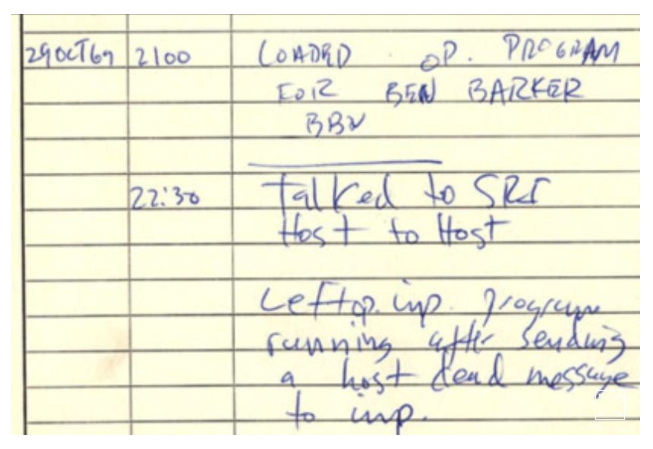
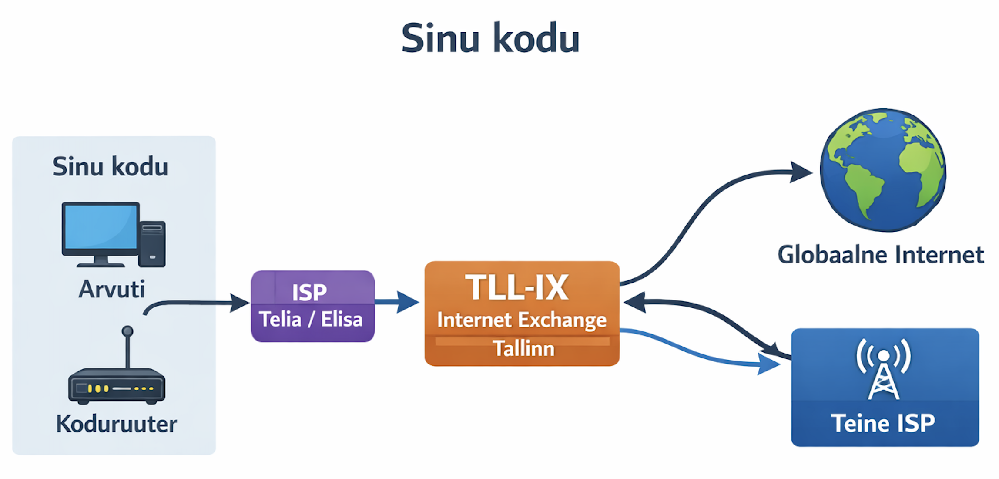

---
tags:
  - Võrgud
---

# Sissejuhatus: miks võrgud?

!!! abstract "Eesmärgid"
    Selle peatüki läbimise järel:

    - Oskan selgitada, mis on arvutivõrk ja miks seda vajatakse
    - Oskan kirjeldada interneti ajaloo olulisemaid verstaposte
    - Oskan selgitada, kuidas internet on üles ehitatud kui "võrkude võrk"
    - Oskan tuua näiteid võrkude rollist igapäevaelus

## Kuidas kõik algas

1960ndatel olid arvutid toasuurused masinad, mis maksid miljoneid. Igaüks töötas eraldi — kui teadlane Californias tahtis andmeid jagada kolleegiga Stanfordis, pidi ta saatma lindikasseti postiga.

USA kaitseministeeriumi agentuur DARPA tahtis seda muuta. Nii sündis **ARPANET**.[^leiner]

**29. oktoobril 1969** saadeti esimene sõnum kahe arvuti vahel — UCLA-st Stanfordi ülikooli. Sõnum pidi olema *LOGIN*, aga süsteem jooksis kahe tähe järel kokku. Esimene sõnum, mis kunagi üle arvutivõrgu läks, oli seega **"LO"**.[^arpanet]

<figure markdown="span">
  
  <figcaption>Joonis 0.2. ARPANET IMP log — esimene võrgusõnum. "CSK" viitab tudeng Charles S. Kline'ile, kes oli esimene inimene, kes ühendus kaugarvutiga (allikas: UCLA Digital Library).</figcaption>
</figure>

## Interneti ajaloo verstapostid

| Aasta | Sündmus | Miks oluline |
|---|---|---|
| 1969 | Esimene ARPANET ühendus: UCLA ↔ Stanford | Tõestus, et arvutid saavad üle telefoniliini suhelda |
| 1973 | ARPANET laienes Londonisse ja Norrasse | Esimene rahvusvaheline arvutivõrk |
| 1974 | Vint Cerf ja Bob Kahn leiutavad TCP/IP | "Ühine keel", mis ühendab erinevad võrgud |
| 1983 | TCP/IP saab standardiks | Interneti ametlik sünniaasta — ARPANET läheb üle TCP/IP-le |
| 1990 | Tim Berners-Lee leiutab World Wide Web'i[^bernerslee] | Veebilehed! Internet muutub visuaalseks ja kättesaadavaks |
| 1995 | Internet muutub kommertslikuks | Amazon, eBay, Yahoo — veeb pole enam ainult teadlastele |
| 2007 | iPhone'i tulek | Mobiilne internet — võrk läheb taskusse |
| 2020+ | IoT, 5G, pilveteenused | Külmikul on IP-aadress. Maailm on võrk |

*Tabel 0.1. Interneti ajaloo olulisemad verstapostid*

!!! example "Kas teadsid?"
    Esimesel ARPANET-ühenduse loomisel olid kohal ainult neli inimest. Keegi ei teinud fotot, keegi ei kirjutanud pressiteadet. Üks suurimaid tehnoloogilisi läbimurdeid ajaloos juhtus täiesti vaikselt.

## Võrkude roll igapäevaelus

Iga kord, kui saadad sõnumi, vaatad videot, loed e-kirja või kasutad nutikodu seadet, liigub info läbi erinevate võrkude. Tänapäeval on raske leida seadet, mis **ei ole** võrku ühendatud.

Kodus kasutad tõenäoliselt WiFi-võrku, mis ühendab nutitelefoni, arvuti, nutitelevisiooni ja võib-olla isegi külmikut või valgustussüsteemi. Need seadmed moodustavad koduse võrgu, mis omakorda ühendub internetiga läbi teenusepakkuja.[^pmrit]

<figure markdown="span">
  
  <figcaption>Joonis 0.3. Koduvõrgu struktuur — seadmed, ruuter ja internetiühendus (PMR IT Consulting, 2020).</figcaption>
</figure>

## Internet kui "võrkude võrk"

Internet ei ole üks suur võrk, vaid **võrkude võrk** — tuhandetest väiksematest võrkudest koosnev globaalne süsteem. Internetiteenuse pakkujad (ISP-d) moodustavad interneti selgroo, ühendades riike ja mandreid.[^cerf]

<figure markdown="span">
  
  <figcaption>Joonis 0.4. Interneti struktuur — kodust TLL-IX kaudu maailma (Talvik, 2025).</figcaption>
</figure>

Eestis ühendab **TLL-IX** (Tallinn Internet Exchange) kohalikud teenusepakkujad omavahel, nii et Eesti-sisene liiklus ei pea läbi välismaa käima. Kui Tartus olev arvuti vaatab ERR-i veebi, ei lähe andmed läbi Rootsi — tänu TLL-IX-ile jäävad need Eestisse.

## Eesti ja maailma interneti infrastruktuur

Kuidas jõuab internet Eestisse? Vastus peitub ookeanipõhjas. Üle 95% rahvusvahelisest internetiliiklusest liigub **merepõhjakaableid** mööda — fiiberkiude, mis on õhemad kui aiavoolik, aga ühendavad mandreid.[^submarine] Kokku on selliseid kaableid üle 500 ja nende kogupikkus ületab 1,3 miljonit kilomeetrit.

Eestit ühendavad maailmaga mitu merepõhjakaablit, sealhulgas **C-Lion1** (Helsinki–Rostock) ja **Eastern Light / Baltic Connector** kaablid Soome kaudu. 2024. aastal said uudiseks ka kaablite haavatavus — Läänemere põhjas on kaableid kahjustatud ankrutega, mis tõi teravalt esile merepõhja infrastruktuuri kaitse vajaduse.[^balticcable]

| Kaabel | Marsruut | Pikkus | Kiirus |
|---|---|---|---|
| C-Lion1 | Helsinki – Rostock | 1 172 km | 144 Tbps |
| EE-S Link | Tallinn – Stockholm (planeeritud) | ~400 km | — |
| Baltic Sea kaablid | Ühendavad Skandinaavia ja Kesk-Euroopa | tuhandeid km | varieerub |

*Tabel 0.2. Eestit puudutavad merepõhjakaablid*

> Märkus: kaablite arv, võimsused (Tbps) ja projektide staatus muutuvad ajas. Tabel on illustratiivne; täpsete numbrite jaoks vaata viiteid all.

!!! info "Uuri ise"
    Merepõhjakaablite võrgustikku saab uurida interaktiivsetel kaartidel:

    - [Submarine Cable Map](https://www.submarinecablemap.com/) — TeleGeography zoomitav kaart kõigi kaablitega, uuendatakse reaalajas
    - [He.net 3D Globe](https://he.net/3d-map/) — kolmemõõtmeline vaade kaablitele
    - [How the Internet Travels Across Oceans](https://www.nytimes.com/interactive/2019/03/10/technology/internet-cables-oceans.html) — New York Timesi interaktiivne lugu, mis näitab, kuidas kaablid välja näevad ja kuidas neid paigaldatakse[^nyt]
    - [Warriors of the Net](https://www.youtube.com/watch?v=7Zf203Vmbig) — steampunk-stiilis animatsioon pakettide teekonnast läbi interneti

Eesti on ka e-riigina tuntud: X-tee (andmevahetuskiht), e-residentsus, digiallkirjastamine ja i-hääletamine toetuvad kõik turvalisele võrguinfrastruktuurile.[^tllix]

---

## Kokkuvõte

Arvutivõrgud said alguse 1969. aastal, kui ARPANET ühendas neli USA ülikooli. TCP/IP protokoll (1983) lõi ühise keele, mis võimaldas eri võrkudel omavahel suhelda. World Wide Web (1990) tegi interneti visuaalseks ja kättesaadavaks kõigile. Tänapäeval on internet võrkude võrk, mida haldavad ISP-d ja internet exchange'id nagu Eesti TLL-IX.

---

## Enesekontroll

??? question "1. Mis on arvutivõrk?"
    Arvutivõrk on kahe või enama seadme ühendus, mis võimaldab neil omavahel andmeid jagada ja ressursse kasutada.

??? question "2. Mis oli ARPANET ja miks see loodi?"
    ARPANET oli esimene suurem arvutivõrk, mille lõi USA kaitseministeeriumi agentuur DARPA 1969. aastal. Eesmärk oli ühendada ülikoolid ja teadusasutused, et jagada andmeid ja arvutusressursse.

??? question "3. Mis juhtus 29. oktoobril 1969?"
    Saadeti esimene sõnum üle arvutivõrgu — UCLA-st Stanfordi ülikooli. Sõnum pidi olema LOGIN, aga süsteem jooksis kokku kahe tähe järel. Esimene edukalt edastatud sõnum oli "LO".

??? question "4. Miks on TCP/IP oluline?"
    TCP/IP on protokollistik, mis lõi "ühise keele" erinevatele võrkudele. Tänu TCP/IP-le saavad eri tootjate seadmed ja eri tüüpi võrgud omavahel suhelda — ilma selleta poleks internetti.

??? question "5. Mis on ISP ja mis on TLL-IX?"
    ISP (Internet Service Provider) ehk internetiteenuse pakkuja ühendab kodukasutajad ja ettevõtted internetiga (nt Telia, Elisa). TLL-IX (Tallinn Internet Exchange) on koht, kus Eesti ISP-d omavahel ühenduvad, et Eesti-sisene liiklus jääks kohalikuks.

[^leiner]: Leiner, B. M. et al. (2009). *A Brief History of the Internet*. ACM SIGCOMM Computer Communication Review, 39(5). https://doi.org/10.1145/1629607.1629613

[^arpanet]: Zimmermann, K. A. (2022). *ARPANET: The World's First Internet*. ThoughtCo. https://www.thoughtco.com/arpanet-the-worlds-first-internet-4072558

[^bernerslee]: Berners-Lee, T. (1989). *Information Management: A Proposal*. CERN. https://www.w3.org/History/1989/proposal.html

[^cerf]: Cerf, V. & Kahn, R. (1974). *A Protocol for Packet Network Intercommunication*. IEEE Transactions on Communications, 22(5). https://doi.org/10.1109/TCOM.1974.1092259

[^submarine]: TeleGeography. (2025). *Submarine Cable Map*. https://www.submarinecablemap.com/

[^balticcable]: Bayer, L. (2024). *Baltic Sea cable damage raises fears of sabotage*. Politico. https://www.politico.eu/article/baltic-sea-cable-damage-raises-sabotage-fears/

[^tllix]: TLL-IX. (2025). *Tallinn Internet Exchange*. https://www.tll-ix.ee/

[^nyt]: Satariano, A. (2019). *How the Internet Travels Across Oceans*. The New York Times. https://www.nytimes.com/interactive/2019/03/10/technology/internet-cables-oceans.html

[^pmrit]: PMR IT Consulting. (2020). *Milline võiks olla korrektne koduvõrk*. https://pmrit.eu/milline-voiks-olla-korrektne-koduvork/
