---
tags:
  - Võrgud
---

# Võrguseadmed

!!! abstract "Eesmärgid"
    Selle peatüki läbimise järel:

    - Oskan nimetada võrgu kolm põhikomponenti (lõppseadmed, vahepealsed seadmed, meedium)
    - Oskan selgitada iga vahepealse seadme rolli ja ajalugu
    - Oskan kirjeldada võrgukaardi (NIC) funktsiooni
    - Oskan eristada kolme võrgumeediumit ja teada, millal mida kasutada
    - Oskan selgitada seadmete arengulugu — miks iga seade tekkis

## Kuidas kõik algas: kaabel kahe arvuti vahel

1969 — ARPANET. Neli arvutit, ühendatud telefoniliinide kaudu. Kõik töötas, aga tekkis küsimus: kuidas ühendada neid rohkem? Ja kuidas teha nii, et kõik ei peaks omavahel otse kaabliga ühendatud olema? Iga uus probleem sünnitas uue seadme — ja nii kasvaski välja terve perekond võrguseadmeid, mida me täna kasutame.

---

## Võrgu kolm põhielementi

Iga võrk — olgu see kodune WiFi või Google'i andmekeskus — koosneb kolmest asjast. Need kolm komponenti on alati samad, olenemata sellest, kas räägime väikesest koduvõrgust või miljonite kasutajatega pilveplatvormist.

<figure markdown="span">
  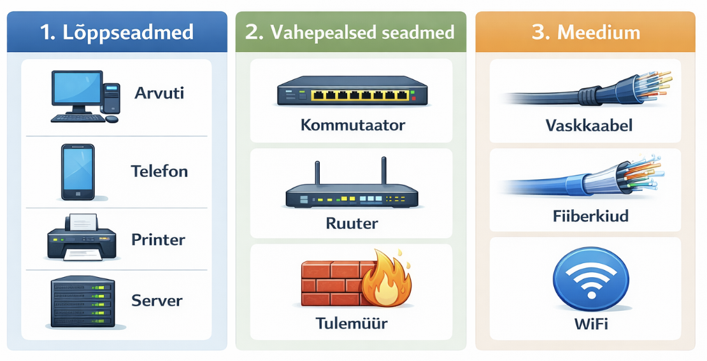
  <figcaption>Joonis 0.6. Võrgu kolm põhielementi — lõppseadmed, vahepealsed seadmed ja meedium (Talvik, 2025).</figcaption>
</figure>

---

## Lõppseadmed (*end devices*)

Lõppseadmed on need, mida sina kasutajana vahetult kasutad — arvuti, telefon, printer, server. Võrgu mõttes on need kohad, kus andmed **tekivad** või **jõuavad kohale**. Kui saadad sõbrale sõnumi, siis sinu telefon on üks lõppseade ja sõbra telefon teine. Kõik, mis nende vahel juhtub, on vahepealsete seadmete ja meediumi töö.

<figure markdown="span">
  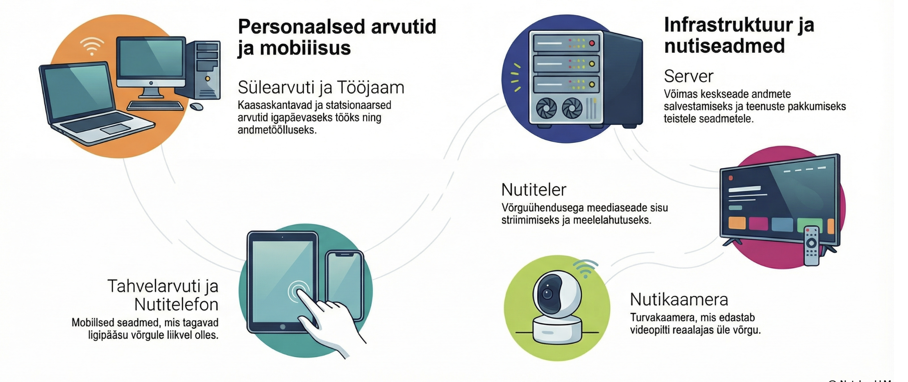
  <figcaption>Joonis 0.7. Lõppseadmete näited — arvutid, serverid, nutiseadmed ja IoT seadmed (Talvik, 2025). Loodud tehisintellekti abil.</figcaption>
</figure>

| Seade | Roll võrgus | Näide |
|---|---|---|
| Arvuti / sülearvuti | Kasutaja tööjaam | Kooli arvutiklassi PC |
| Nutitelefon | Mobiilne klient | Telefon WiFi-s |
| Server | Teenuse pakkuja | Kooli veebileht, e-posti server |
| Printer | Jagatud ressurss | Kontoriprinter, kuhu kõik saavad printida |
| IoT seade | Andur / automaatika | Nutikaamera, tark termostaat |

*Tabel 0.3. Lõppseadmete tüübid*

### Võrgukaart (*NIC — Network Interface Card*)

Et arvuti saaks üldse võrguga ühenduda, vajab ta **võrgukaarti** (*NIC*). See on riistvara, mis teisendab arvuti andmed elektri- või valgussignaalideks ja saadab need kaabli (või WiFi) kaudu teele. Ilma võrgukaardita on arvuti nagu maja ilma ukseta — seest on kõik olemas, aga kellegagi suhelda ei saa.

<figure markdown="span">
  
  <figcaption>Joonis 0.8. Ethernet võrgukaart (NIC) — igal kaardil on unikaalne MAC-aadress, mis on "sisse põletatud" juba tehases (Wikimedia Commons).</figcaption>
</figure>

Esimesed võrgukaardid olid eraldiseisvad laienduskaardid, mille pidid arvutisse ise paigaldama — neid müüdi eraldi karpides ja paigaldamine nõudis kruvikeerajat. Tänapäeva arvutites on NIC **emaplaadile integreeritud** — sa ei näe eraldi kaarti, aga see on seal olemas.

Igal võrgukaardil on **MAC-aadress** — tehases omistatud unikaalne 48-bitine aadress, mille järgi kommutaator seadme ära tunneb. Seda võib mõelda kui seadme "isikukoodi" võrgus. MAC-aadressidest loe lähemalt [Peatükk 4: Andmesidekiht](04_andmesidekiht.md).

!!! tip "Mitu võrgukaarti"
    Tavalisel arvutil on üks Ethernet-port ja üks WiFi-adapter — see tähendab kahte NIC-i ja kahte MAC-aadressi! Serveritel on tihti neli või rohkem võrgukaarti — üks haldusliikluse, teine andmete, kolmas varundamise jaoks.

---

## Vahepealsed seadmed — arengulugu

Vahepealsed seadmed tagavad andmete liikumise lõppseadmete vahel. Huvitav on see, et iga seade tekkis **konkreetse probleemi** lahendamiseks — keegi ei istunud maha ja öelnud "teeme kõik seadmed korraga valmis". Pigem oli nii, et üks probleem lahendati, aga lahendus tekitas uue probleemi, ja nii edasi. Vaatame seda lugu kronoloogilises järjekorras.

<figure markdown="span">
  
  <figcaption>Joonis 0.9. Vahepealsed seadmed — kommutaatorid, ruuterid, tulemüürid, hub'id, modemid ja teised (allikas: IPCisco.com).</figcaption>
</figure>

---

### 1960ndad–1970ndad: Modem — esimene "tõlk"

<figure markdown="span">
  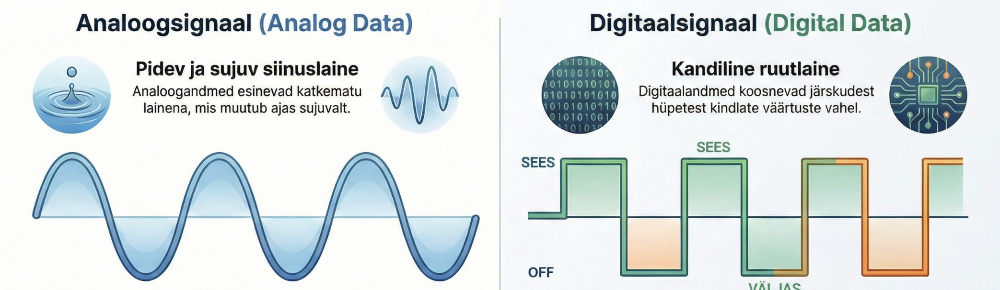
  <figcaption>Joonis 0.10. Analoog- ja digitaalsignaal — modem teisendab nende vahel (Talvik, 2025). Loodud tehisintellekti abil.</figcaption>
</figure>

ARPANET-i arvutid pidid omavahel suhtlema, aga ainuke olemasolev infrastruktuur oli telefonivõrk. Probleem: arvutid räägivad digitaalset keelt (nullid ja ühed), telefoniliinid aga kannavad analoogsignaali (helilaineid). Keegi pidi tõlkima.

Selleks loodigi **modem** (**mo**dulator-**dem**odulator) — seade, mis teisendab digitaalsed andmed analoogsignaaliks saatmiseks ja vastuvõtmisel tagasi digitaalseks. Kui oled piisavalt vana (või oled filme vaadanud), siis mäletad ehk seda iseloomulikku kriiksuvat heli, mida dial-up modem tegi ühenduse loomisel — see oligi kahe modemi "käepigistus".

Esimesed modemid (AT&T, 1958) suutsid edastada vaid 300 bitti sekundis. 1990ndate dial-up modemid jõudsid 56 kbps-ni — ühe MP3 (4 MB) allalaadimine võttis sellega ~10 minutit. Täna pakuvad fiibermodemid (ONT) kiirust kuni 10 Gbps — see on üle 170 000 korra kiirem.

---

### 1970ndad: Repeater — signaali võimendaja

Järgmine mure oli füüsika. Elektrisignaal nõrgeneb kaablis — mida pikem kaabel, seda nõrgem signaal. Umbes 500 meetri pärast on signaal nii nõrk, et vastuvõtja ei saa enam aru, mis saadeti.

Lahendus oli lihtne: **repeater** (kordisti). See on seade, mis võtab nõrgenenud signaali, võimendab selle ja saadab edasi. Repeater ei "mõtle" ega suuna — ta lihtsalt kordab. Nagu telefonimängus, kus iga inimene ütleb sõnumi selgemini edasi.

---

### 1980ndad: Hub — mitu arvutit ühte kokku

<figure markdown="span">
  
  <figcaption>Joonis 0.11. Ethernet hub — 4-pordiline Netgear jaotur. Sisuliselt multiport repeater (Wikimedia Commons).</figcaption>
</figure>

Võrgud kasvasid ja tekkis uus küsimus: kuidas ühendada 10, 20 või 50 arvutit ühte võrku? Varasem lahendus — koaksiaalkaabliga siinitopoloogia — oli habras nagu jõulutulede vanik: üks katkestus kusagil pani kogu võrgu maha.

Nii sündis **hub** — sisuliselt multiport repeater. Iga arvuti sai oma kaabli ja oma pordi hub'i peal. See oli samm edasi, aga hub'il oli üks suur puudus: ta on **rumal**. Kui üks arvuti saadab andmeid, edastab hub need **kõigile** teistele portidele. See on nagu klassiruumis karjumine — kõik kuulevad, isegi need, kellele see pole mõeldud.

<figure markdown="span">
  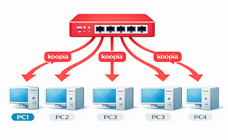
  <figcaption>Joonis 0.12. Hub saadab andmed kõigile portidele (Talvik, 2025). Loodud tehisintellekti abil.</figcaption>
</figure>

Miks see probleem on? Kujuta ette, et hub on nagu ühe toaga kontor, kus kõik peavad kõva häälega rääkima. Kui üks inimene räägib, peavad kõik teised ootama — muidu keegi ei kuule midagi. Mida rohkem inimesi toas, seda rohkem tekib olukordi, kus kaks inimest üritavad korraga rääkida. Seda nimetatakse **kollisiooniks**. Pärast kollisiooni peavad mõlemad ootama juhusliku aja ja uuesti proovima. Lisaks jagati kogu 10 Mbit/s ribalaiust KÕIGI seadmete vahel — viiekümne arvutiga jäi igale seadmele alla 200 kbit/s, millest ei piisanud isegi lihtsa veebilehe avamiseks.

!!! warning "Hub on ajalooline seade"
    Tänapäeval hub'e enam ei müüda ega kasutata — need asendati kommutaatoritega. Aga hub'i mõistmine aitab aru saada, MIKS kommutaator loodi.

---

### 1980ndad: Bridge — esimene "nutikas" seade

<figure markdown="span">
  
  <figcaption>Joonis 0.13. Võrgubridge — 2-pordiline seade, mis jagas võrgu segmentideks (memory4less.com).</figcaption>
</figure>

Hub'iga ühendatud 50 arvutit tähendas pidevaid kollisioone ja aeglast võrku. Keegi pidi nutikas olema.

**Bridge** oli esimene seade, mis hakkas **mõtlema**. Ta jagas suure võrgu **kaheks segmendiks** ja oli esimene, kes **vaatas MAC-aadresse** — õppis, milline arvuti on kummal pool. Liiklus lasti läbi ainult siis, kui sihtkoht oli teisel poolel. Kui kaks arvutit samal poolel omavahel rääkisid, ei koormatud teist poolt üldse.

Bridge'il oli tavaliselt ainult **2–4 porti**. See aitas, aga tekitas loogilise küsimuse — mis oleks, kui teeksime bridge'i **paljude** portidega?

---

### 1980ndad: Ruuter — eri võrkude ühendaja

<figure markdown="span">
  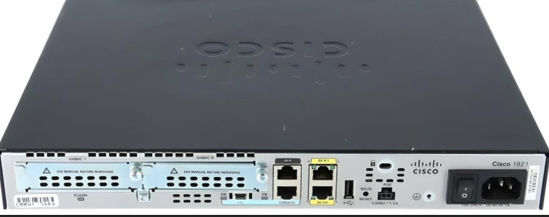
  <figcaption>Joonis 0.14. Cisco 1921 ruuter — pordid: 2x GigabitEthernet, Console, AUX, HWIC moodulipesad (Talvik, 2025). Loodud tehisintellekti abil.</figcaption>
</figure>

Samal ajal kasvas ARPANET kiiresti — ülikoolid, teadusasutused, sõjavägi. Iga asutusel oli oma sisemine võrk, aga need kasutasid erinevaid tehnoloogiaid. Kuidas panna need eri võrgud omavahel suhtlema?

**Ruuter** lahendas selle probleemi. Erinevalt hub'ist ja bridge'ist, mis töötavad ühe võrgu sees, ühendab ruuter **erinevaid** võrke ja suunab andmeid **IP-aadresside** järgi. Kui kommutaator on nagu postiljon, kes jagab kirju ühes majas, siis ruuter on nagu maanteeviidasüsteem: "Tallinn vasakule, Tartu paremale".

**Cisco** ajalugu on siinkohal oluline. 1984. aastal lõid Stanfordi ülikooli töötajad **Leonard Bosack** ja **Sandy Lerner** firma nimega *cisco Systems* (jah, väikese tähega!). Nende esimene toode oli multiprotokolliline ruuter, mis suutis ühendada eri tüüpi võrke. See lahendas nii suure probleemi, et Ciscost sai kiiresti võrgumaailma domineeriv jõud — ja on seda siiani.

Aga Cisco pole kaugeltki ainuke tegija:

| Tootja | Tuntud selle poolest | Tüüpiline kasutus |
|---|---|---|
| **Cisco** | Turuliidr, IOS operatsioonisüsteem | Ettevõtted, ISP-d, haridus |
| **Juniper Networks** | Kõrgjõudlus, Junos OS | ISP-d, andmekeskused |
| **Huawei** | Soodne hind, VRP süsteem | Telekomid (eriti Aasia, Euroopa) |
| **MikroTik** | Väga odav, RouterOS, Läti firma! | Väikeettevõtted, WiFi ISP-d, Baltimaad |
| **Arista** | Andmekeskused, pilv | Suurettevõtted (Meta, Microsoft) |
| **TP-Link / Netgear / ASUS** | Kodukasutaja ruuterid | Koduvõrgud |

*Tabel 0.4. Ruuterite tootjad*

!!! tip "MikroTik — Balti edulugu"
    MikroTik on **Läti firma** Riiast! Nende ruuterid ja kommutaatorid on eriti populaarsed Ida-Euroopas ja arengumaades, sest need on väga soodsad aga üllatavalt võimsad. Paljud Eesti WiFi-pakkujad kasutavad MikroTiku seadmeid.

Lihtsustatult öeldes — ruuter on seade, mis istub kahe võrgu vahel ja otsustab, kuhu iga andmepakett läheb:

<figure markdown="span">
  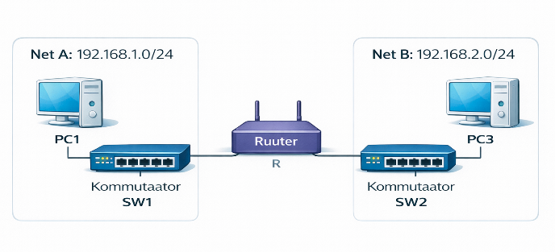
  <figcaption>Joonis 0.15. Ruuter ühendab kaks erinevat võrku (Talvik, 2025). Loodud tehisintellekti abil.</figcaption>
</figure>

Ruuterist lähemalt [Peatükk 6: Võrgukiht](06_vorgukiht.md) ja [Peatükk 12: Marsruutimine](12_marsruutimine.md).

---

### 1990ndad: Kommutaator — revolutsioon

<figure markdown="span">
  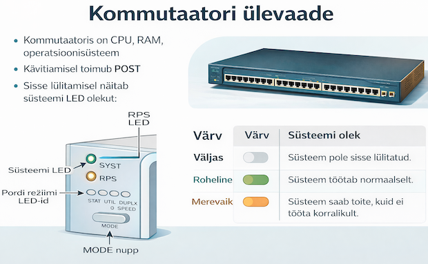
  <figcaption>Joonis 0.16. Cisco Catalyst kommutaator — LED indikaatorid näitavad portide olekut (Talvik, 2025). Loodud tehisintellekti abil.</figcaption>
</figure>

Mäletad bridge'i — nutikat seadet, mis vaatas MAC-aadresse, aga millel oli ainult 2–4 porti? Mis oleks, kui teeksime sama asja, aga **24 või 48 pordiga**?

Täpselt nii sündiski **kommutaator** (*switch*) — sisuliselt **multiport bridge**. Iga port on eraldi ja seade peab **MAC-aadresside tabelit** — õpib, kes on kus, ja saadab andmed **ainult õigesse porti**. Mitte kellelegi teisele.

Hub'iga jagasid kõik arvutid ühte 10 Mbit/s torujuhet. Kommutaatoriga sai iga port **täiskiiruse**, kollisioone polnud enam ja võrgud muutusid kordades kiiremaks. Hub kadus turult kiiresti.

<figure markdown="span">
  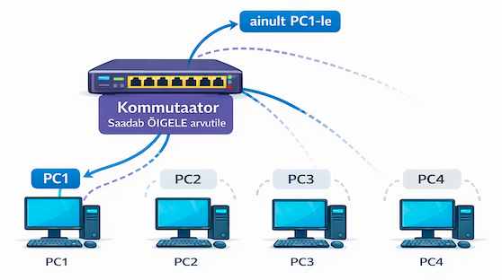
  <figcaption>Joonis 0.17. Kommutaator saadab andmed ainult õigesse porti (Talvik, 2025). Loodud tehisintellekti abil.</figcaption>
</figure>

Üks varajasi kommutaatorite tootjaid oli **Kalpana** (1990. aastate algus) — tollal olid hinnad kõrged, sageli üle 10 000 dollari. Cisco ostis Kalpana 1994. aastal ja sellest sündis legendaarne **Catalyst** seeria, mis on tänapäevani üks levinumaid kommutaatorite brände maailmas.

| Tootja | Tooteseeria | Tuntud |
|---|---|---|
| **Cisco** | Catalyst, Nexus | Turuliidr, CCNA standard |
| **Juniper** | EX seeria | Kõrgjõudlus |
| **Huawei** | CloudEngine | Soodne hind |
| **HP/Aruba** | ProCurve, CX | Hea hinna-kvaliteedi suhe |
| **MikroTik** | CRS seeria | Väga odav, RouterOS |
| **D-Link / TP-Link** | DGS / TL-SG | Koduseadmed, väikeettevõtted |

*Tabel 0.5. Kommutaatorite tootjad*

**Hub vs kommutaator:**

| Omadus | Hub | Kommutaator |
|---|---|---|
| Saadab andmed | Kõigile portidele | Ainult õigele pordile |
| Kollisioonid | Jah — kõik jagavad ribalaiust | Ei — iga port on eraldi |
| Kiirus | Jagatud (10 Mbit/s kõigi vahel) | Täiskiirus igale pordile |
| MAC-aadresside tabel | Ei | Jah |
| OSI kiht | Layer 1 (füüsiline) | Layer 2 (andmeside) |

*Tabel 0.6. Hub vs kommutaator*

Kommutaatorist lähemalt [Peatükk 4: Andmesidekiht](04_andmesidekiht.md) ja [Praktikumis 7](../praktikumid/praktikum_07.md) näed MAC-tabelit oma silmaga.

---

### 1988+: Tulemüür — turvamees uksel

Niipea, kui võrgud hakkasid omavahel ühenduma ja internet kasvas, tekkis paratamatu küsimus: kuidas hoida soovimatud külalised eemal? Kui sinu võrk on ühendatud maailmaga, siis on maailm ühendatud ka sinuga — koos kõige hea ja halvaga.

**Tulemüür** (*firewall*) on nagu turvamees maja uksel — kontrollib, kes sisse ja välja pääseb. Ta vaatab iga andmepaketi päist ja otsustab reeglite järgi, kas see liiklus on lubatud või mitte. Esimene kommertsiaalne tulemüür oli **DEC SEAL** (1992), aga tänaseks on tulemüürid muutunud uskumatult keerukateks — nad suudavad analüüsida rakenduste sisu, tuvastada pahavara ja isegi masinõppega kahtlast käitumist märgata.

Tänapäeva suurimad tegijad on **Palo Alto Networks**, **Fortinet (FortiGate)**, **Check Point** ja **Cisco (ASA/Firepower)**. Tulemüüre on nii **riistvara** kujul (eraldiseisev seade serveriruumis) kui ka **tarkvara**na (Windows Firewall, iptables Linuxis). Sinu koduruuteris on samuti sisseehitatud tulemüür — lihtsam versioon, aga siiski.

---

### 1999+: WiFi pääsupunkt — juhtmed ära!

Sülearvutid muutusid populaarseks, telefonid said nutikaks — ja inimesed ei tahtnud enam kaabliga laua taga istuda. Aga kuidas ühendada seadmeid võrku ilma füüsilise kaablita?

**Juhtmevaba pääsupunkt** (*Wireless Access Point / WAP*) oli vastus. Sisuliselt on see nagu "juhtmevaba kommutaator" — pääsupunkt ise on kaabliga ühendatud võrguinfrastruktuuri külge, aga lõppseadmed ühenduvad sellega raadiolainete teel.

WiFi standard **IEEE 802.11** ilmus juba 1997. aastal, aga esimesed praktilised tooted jõudsid turule 1999 — **Apple AirPort** oli üks esimesi kodukasutajale mõeldud WiFi seadmeid ja see muutis mängu täielikult. Täna on suurimad tootjad **Ubiquiti** (UniFi seeria — eriti populaarne väikeettevõtetes ja kodudes), **Cisco (Meraki)**, **Aruba (HPE)**, **Ruckus** ja **TP-Link**.

Lähemalt [Peatükk 3: Juhtmevabad võrgud](03_juhtmevabad_vorgud.md).

---

### Kodune ruuter — "kõik ühes"

<figure markdown="span">
  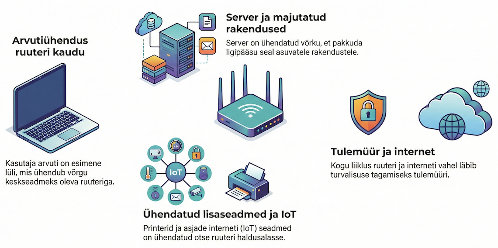
  <figcaption>Joonis 0.18. Tüüpiline koduvõrk — kasutaja, arvutid, ruuter, tulemüür, internet, server (Talvik, 2025). Loodud tehisintellekti abil.</figcaption>
</figure>

Kui vaatad oma kodus seda valget kasti, mille Telia või Elisa paigaldas, siis sa tegelikult vaatad **mitut seadet ühes korpuses**. See väike kast teeb samaaegselt mitme eraldi seadme tööd:

| Funktsioon | Mida teeb | Eraldi seade laboris |
|---|---|---|
| **Ruuter** | Ühendab koduvõrgu ISP-ga (NAT) | Cisco 1941/4321 |
| **Kommutaator** | 4 Ethernet porti koduseadmetele | Cisco Catalyst 2960 |
| **WiFi pääsupunkt** | Juhtmevaba ühendus | Ubiquiti UniFi AP |
| **Modem** (mõnel) | DSL/kaabel teisendamine | Eraldi modem |
| **Tulemüür** | Kaitseb koduvõrku | Cisco ASA / FortiGate |
| **DHCP server** | Jagab automaatselt IP-aadresse | Seadistatud ruuteril |

*Tabel 0.7. Koduse ruuteri funktsioonid vs eraldi seadmed*

Kooli laboris kasutame neid **eraldi seadmetena** — nii saad paremini aru, mida iga osa tegelikult teeb. Kodus on mugav, et kõik on ühes kastis, aga õppimiseks on kasulikum näha iga seadet eraldi.

---

## Seadmete ajajoon

Oleme nüüd läbi käinud terve rea võrguseadmeid — modemist WiFi pääsupunktini. Iga seade sündis eelmise puuduste tõttu ja iga uus lahendus viis võrgud sammu edasi. Allolev ajajoon näitab, kuidas see areng 40 aasta jooksul välja nägi:

<figure markdown="span">
  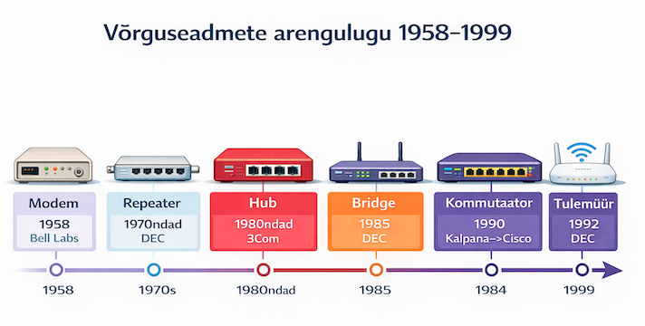
  <figcaption>Joonis 0.19. Võrguseadmete arengulugu 1958–1999 (Talvik, 2025). Loodud tehisintellekti abil.</figcaption>
</figure>

---

## Võrgumeedium (*network media*)

Meedium on füüsiline kanal, mida mööda andmed liiguvad. Olenemata sellest, kui nutikad su seadmed on — ilma meediumita nad suhelda ei saa. Kolm põhitüüpi:

<figure markdown="span">
  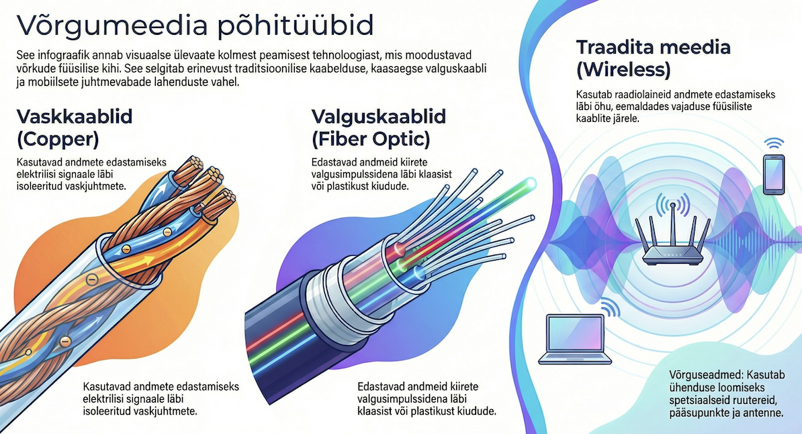
  <figcaption>Joonis 0.20. Kolm põhilist võrgumeediumit — vask (UTP kaablid), fiiberkiud (valgussignaal) ja juhtmevaba (WiFi, raadiolained) (Talvik, 2025). Loodud tehisintellekti abil.</figcaption>
</figure>

### Vaskkaabel (UTP — *Unshielded Twisted Pair*)

<figure markdown="span">
  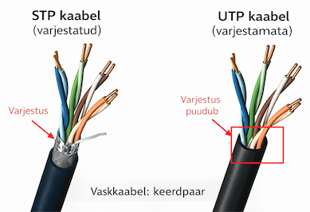
  <figcaption>Joonis 0.21. UTP keerdpaarkaabel — neli keerdpaari (8 juhet), keerdesse aetud häirete vähendamiseks (Talvik, 2025). Loodud tehisintellekti abil.</figcaption>
</figure>

Kõige levinum kaabel kohtvõrkudes. Sees on neli paari vaskjuhtmeid, mis on **keerdesse aetud** — see pole moeasi, vaid füüsika: keerd vähendab elektromagneetilisi häireid. Mida tihedam keerd, seda parem kaitse. Kaabli otsas on **RJ45 pistik** — see on see läbipaistev plastikust konnektoriga otsik, mida sa oled kindlasti näinud iga arvuti taga või koduruuteri küljes.

<figure markdown="span">
  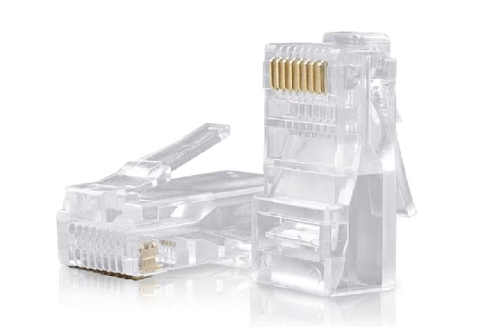
  <figcaption>Joonis 0.22. RJ45 pistik — Ethernet kaabli standardne pistik (Talvik, 2025). Loodud tehisintellekti abil.</figcaption>
</figure>

| Kategooria | Kiirus | Kasutus |
|---|---|---|
| Cat 5e | Kuni 1 Gbit/s | Vanemad kontorid |
| Cat 6 | Kuni 10 Gbit/s (55 m) | Uued paigaldused |
| Cat 6a | Kuni 10 Gbit/s (100 m) | Andmekeskused |

*Tabel 0.8. UTP kaablikategooriad*

Kaablitest lähemalt [Peatükk 2: Füüsiline kiht](02_fuusiline_kiht.md) ja [Praktikumis 6](../praktikumid/praktikum_06.md) ehitad ise Ethernet-kaabli!

### Fiiberkiud (*fiber optic*)

Andmed liiguvad **valgusimpulssidena** läbi õhukese klaasjuhtme. Fiiberkiud on kiirem, ulatub kaugemale ja on häiretele immuunne — aga selle paigaldamine nõuab eriseadmeid ja oskusi, mis teeb selle kallimaks.

Kasutus: ISP-de tuumvõrk, andmekeskused, merepõhjakaablid. Tootjad: **Corning** (maailma suurim fiiberkiu tootja — jah, see sama Corning, kes teeb Gorilla Glass'i su telefoni ekraanile!), **Prysmian**, **OFS**.

### Juhtmevaba (WiFi, Bluetooth)

Andmed liiguvad **raadiolainetel**. Mugav — ei vaja kaablit — aga aeglasem ja häiretele tundlikum kui kaabel. Sein, mikrolaineahi ja isegi akvaarium võivad WiFi signaali nõrgendada. Lähemalt [Peatükk 3: Juhtmevabad võrgud](03_juhtmevabad_vorgud.md).

### Meediumite võrdlus

| Meedium | Kuidas | Kiirus | Kaugus | Hind | Kasutus |
|---|---|---|---|---|---|
| Vask (UTP) | Elekter | Kuni 10 Gbps | ~100 m | Odav | LAN |
| Fiiberkiud | Valgus | Kuni 100+ Gbps | Kümned km | Kallis | WAN, DC |
| WiFi | Raadio | Kuni 9.6 Gbps | ~30-50 m | Keskmine | Mobiilne |

*Tabel 0.9. Võrgumeediumite võrdlus*

!!! tip "Miks vask, mitte alati fiiberkiud?"
    Fiiberkiud on kiirem ja kaugemale ulatuv, aga ka **kallim** ja keerulisem paigaldada (vajab spetsiaalseid tööriistu ja oskusi). Vaskkaabel on odav, lihtne ja piisav kohtvõrgu jaoks (100 meetrit). Sellepärast kasutab enamik kontoreid ja koole vaskkaablit lõppseadmeteni ja fiiberkiudu tuumvõrgus.

---

## Struktureeritud kaabeldus

Päris hoones ei liigu kaablid laest läbi nagu spagetivõrgustik — kasutatakse **struktureeritud kaabeldust**. See tähendab, et kaablid on korralikult seinade sees, ühendatud seinapesade ja patchpaneelidega serverruumis.

<figure markdown="span">
  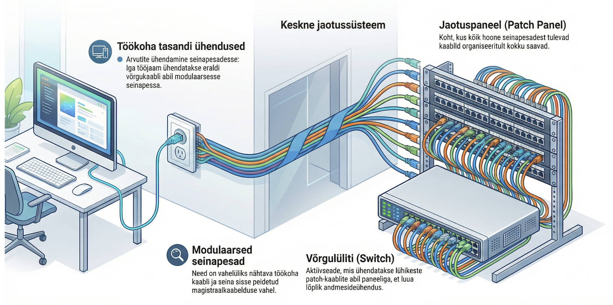
  <figcaption>Joonis 0.23. Struktureeritud kaabeldus — arvutid ühendatud seinapesade ja patchpaneeli kaudu kommutaatoriga (Talvik, 2025). Loodud tehisintellekti abil.</figcaption>
</figure>

Struktureeritud kaabeldus tähendab, et kaablid ei jookse suvaliselt laest läbi, vaid järgivad kindlat süsteemi. Teekond arvutist kommutaatorini näeb välja selline: arvutist läheb lühike patchkaabel seinapesasse, sealt jookseb kaabel seina sees serverruumini patchpaneelile ja sealt läheb jälle lühike patchkaabel kommutaatorisse. See tähendab, et kui midagi katki läheb, saad kiiresti tuvastada, kus probleem on — ja seinas olevat kaablit ei pea kunagi puutuma.

<figure markdown="span">
  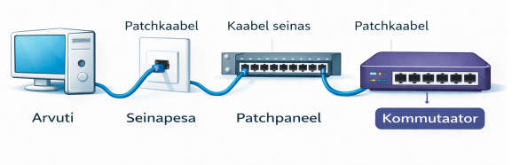
  <figcaption>Joonis 0.24. Struktureeritud kaabeldus — arvutist kommutaatorini (Talvik, 2025). Loodud tehisintellekti abil.</figcaption>
</figure>

---

## Võrguhierarhia

Väikeses kontoris piisab ühest kommutaatorist ja ruuterist. Aga mis juhtub, kui sul on 500 või 5000 kasutajat? Siis läheb vaja **kihtidesse** jagamist — iga kiht tegeleb oma ülesandega:

<figure markdown="span">
  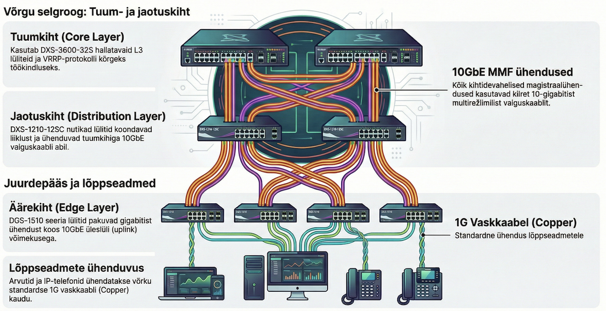
  <figcaption>Joonis 0.25. Võrguhierarhia — tuumkiht (Core), jaotuskiht (Distribution) ja servakiht (Edge/Access) D-Linki seadmetel (Talvik, 2025). Loodud tehisintellekti abil.</figcaption>
</figure>

| Kiht | Roll | Seadmed |
|---|---|---|
| **Core** (tuum) | Kiire andmeedastus | L3 kommutaatorid (Cisco Nexus, Arista) |
| **Distribution** (jaotus) | Poliitikad, filtreerimine | L3 kommutaatorid, ruuterid |
| **Access** (serva) | Lõppseadmete ühendamine | L2 kommutaatorid (Cisco Catalyst), WiFi AP |

*Tabel 0.10. Kolmekihiline võrguhierarhia*

> Märkus: väikestes võrkudes võib sama seade täita mitme kihi rolli (nt „koduruuter" + L2 switch + WiFi AP ühes kastis). Suurtes võrkudes eristatakse kihid skaleerimise ja halduse lihtsustamiseks.

!!! info "Uuri ise"
    - [Dial-up modemi heli selgitusega](https://www.youtube.com/watch?v=gsNaR6FRuO0) — miks modem nii kriiksus?
    - [How a Switch Works](https://www.youtube.com/watch?v=9eH16Fxeb9o) — Sunny animatsioon kommutaatori MAC-tabeli õppimisest
    - [Inside a Google Data Center](https://www.youtube.com/watch?v=XZmGGAbHqa0) — kuidas näeb välja koht, kus miljonid kaablid ja seadmed kohtuvad

---

## Kokkuvõte

Iga võrguseade tekkis konkreetse probleemi lahendamiseks: modem (1958) ühendas arvuti telefoniliiniga, repeater pikendas signaali ulatust, hub (1980ndad) ühendas mitu arvutit aga oli rumal, bridge õppis MAC-aadresse, ruuter (1984, Cisco) ühendas eri võrgud, kommutaator (1990, Kalpana) tegi hub'i nutikaks, tulemüür (1992) lisas turvalisuse ja WiFi AP (1999) kaotas kaablid. Seadmeid toodavad paljud firmad — Cisco on turuliidr, aga Juniper, Huawei, MikroTik (Läti!), HP/Aruba, Ubiquiti, Fortinet ja teised on samuti olulised tegijad.

---

## Enesekontroll

??? question "1. Nimeta kolm võrgu põhikomponenti ja too igaühele kaks näidet."
    Lõppseadmed (arvuti, server), vahepealsed seadmed (kommutaator, ruuter) ja võrgumeedium (vaskkaabel, WiFi).

??? question "2. Mis vahe on hub'il ja kommutaatoril?"
    Hub saadab liikluse KÕIGILE portidele, tekivad kollisioonid, ribalaiust jagatakse. Kommutaator õpib MAC-aadresside järgi, milline seade on millise pordi taga, ja saadab ainult õigesse porti. Iga port saab täiskiiruse.

??? question "3. Mis aastal asutati Cisco ja milline oli nende esimene toode?"
    Cisco asutati 1984. aastal Stanfordi ülikooli töötajate Leonard Bosacki ja Sandy Lerneri poolt. Esimene toode oli multiprotokolliline ruuter, mis suutis ühendada eri tüüpi võrke.

??? question "4. Nimeta kolm ruuterite tootjat peale Cisco."
    Juniper Networks, Huawei, MikroTik (Läti!), Arista, TP-Link, Netgear, ASUS (sobivad kõik nendest).

??? question "5. Mis on NIC ja miks sellel on MAC-aadress?"
    NIC on võrgukaart — riistvara, mis ühendab arvuti võrguga. Igal NIC-il on tehases omistatud unikaalne MAC-aadress, mille järgi kommutaator seadme ära tunneb.

??? question "6. Mida tähendab sõna 'modem' ja miks seda vaja on?"
    Modem = MOdulator-DEModulator. Teisendab digitaalsed andmed analoogsignaaliks (ja vastupidi) telefoniliini või kaabel-TV liini jaoks.

??? question "7. Miks kodune WiFi-ruuter on tegelikult mitu seadet ühes?"
    Sisaldab: ruuterit, kommutaatorit, WiFi pääsupunkti, tulemüüri ja DHCP serverit. Kooli laboris kasutame neid eraldi.

??? question "8. Milline Baltimaade firma toodab ruutereid ja kommutaatoreid?"
    MikroTik — Läti firma Riiast, tuntud odavate aga võimsate seadmete poolest. Eriti populaarne Ida-Euroopas ja arengumaades.
