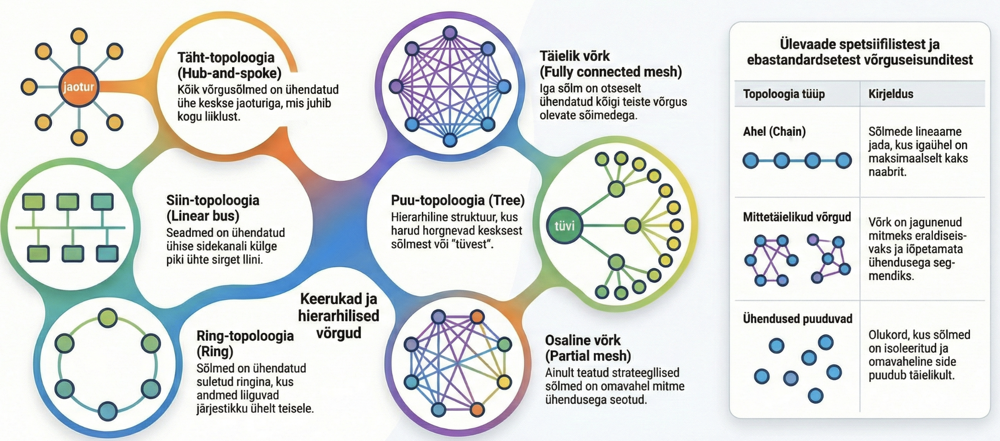
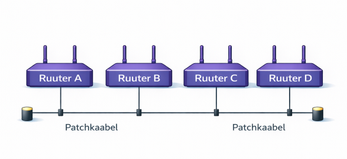
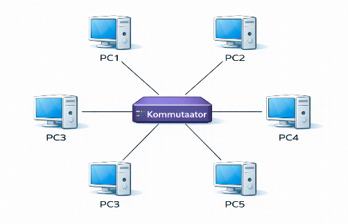
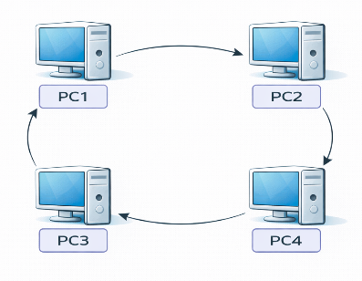
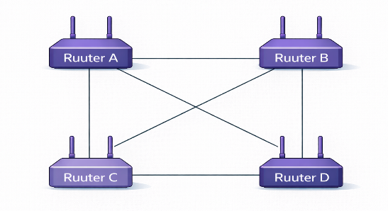

---
tags:
  - Võrgud
---

# Võrgutopoloogiad

<figure markdown="span">
  
  <figcaption>Joonis 0.26. Peamised võrgutopoloogiad (Talvik, 2025). Loodud tehisintellekti abil.</figcaption>
</figure>

!!! abstract "Eesmärgid"
    Selle peatüki läbimise järel:

    - Oskan kirjeldada nelja peamist võrgutopoloogiat (siin, täht, rõngas, võrk)
    - Oskan selgitada iga topoloogia eeliseid ja puuduseid
    - Oskan põhjendada, miks tänapäeval kasutatakse enamasti tähttopoloogiat
    - Oskan eristada füüsilist ja loogilist topoloogiat

## Miks topoloogia loeb

Kui ühendad kaks arvutit kaabliga — see on lihtne. Aga kümme? Sada? Tuhat? Kuidas sa need kõik omavahel ühendad? Sellele küsimusele vastamiseks on mitu lähenemist, ja igaüks mõjutab oluliselt seda, kui hästi su võrk töötab.

Viis, kuidas seadmed omavahel ühendatakse, määrab ära kiiruse (kui palju "liiklusummikuid" tekib), töökindluse (mis juhtub, kui üks kaabel katki läheb), hinna (kui palju kaablit ja seadmeid vaja läheb) ja laiendatavuse (kui lihtne on uut seadet lisada). Seda ühendamise viisi nimetataksegi **topoloogiaks**.

Ajaloo jooksul on proovitud mitut erinevat lähenemist. Mõned osutusid suurepärasteks, teised jäid ajale jalgu. Vaatame need ükshaaval läbi.

## Siinitopoloogia (*Bus*)

<figure markdown="span">
  
  <figcaption>Joonis 0.27. Siinitopoloogia — kõik seadmed ühel kaablil (Talvik, 2025). Loodud tehisintellekti abil.</figcaption>
</figure>

Siinitopoloogia on kõige vanem ja lihtsam viis arvuteid ühendada. Kujuta ette pikka koaksiaalkaablit, mis läheb ühest ruumi otsast teise — ja iga arvuti on selle külge T-konnektoriga ühendatud. Nagu majad ühel tänaval, mis kõik jagavad sama kõnniteed.

Kui üks arvuti saadab andmed, kuulevad neid kõik teised kaablil olevad seadmed. Iga seade kontrollib, kas sõnum on talle mõeldud — kui ei, ignoreerib seda. See oli esimene Ethernet'i standard (1970ndad–1990ndad) ja ta töötas, aga oli üks suur puudus: kui kaabel kusagilt katki läks või T-konnektori kontakt kadus, jäi **kogu võrk** seisma. Mäletad eelmisest peatükist jõulutulede analoogiat? Just selline see oli.

| Eelised | Puudused |
|---|---|
| Lihtne ja odav | Üks katkestus = kogu võrk maas |
| Vähe kaablit | Mida rohkem seadmeid, seda aeglasem |
| | Raske tõrkeid leida |

*Tabel 0.11. Siinitopoloogia eelised ja puudused*

!!! warning "Ajalooline topoloogia"
    Siinitopoloogiat enam ei kasutata — see asendati tähttopoloogiaga 1990ndatel, kui hub'id ja kommutaatorid odavaks muutusid.

## Tähttopoloogia (*Star*)

<figure markdown="span">
  
  <figcaption>Joonis 0.28. Tähttopoloogia — kõik seadmed ühendatud keskse kommutaatoriga (Talvik, 2025). Loodud tehisintellekti abil.</figcaption>
</figure>

Tähttopoloogia lahendas siinitopoloogia suurima probleemi. Selle asemel, et kõik arvutid jagaksid ühte pikka kaablit, sai iga seade oma eraldi kaabli, mis ühendab ta keskse seadmega — algul hub'iga, hiljem kommutaatoriga. Kujuta ette tähe kuju: keskel on kommutaator ja temast väljuvad "kiired" iga arvutini.

See muutis kõike. Kui üks kaabel katki läheb, jääb võrgust välja ainult see üks arvuti — kõik teised töötavad edasi. Uue seadme lisamine on lihtne: tõmbad kaabli ja ühendad kommutaatori vabaporti. Tõrkeid on kerge leida, sest iga ühendus on eraldi.

Tähttopoloogia sai domineerivaks 1990ndatel ja on tänapäeval **standardne** topoloogia peaaegu kõigis kohtvõrkudes. Kui sa vaatad oma kooli arvutiklassi, siis see on tähttopoloogia: iga arvuti on ühendatud kaabliga seinapesasse, sealt läheb kaabel patchpaneelile ja sealt kommutaatorisse.

| Eelised | Puudused |
|---|---|
| Ühe seadme rike ei mõjuta teisi | Keskseade on kriitiline punkt |
| Lihtne hallata ja tõrkeid leida | Rohkem kaablit kui siinil |
| Lihtne laiendada — ühenda uus kaabel | Keskseade peab olema piisavalt võimas |

*Tabel 0.12. Tähttopoloogia eelised ja puudused*

!!! tip "Keskseadme tähtsus"
    Tähttopoloogia nõrk koht on keskseade — kui kommutaator rikneb, jäävad kõik seadmed võrgust välja. Sellepärast kasutavad suuremad võrgud mitut kommutaatorit ja vahel ka varuseadmeid, mis võtavad rikke korral automaatselt üle.

Kuidas see praktikas välja näeb? Arvutiklassis on iga arvuti ühendatud seinapesaga, sealt läheb kaabel seina sees patchpaneelile ja sealt edasi kommutaatorisse:

<figure markdown="span">
  
  <figcaption>Joonis 0.29. Tähttopoloogia praktikas — arvutid ühendatud seinapesade ja patchpaneeli kaudu kommutaatoriga (Talvik, 2025). Loodud tehisintellekti abil.</figcaption>
</figure>

## Rõngastopoloogia (*Ring*)

<figure markdown="span">
  
  <figcaption>Joonis 0.30. Rõngastopoloogia — andmed liiguvad ringis seadmelt seadmele (Talvik, 2025). Loodud tehisintellekti abil.</figcaption>
</figure>

Rõngastopoloogias on seadmed ühendatud ringina — andmed liiguvad ühes suunas, seadmelt seadmele, nagu teatepulk jooksuvõistlusel. Iga seade võtab andmed vastu, kontrollib, kas need on talle mõeldud, ja saadab edasi järgmisele.

IBM Token Ring (1980ndad) oli selle topoloogia kuulsaim esindaja. Idee oli nutikas: võrgus ringleb "token" (märk) — ja ainult see seade, kellel on token, tohib saata. See lahendas siinitopoloogia kollisiooniprobleemi elegantselt, sest kaks seadet ei saanud kunagi korraga rääkida. Aga oli ka varjupool: kui üks seade rivist välja langes, katkes kogu ring. Lisaks pidi iga pakett läbima kõik vahepealsed seadmed, mis tegi võrgu aeglasemaks.

| Eelised | Puudused |
|---|---|
| Pole kollisioone (token kontrollib) | Ühe seadme rike katkestab ringi |
| Iga seade saab garanteeritud saateaja | Aeglane — pakett peab läbima kõik seadmed |

*Tabel 0.13. Rõngastopoloogia eelised ja puudused*

!!! info "Token Ring vs Ethernet"
    1990ndatel võitis Ethernet (tähttopoloogia) Token Ringi (rõngas) üle, sest Ethernet oli lihtsalt odavam ja kiirem. Token Ringi seadmed olid kallid (IBM omandustehnoloogia) ja topoloogia oli vähem paindlik. Kui kommutaatorid muutusid taskukohaseks, polnud Token Ringil enam mingit eelist.

## Võrktopoloogia (*Mesh*)

<figure markdown="span">
  
  <figcaption>Joonis 0.31. Võrktopoloogia — iga seade ühendatud mitme teisega (Talvik, 2025). Loodud tehisintellekti abil.</figcaption>
</figure>

Võrktopoloogia on nagu kindlustuspoliis — iga seade on ühendatud mitme teise seadmega, nii et kui üks ühendus katkeb, leiavad andmed alternatiivse tee. Just sellist topoloogiat kasutas ka ARPANET — sõjaväevõrk, mis pidi töötama isegi siis, kui osa ühendusi tuumalõhkepaisu tõttu hävis.

Tänapäeva **Internet** on maailma suurim mesh-võrk. Kui kaabel Atlandi ookeanis katki läheb (ja see juhtub — haid närivad merepõhjakaableid!), suunavad ruuterid liikluse automaatselt ümber teist teed pidi.

| Eelised | Puudused |
|---|---|
| Väga töökindel — palju alternatiivteid | Kallis — iga ühendus on kulu |
| Üks rike ei mõjuta teisi | Keeruline hallata |

*Tabel 0.14. Võrktopoloogia eelised ja puudused*

Oluline eristus: **täisvõrk** (*full mesh*) tähendab, et iga seade on ühendatud igaühega — see on uskumatult kallis ja kasutatakse ainult väga kriitilistes kohtades. **Osavõrk** (*partial mesh*) tähendab, et ainult kõige olulisemad ühendused on dubleeritud. Internet kasutab osavõrku.

## Füüsiline vs loogiline topoloogia

Siiamaani oleme rääkinud sellest, kuidas kaablid füüsiliselt lähevad. Aga andmed ei pruugi liikuda sama teed pidi, kui kaablid on paigaldatud. Sellepärast eristatakse kahte topoloogiat:

| Tüüp | Mida näitab | Näide |
|---|---|---|
| **Füüsiline** | Kuidas kaablid tegelikult lähevad | Tähttopoloogia — kaablid kommutaatorisse |
| **Loogiline** | Kuidas andmed tegelikult liiguvad | WiFi — füüsiliselt täht, loogiliselt siin |

*Tabel 0.15. Füüsiline vs loogiline topoloogia*

!!! example "WiFi näide"
    Kodune WiFi on **füüsiliselt** täht (kõik seadmed ühenduvad ruuteriga), kuid **loogiliselt** jagatud keskkond: sama õhukanalit jagavad kõik jaamad ning nad peavad "ootama oma korda" (CSMA/CA). Sellepärast on WiFi läbilaskevõime sageli väiksem ja muutlikum kui kaablil.

## Topoloogiate võrdlus

Neli topoloogiat kõrvuti — näha on selgelt, miks täht ja võrk on tänapäeval domineerivad:

| Topoloogia | Töökindlus | Hind | Kiirus | Kasutus täna |
|---|---|---|---|---|
| Siin (*Bus*) | Madal | Odav | Aeglane | Ajalooline |
| Täht (*Star*) | Kõrge | Keskmine | Kiire | LAN — standard |
| Rõngas (*Ring*) | Madal | Keskmine | Keskmine | Ajalooline |
| Võrk (*Mesh*) | Väga kõrge | Kallis | Kiire | Internet, WAN |

*Tabel 0.16. Topoloogiate võrdlus*

!!! info "Uuri ise"
    - [Bus vs Star vs Ring — animatsioon](https://www.youtube.com/watch?v=zbqrNg4C98U) — kuidas andmed liiguvad eri topoloogiates
    - [Token Ring vs Ethernet](https://www.youtube.com/watch?v=HLziLmaYsO0) — miks Ethernet võitis?
    - [ARPANET kujunemine kaardil](https://personalpages.manchester.ac.uk/staff/m.dodge/cybergeography/atlas/arpanet3.gif) — mesh-topoloogia päriselt

---

## Kokkuvõte

Topoloogia määrab, kuidas seadmed on ühendatud ja kuidas andmed liiguvad. Siinitopoloogia (kõik ühel kaablil) ja rõngastopoloogia (IBM Token Ring) on ajaloolised — need jäid ajale jalgu 1990ndatel, kui kommutaatorid odavaks muutusid. Tänapäeval kasutatakse kohtvõrkudes tähttopoloogiat (iga seade eraldi kaabliga keskse kommutaatoriga ühendatud) ja internetis võrktopoloogiat (palju alternatiivteid, et üks rike ei paneks midagi seisma). WiFi puhul on oluline eristada füüsilist (täht) ja loogilist (jagatud õhukanal) topoloogiat.

---

## Enesekontroll

??? question "1. Miks siinitopoloogia enam ei sobi?"
    Üks katkestus kaablis paneb kogu võrgu maha. Samuti tekivad kollisioonid — mida rohkem seadmeid, seda aeglasem võrk. Tähttopoloogias mõjutab ühe kaabli rike ainult ühte seadet.

??? question "2. Miks on tähttopoloogia kõige levinum?"
    Ühe seadme rike ei mõjuta teisi, võrku on lihtne laiendada (ühenda uus kaabel), ja tõrkeid on lihtne leida (iga kaabel on eraldi).

??? question "3. Miks kasutab Internet mesh-topoloogiat?"
    Töökindlus — kui üks ühendus katkeb, leiavad andmed alternatiivse tee. See on kriitiliselt oluline globaalse võrgu jaoks, kus kaablid lähevad katki, seadmed jooksevad kokku ja maavärinad lõhuvad merepõhjakaableid.

??? question "4. Mis vahe on füüsilisel ja loogilist topoloogial?"
    Füüsiline topoloogia näitab, kuidas kaablid on tegelikult ühendatud. Loogiline topoloogia näitab, kuidas andmed liiguvad. Need võivad erineda — WiFi on füüsiliselt täht, aga loogiliselt siin.

??? question "5. Miks Token Ring kaotas Ethernetile?"
    Ethernet oli odavam ja kiirem. Token Ringi seadmed olid kallid (IBM omandustehnoloogia) ja topoloogia oli vähem paindlik. Kui kommutaatorid muutusid odavaks, polnud Token Ringil enam eelist.
