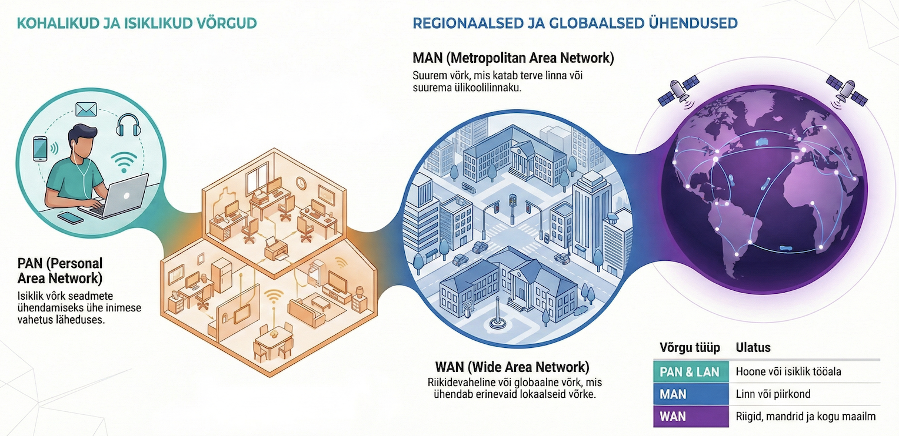

---
tags:
  - Võrgud
---

# Võrgutüübid

<figure markdown="span">
  
  <figcaption>Joonis 0.32. Võrgutüübid ulatuse järgi — PAN-ist WAN-ini (Talvik, 2025). Loodud tehisintellekti abil.</figcaption>
</figure>

!!! abstract "Eesmärgid"
    Selle peatüki läbimise järel:

    - Oskan eristada võrgutüüpe ulatuse järgi (PAN, LAN, MAN, WAN)
    - Oskan tuua iga tüübi kohta igapäevaseid näiteid
    - Oskan selgitada, kuidas eri tüüpi võrgud omavahel seostuvad

## Väikesest suureni

Võrgud on nagu Vene nukud — väike on suure sees. Su Bluetooth-kõrvaklapid moodustavad pisikese PAN-i, mis on ühendatud telefoniga, mis on ühendatud koduse WiFi LAN-iga, mis on ühendatud ISP WAN-iga, mis on osa Internetist. Iga päev kasutad kõiki nelja võrgutüüpi, ilma et sellele üldse mõtleksid.

Neid võrgutüüpe eristatakse peamiselt **ulatuse** järgi — kui kaugele võrk ulatub. Vaatame igaüht lähemalt.

## PAN — Personal Area Network

Kõige väiksem võrk, mida sa üldse kohata võid. PAN ulatub mõne meetri kaugusele ja ühendab seadmed, mis on ühe inimese ümber. Tavaliselt kasutab Bluetooth'i või NFC-d.

Kui su telefon on ühendatud Bluetooth-kõrvaklappide ja nutikellaga — palju õnne, sa oled loonud PAN-i. Sa oled selle võrgu ainus kasutaja ja ainus administraator. Viipemakse kaardiga poes? Seegi on PAN — NFC-tehnoloogia, mis töötab mõne sentimeetri ulatuses.

## LAN — Local Area Network

LAN on see, millega sellel kursusel kõige rohkem tegeleme. Kohtvõrk (*Local Area Network*) ühendab seadmed ühes hoones või territooriumil — kooli arvutiklass, kodune WiFi, kontori võrk.

Miks LAN nii oluline on? Sest see on see, mida võrguadministraator tegelikult igapäevaselt ehitab ja haldab. Keegi peab otsustama, kuhu kommutaatorid paigutada, kuhu kaablid tõmmata, kuidas IP-aadresse jagada ja mida teha, kui kolmanda korruse printer jälle ei tööta.

LAN-i tunnused: see kuulub ühele organisatsioonile, pakub kõrget kiirust (1–10 Gbps), madalat viivitust ja katab piiratud ala (tavaliselt kuni paar hoonet).

!!! tip "Praktiline näide"
    Haapsalu Kutsehariduskeskuse arvutiklassis on igal arvutil kaabel seinapesasse, sealt läheb kaabel serverituppa kommutaatorisse. See on LAN — kooli kohtvõrk. Kui üks arvuti ei saa võrku, on probleem tõenäoliselt selle ühe kaabli või pordi juures — mitte kogu võrgus.

## MAN — Metropolitan Area Network

MAN on midagi LAN-i ja WAN-i vahepealset — see katab linna või piirkonna, tavaliselt kuni 50 kilomeetrit. Enamasti ühendab MAN mitut LAN-i omavahel.

Hea näide on Tartu Ülikool: peahoone, Delta maja, Maarjamõisa kliinikum ja kõik teised hooned on ühendatud ühtseks võrguks fiiberkiuga. Iga hoone sees on oma LAN, aga need kõik on ühendatud ülikooli MAN-iks. Ka linna avalik WiFi-võrk on sisuliselt MAN.

MAN on natuke ähmane mõiste — paljud kasutavad lihtsalt "suur LAN" või "väike WAN" ja see pole vale. Aga eksamil on hea teada, et selline termin olemas on.

## WAN — Wide Area Network

Kui LAN katab ühte hoonet ja MAN ühte linna, siis WAN ulatub üle riikide ja mandrite. Kõige suurem WAN on **Internet** ise — globaalne võrkude võrk, mis ühendab miljardeid seadmeid.

WAN erineb LAN-ist mitmel olulisel moel. Esiteks, seda ei oma üks organisatsioon — WAN koosneb paljude ISP-de, riikide ja ettevõtete infrastruktuurist. Teiseks, kiirus on tavaliselt madalam ja viivitus suurem, sest andmed peavad läbima tuhandeid kilomeetreid. Kolmandaks, kasutatakse teistsugust tehnoloogiat — fiiberkiudu, satelliite ja merepõhjakaableid.

Üle 95% rahvusvahelisest internetiliiklusest liigub **merepõhjakaableid** mööda — mitte satelliitide kaudu, nagu paljud arvavad. Kokku on selliseid kaableid üle 500, kogupikkusega üle 1,3 miljoni kilomeetri. Ja jah, haid tõesti närivad neid vahel.

## Võrgutüüpide võrdlus

| Tüüp | Ulatus | Kiirus | Omanik | Näide |
|---|---|---|---|---|
| PAN | ~1–10 m | Madal–keskmine | Isik | Bluetooth-kõrvaklapid |
| LAN | ~100 m – 1 km | Kõrge (1–10 Gbps) | Organisatsioon | Kooli arvutiklass |
| MAN | ~1–50 km | Keskmine–kõrge | Linn / organisatsioon | Tartu Ülikooli võrk |
| WAN | Riigid / maailm | Varieerub | Mitu omanikku | Internet |

*Tabel 0.17. Võrgutüübid ulatuse järgi*

## Kuidas need koos töötavad

Iga päev kasutad sa kõiki nelja võrgutüüpi ahelana, ilma et sellele mõtleksid. See ahel näeb välja nii: kõrvaklapid (PAN) ühenduvad telefoniga, telefon ühendub koduse WiFi-ga (LAN), koduruuter ühendub Teliaga (WAN) ja Telia on osa Internetist. Kooli minnes vahetad ühe LAN-i teise vastu, aga PAN ja WAN jäävad samaks.

---

## Kokkuvõte

Võrke jaotatakse ulatuse järgi: PAN (isiklik, mõni meeter), LAN (kohtvõrk, üks hoone), MAN (linnavõrk, mitu hoonet) ja WAN (laivõrk, riigid ja maailm). Need on nagu Vene nukud — väiksem on suurema sees. Sellel kursusel keskendume peamiselt LAN-ile, sest see on see, mida võrguadministraator igapäevaselt ehitab ja haldab.

---

## Enesekontroll

??? question "1. Mis vahe on LAN-il ja WAN-il?"
    LAN katab ühe hoone või piirkonna, on ühe organisatsiooni omand ja pakub kõrget kiirust. WAN ühendab kaugel asuvaid võrke, kuulub mitmele omanikule ja kasutab ISP-de infrastruktuuri.

??? question "2. Too näide, kuidas kasutad ühel päeval kõiki nelja võrgutüüpi."
    Bluetooth-kõrvaklapid + telefon (PAN) → telefon ühendub koduse WiFi-ga (LAN) → koduruuter ühendub Teliaga (WAN) → Telia on osa Internetist (WAN). Kui lähed kooli ja ühendud kooli WiFi-ga, vahetad ühelt LAN-ilt teisele.

??? question "3. Miks on LAN kiirem kui WAN?"
    LAN-is on andmete tee lühem (meetrid, mitte kilomeetrid), kasutatakse kvaliteetset kaabeldust ja seadmed on ühe omaniku kontrolli all. WAN-is peavad andmed läbima palju seadmeid ja pikki vahemaid, mis tekitab viivitust.

??? question "4. Kuidas liigub enamik rahvusvahelisest internetiliiklusest?"
    Merepõhjakaableid mööda (fiiberkiud). Üle 95% rahvusvahelisest liiklusest kasutab merepõhjakaableid, mitte satelliite. Kokku on selliseid kaableid üle 500, kogupikkusega üle 1,3 miljoni kilomeetri.
