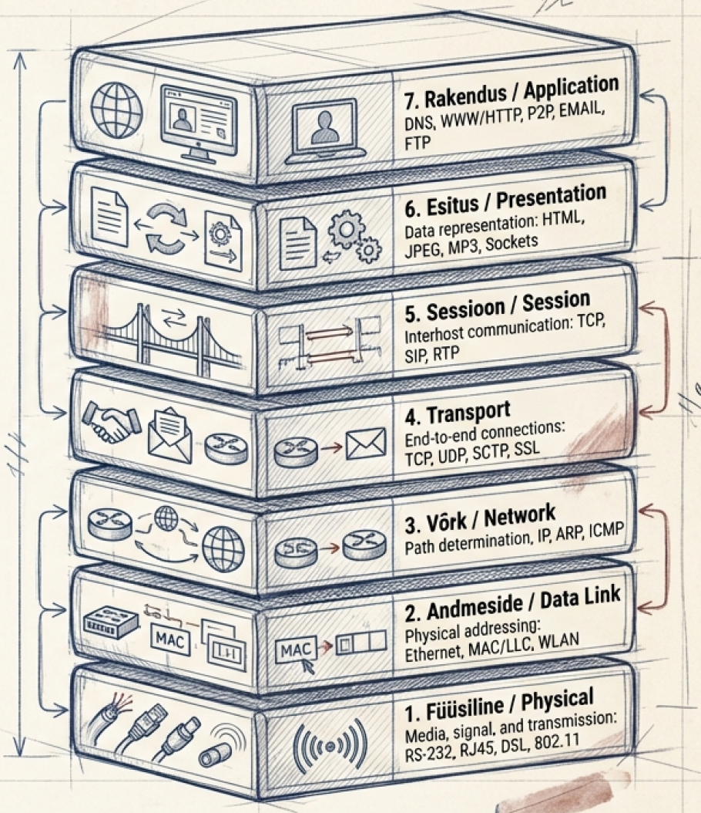
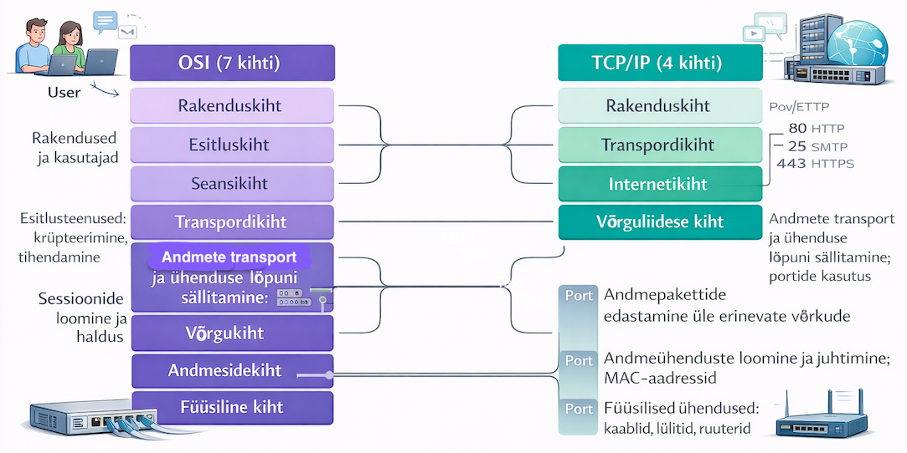
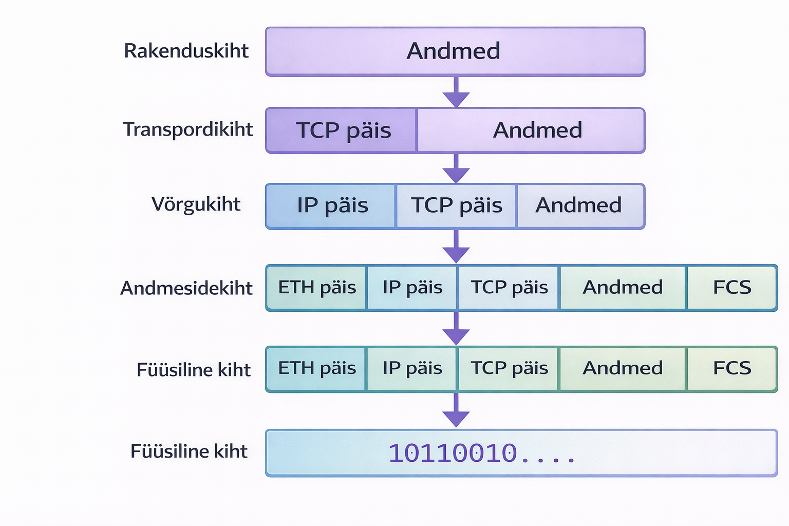

---
tags:
  - OSI
  - TCP/IP
---

# Protokollid ja mudelid

!!! abstract "Eesmärgid"
    Selle peatüki läbimise järel:

    - Oskan selgitada, mis on võrguprotokoll ja miks protokolle vajatakse
    - Oskan nimetada protokolli kolm komponenti (süntaks, semantika, ajastus)
    - Oskan loetleda OSI mudeli 7 kihti ja kirjeldada igaühe rolli
    - Oskan võrrelda OSI ja TCP/IP mudeleid
    - Oskan selgitada kapseldamise protsessi
    - Oskan seostada levinumaid protokolle õige OSI kihiga

## Miks on protokollid vajalikud?

Kujuta ette 1970ndaid. Suured organisatsioonid ostsid arvuteid erinevatelt tootjatelt — IBM, DEC, Burroughs. Iga tootja kasutas oma formaati ja reegleid, ja tulemus oli etteaimatav: need masinad ei saanud omavahel suhelda. Andmeid kanti sõna otseses mõttes käsitsi magnetlintidel ühest masinast teise. See oli nagu maailm, kus iga riik räägib oma keelt ja tõlke ei eksisteeri.

Selle probleemi lahendavad **protokollid** — kokkulepitud reeglid andmevahetuseks. Protokoll ütleb: "me kõik nõustume, et andmed näevad välja nii, tähendavad seda ja saadetakse sellises järjekorras." Ilma protokollideta oleks internet võimatu.

| Ajajärk | Mis toimus | Kuhu jõuti |
|---|---|---|
| 1960ndad | Iga tootja oma süsteem | Kaos — keegi ei saa kellegagi suhelda |
| 1970ndad | IBM räägib IBM-ga, DEC räägib DEC-ga | Suletud "saarekesed" |
| 1984 | ISO loob OSI mudeli | Universaalne raamistik |
| 1990ndad | Internet plahvatab | TCP/IP võidab de facto standardina |
| Täna | IoT, 5G, pilveteenused | Protokollid arenevad edasi |

*Tabel 1.1. Protokollide ajalugu*

## Protokolli komponendid

Iga protokoll defineerib kolm asja, mis tagavad eduka suhtluse. Mõtle tavalisele vestlusele — sealgi on reeglid: sa tead, mis keelt rääkida (süntaks), mida sõnad tähendavad (semantika) ja et sa ootad ära, kuni teine lõpetab rääkimise (ajastus). Protokollid töötavad samamoodi.[^tanenbaum]

**Süntaks** määrab andmevormingu ja struktuuri — kuidas bitid ja baidid pakettidesse paigutatakse. Näiteks HTTP päring algab alati võtmesõnaga `GET` või `POST`, millele järgneb tee ja versioon.

**Semantika** defineerib väljade tähenduse. Näiteks port 80 tähendab HTTP veebiserverit, port 443 tähendab HTTPS turvalist ühendust. Ilma semantikata oleks andmed lihtsalt mõttetu numbrijada.

**Ajastus** kehtestab sündmuste järjekorra ja ajalised piirangud. Näiteks kui server ei vasta 30 sekundi jooksul, loetakse ühendus katkenenuks ja proovitakse uuesti.

!!! example "HTTP päring praktikas"
    Kui brauser avab veebilehe, saadab ta serverile HTTP päringu: `GET /index.html HTTP/1.1`. Siin on süntaks (GET käsk, tee, versioon), semantika (GET = "anna mulle see leht") ja ajastus (server peab vastama mõistliku aja jooksul).

## Kihiline arhitektuur

Miks on võrguprotokollid organiseeritud kihtidena, mitte ühe suure monoliitkoodina? Sest nii on lihtsam. Kujuta ette postiteenust: keegi kirjutab kirja (sisu), keegi paneb ümbrikusse (aadress), keegi sorteerib postimajas (marsruutimine), keegi viib autoga kohale (transport). Iga inimene teeb oma tööd, ilma et peaks mõistma kogu süsteemi.

Sama loogika kehtib võrkudes. **Keerukuse haldamine** — iga kiht lahendab ühte konkreetset probleemi. **Paindlikkus** — WiFi saab asendada 5G-ga ilma ülemisi kihte muutmata. **Standardiseerimine** — iga kihi jaoks saab luua eraldi standardid, ja eri tootjad saavad arendada tooteid sama kihi jaoks.

## OSI mudel

1970ndatel oli võrgumaailm kaos. IBM-i arvutid rääkisid ainult IBM-i arvutitega (SNA protokoll), DEC-i masinad ainult DEC-iga (DECnet), Honeywell, Burroughs — igal tootjal oma suletud süsteem. Ettevõtted, kes olid ostnud seadmeid erinevatelt tootjatelt, avastasid, et need lihtsalt ei suhtle omavahel.

1977. aastal alustas ISO (*International Organization for Standardization*) tööd universaalse mudeli kallal. Hubert Zimmermann Prantsusmaalt ja Charles Bachman USA-st juhtisid projekti, mis kulmineerus 1984. aastal **OSI** (*Open Systems Interconnection*) mudeli ametliku standardina.[^zimmermann]

OSI mudeli põhiidee oli lihtne: jaga kogu võrgusuhtlus **seitsmeks kihiks**, kus iga kiht lahendab konkreetset probleemi ja suhtleb ainult oma naaberkihtidega. Nii saab iga kihti arendada ja asendada sõltumatult teistest.

Naljakas on see, et OSI mudeli enda protokollid jäid TCP/IP-le alla — kui ISO alles lõpetas oma standardit, oli TCP/IP juba ARPANET-i kaudu laialdaselt kasutuses. Aga mudel ise jäi elama. Kui võrguinsener ütleb "Layer 2 switch", "Layer 3 routing" või "Layer 7 firewall" — see on OSI keel ja seda kasutavad kõik igapäevaselt.

<figure markdown="span">
  
  <figcaption>Joonis 1.1. OSI mudeli 7 kihti (Talvik, 2025). Loodud tehisintellekti abil.</figcaption>
</figure>

!!! tip "Meeldejätmise nipp"
    Alt üles: **P**lease **D**o **N**ot **T**hrow **S**ausage **P**izza **A**way (Physical, Data Link, Network, Transport, Session, Presentation, Application).

### Kiht 1: Füüsiline kiht (*Physical*)

Kõige alumine kiht ja kõige "käegakatsutavam". Siin pole mingit loogikat ega aadresse — ainult **bitid**, mis liiguvad kaablis elektrina, fiibris valgusena või õhus raadiolainetena. See kiht määrab, milline pistik kaabli otsas on, millise pingega signaale saadetakse ja kui kiiresti. Seadmed: **hub** ja **repeater** — mõlemad lihtsalt kordavad signaali edasi, mõtlemata.

### Kiht 2: Andmesidekiht (*Data Link*)

Siin muutuvad bitid esimest korda millekski mõistlikuks — **kaadriteks** (*frames*). Andmesidekiht lisab igale andmeportsuile lähte- ja siht-**MAC-aadressi** ning kontrollsumma (CRC), et tuvastada ülekandel tekkinud vigu. Kui füüsiline kiht on maantee, siis andmesidekiht on postiljon, kes teab, millisse postkasti kiri panna. Seadmed: **kommutaator** (*switch*) ja **sild** (*bridge*).

### Kiht 3: Võrgukiht (*Network*)

Andmesidekiht toimib ainult ühes võrgus. Aga kui andmed peavad jõudma teise võrku — teise linna, teise riiki? Sellega tegeleb võrgukiht. Ta lisab **IP-aadressi** (nii lähte- kui sihtaadressi), TTL (*Time To Live*) välja ja fragmenteerib vajadusel suured paketid väiksemateks. Kui andmesidekiht on postiljon, siis võrgukiht on viidasüsteem: "Tallinn vasakule, Tartu paremale". Seadmed: **ruuter** (*router*).

### Kiht 4: Transpordikiht (*Transport*)

Alumised kihid toimetavad andmed õigesse arvutisse, aga arvutis jookseb korraga palju programme. Transpordikiht teab, millise **rakenduse** jaoks andmed on mõeldud, kasutades **pordinumbreid** (port 80 = veebileht, port 443 = turvaline veebileht, port 22 = SSH). Siin on kaks valikut: **TCP** (usaldusväärne, kontrollib kas kõik kohale jõudis) ja **UDP** (kiire, aga ei kontrolli — hea videokõnede ja mängude jaoks).

### Kihid 5–7: Ülemised kihid

**Seansikiht** (5) haldab seansse — alustab, sünkroniseerib ja lõpetab ühendusi. **Esitluskiht** (6) tegeleb andmete teisendamisega — pakkimine, krüpteerimine, kodeeringute tõlkimine. **Rakenduskiht** (7) on kasutajale kõige lähemal — HTTP veebilehtede jaoks, SMTP e-posti jaoks, DNS nimede lahendamiseks. Praktikas on need kolm kihti TCP/IP mudelis ühendatud üheks rakenduskihiks, sest piir nende vahel on sageli hägune.

| Kiht | Andmeühik | Aadress | Seade |
|---|---|---|---|
| 7–5. Rakendus/Esitlus/Seanss | Andmed (*data*) | — | — |
| 4. Transport | Segment | Port (nt 80, 443) | — |
| 3. Võrk | Pakett (*packet*) | IP-aadress | Ruuter |
| 2. Andmeside | Kaader (*frame*) | MAC-aadress | Kommutaator |
| 1. Füüsiline | Bitt | — | Hub, repeater |

*Tabel 1.2. OSI kihtide andmeühikud, aadressid ja seadmed*

## TCP/IP mudel

Kui ISO akadeemikud alles jõnksutasid paberil kihte, oli teisel pool Atlandit juba valmis midagi, mis tegelikult töötas. 1974. aastal avaldasid **Vint Cerf** ja **Bob Kahn** artikli, mis kirjeldas protokolli pakettide edastamiseks võrkude vahel.[^cerf] Sellest sai TCP/IP — protokollide komplekt, mida USA kaitseministeeriumi ARPANET hakkas kohe kasutama.

1. jaanuaril 1983 toimus ARPANET-is **"lipu päev"** (*flag day*) — kõik võrgusõlmed lülitati ühe päevaga NCP protokollilt TCP/IP-le. See oli riskantne, aga töötas. Sellest kuupäevast loetakse interneti sünnipäeva.

TCP/IP mudel on 4-kihiline ja pragmaatiline. Kui OSI on teooria, siis TCP/IP on praktika — kogu internet töötab selle mudeli järgi. TCP/IP lihtsustab OSI mudelit, ühendades ülemised kihid (5–7) üheks rakenduskihiks ja alumised kihid (1–2) üheks võrgujuurdepääsu kihiks.

<figure markdown="span">
  
  <figcaption>Joonis 1.2. OSI ja TCP/IP mudelite võrdlus (Talvik, 2025). Loodud tehisintellekti abil.</figcaption>
</figure>

| Omadus | OSI | TCP/IP |
|---|---|---|
| Kihtide arv | 7 | 4 |
| Päritolu | ISO standard (1984) | ARPANET (1970ndad) |
| Lähenemine | Teoreetiline, range | Praktiline, paindlik |
| Kasutus | Õppevahend, terminoloogia | Internet, reaalsed süsteemid |
| Ülemised kihid | Eraldi (5, 6, 7) | Ühendatud (Application) |
| Alumised kihid | Eraldi (1, 2) | Ühendatud (Network Access) |

*Tabel 1.3. OSI ja TCP/IP mudelite võrdlus*

## Kapseldamine

Kui andmed liiguvad saatjalt vastuvõtjale, lisab iga kiht oma päise (*header*) — seda protsessi nimetatakse **kapseldamiseks** (*encapsulation*). Mõtle sellest nagu ümbrikusse panemisest: kirjutad kirja (andmed), paned ümbrikusse (transpordikiht lisab pordi), paned teise ümbrikusse (võrgukiht lisab IP-aadressi), paned kolmandasse (andmesidekiht lisab MAC-aadressi). Vastuvõtja avab ümbrikud ükshaaval — see on **dekapseldamine**.

<figure markdown="span">
  
  <figcaption>Joonis 1.3. Andmete kapseldamine OSI kihtides (Talvik, 2025). Loodud tehisintellekti abil.</figcaption>
</figure>

!!! example "E-kirja saatmine sammhaaval"
    1. **Rakenduskiht:** "Tere, kuidas läheb?" (300 baiti)
    2. **Transpordikiht:** TCP päis (20 B) + andmed = 320 baiti
    3. **Võrgukiht:** IP päis (20 B) + eelmine = 340 baiti
    4. **Andmesidekiht:** Ethernet päis (14 B) + eelmine + CRC (4 B) = 358 baiti
    5. **Füüsiline kiht:** 358 × 8 = 2864 bitti elektrit, valgust või raadiolaineid

    Vastuvõtja pool toimub täpselt vastupidine protsess — igal kihil eemaldatakse vastav päis.

## Levinumad protokollid

Siin on protokollid, mida selle kursuse jooksul kõige rohkem kohtad. Ära muretse, kui kõik nimed kohe meelde ei jää — me käsitleme igaüht eraldi peatükis põhjalikumalt.

| Protokoll | Kiht | Port | Kasutus |
|---|---|---|---|
| HTTP | Rakendus | 80 | Veebilehed |
| HTTPS | Rakendus | 443 | Turvalised veebilehed |
| FTP | Rakendus | 21 | Failide ülekanne |
| SSH | Rakendus | 22 | Turvaline kaughaldus |
| DNS | Rakendus | 53 | Nimede lahendamine |
| DHCP | Rakendus | 67/68 | IP automaatne omistamine |
| SMTP | Rakendus | 25 | E-posti saatmine |
| TCP | Transport | — | Usaldusväärne transport |
| UDP | Transport | — | Kiire transport |
| IP | Võrk | — | Marsruutimine |
| ICMP | Võrk | — | Diagnostika (ping) |
| ARP | Andmeside | — | IP → MAC tõlkimine |

*Tabel 1.4. Levinumad võrguprotokollid*

!!! warning "Telnet vs SSH"
    Telnet (port 23) saadab kõik andmed, sealhulgas paroolid, **krüpteerimata tekstina**. Kasuta alati SSH-d (port 22), mis krüpteerib kogu liikluse. Telnet on tänapäeval vastuvõetamatu turvarisk.

## Standardiorganisatsioonid

Protokollid ei teki iseenesest — neid loovad ja haldavad rahvusvahelised organisatsioonid. Erinevalt sellest, mida võiks arvata, pole see igav bürokraatia — just tänu nendele organisatsioonidele saab su Eesti telefon suhelda Jaapani serveriga probleemideta.

| Organisatsioon | Vastutusala | Näited |
|---|---|---|
| IEEE | LAN ja WLAN standardid | 802.3 (Ethernet), 802.11 (WiFi) |
| IETF | Interneti protokollid | TCP/IP, HTTP, DNS (RFC dokumendid) |
| ISO | Rahvusvahelised standardid | OSI mudel |
| ITU | Telekommunikatsioon | H.264 (video), sagedused |
| W3C | Veebistandardid | HTML, CSS, JavaScript |

*Tabel 1.5. Peamised standardiorganisatsioonid*

IETF haldab interneti protokolle läbi **RFC** (*Request for Comments*) dokumentide — näiteks RFC 791 defineerib IP protokolli ja RFC 793 TCP protokolli. Nimi on eksitav — "Request for Comments" kõlab nagu keegi küsib arvamust, aga tegelikult on RFC-d lõplikud standardid, mille järgi kogu internet töötab. Uued RFC-d lisanduvad pidevalt, kuid vanad jäävad kehtima, kui neid pole sõnaselgelt asendatud.[^rfc791]

!!! info "Uuri ise"
    - [OSI vs TCP/IP — visuaalne selgitus](https://www.youtube.com/watch?v=3b_TAYtzuho) — animeeritud võrdlus kahe mudeli vahel
    - [Wireshark kapseldamine praktikas](https://www.wireshark.org/) — tasuta tööriist võrguliikluse analüüsiks, kus näed päriselt kihte ja päiseid
    - [RFC 791 — IP protokolli originaaldokument](https://datatracker.ietf.org/doc/html/rfc791) — 1981. aastast! Loe vähemalt esimest lehekülge

---

## Kokkuvõte

Protokollid on kokkulepitud reeglid, mis võimaldavad erinevatel seadmetel omavahel suhelda. Iga protokoll defineerib süntaksi (vorming), semantika (tähendus) ja ajastuse (millal). Võrguarhitektuur on organiseeritud kihtidena — OSI mudel pakub 7-kihilist teoreetilist raamistikku, TCP/IP mudel 4-kihilist praktilist implementatsiooni. Andmed liiguvad läbi kihtide kapseldamise teel, kus iga kiht lisab oma päise. Täna kasutab kogu internet TCP/IP mudelit, aga OSI terminoloogia on igapäevane keel iga võrguinseneri jaoks.

---

## Enesekontroll

??? question "1. Mis on võrguprotokoll ja miks seda vajatakse?"
    Võrguprotokoll on kokkulepete süsteem, mis määrab andmevahetuse reeglid. Ilma protokollideta ei saa erinevate tootjate seadmed omavahel suhelda — igaüks kasutaks oma formaati.

??? question "2. Nimeta protokolli kolm komponenti ja selgita igaüht."
    Süntaks (kuidas andmed on vormindatud), semantika (mida andmed tähendavad) ja ajastus (millal ja kui kiiresti andmeid saadetakse).

??? question "3. Nimeta OSI mudeli 7 kihti alt üles."
    Füüsiline, andmeside, võrgu, transpordi, seansi, esitlus, rakenduskiht.

??? question "4. Mis vahe on OSI ja TCP/IP mudelil?"
    OSI on 7-kihiline teoreetiline mudel (ISO standard), TCP/IP on 4-kihiline praktiline mudel, millel põhineb internet. TCP/IP ühendab OSI ülemised kihid (5–7) rakenduskihiks ja alumised (1–2) võrgujuurdepääsu kihiks.

??? question "5. Mis on kapseldamine ja kuidas see toimib?"
    Kapseldamine on protsess, kus iga kiht lisab andmetele oma päise. Rakenduskihi andmetele lisatakse TCP päis (segment), seejärel IP päis (pakett), seejärel Ethernet päis ja CRC (kaader), ning lõpuks teisendatakse kõik bittideks.

??? question "6. Millisel OSI kihil töötab switch ja millisel ruuter?"
    Kommutaator töötab andmesidekihil (kiht 2) ja kasutab MAC-aadresse. Ruuter töötab võrgukihil (kiht 3) ja kasutab IP-aadresse.

[^tanenbaum]: Tanenbaum, A. S. & Wetherall, D. (2021). *Computer Networks* (6th ed.). Pearson.

[^zimmermann]: Zimmermann, H. (1980). *OSI Reference Model — The ISO Model of Architecture for Open Systems Interconnection*. IEEE Transactions on Communications, 28(4). https://doi.org/10.1109/TCOM.1980.1094702

[^cerf]: Cerf, V. & Kahn, R. (1974). *A Protocol for Packet Network Intercommunication*. IEEE Transactions on Communications, 22(5). https://doi.org/10.1109/TCOM.1974.1092259

[^rfc791]: Postel, J. (1981). *Internet Protocol*. RFC 791. https://datatracker.ietf.org/doc/html/rfc791
