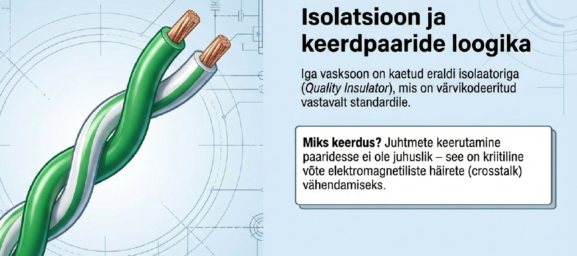
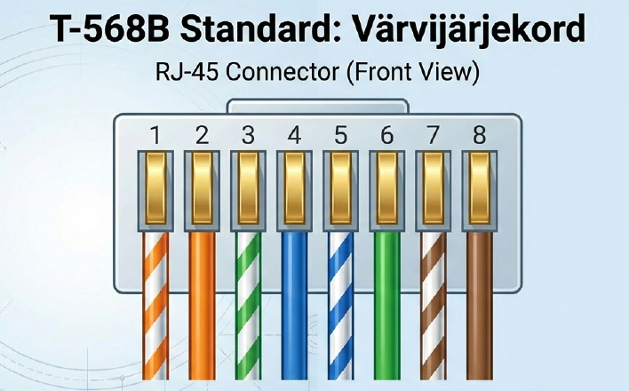
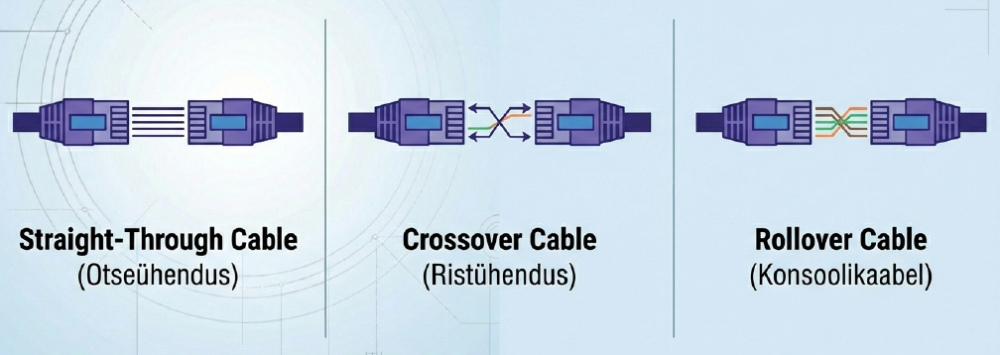
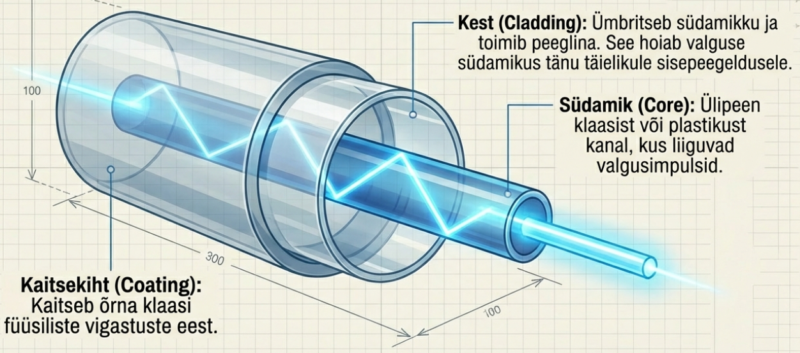
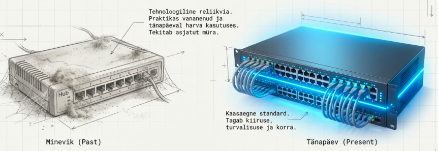

---
tags:
  - Ethernet
  - OSI
---

# Füüsiline kiht

!!! abstract "Eesmärgid"
    Selle peatüki läbimise järel:

    - Oskan selgitada füüsilise kihi rolli OSI mudelis
    - Oskan eristada kolme signaali edastamise viisi (elekter, valgus, raadiolained)
    - Oskan võrrelda keerdpaarkaablite kategooriaid ja varjestuse tüüpe
    - Oskan selgitada fiiberoptiliste kaablite eeliseid ja multimode/singlemode erinevust
    - Oskan eristada T-568A ja T-568B standardeid
    - Oskan selgitada straight-through, crossover ja rollover kaablite kasutust
    - Oskan eristada half-duplex ja full-duplex režiime

## Kõik algab füüsikast

Füüsiline kiht (*Physical Layer*, OSI kiht 1) on kõige alumine kiht — kõik, mida saab käega katsuda. Kaablid, pistikud, signaalid. Selle kihi ülesanne on lihtne: muuta bitid (1 ja 0) füüsilisteks signaalideks ja transportida need ühest punktist teise. Mitte midagi enamat. Mäletad Matrixi filmi seda stseeni, kus Neo näeb ekraanil ainult jooksvaid nulle ja ühtesid? Füüsiline kiht ongi see koht — ainult et päriselus ei ole need rohelised numbrid ekraanil, vaid elektriimpulsid kaablis, valgussähvatused fiibris või raadiolained õhus. Füüsiline kiht ei tea ega hooli, mida andmed tähendavad — ta lihtsalt kannab neid.

Aga miks on selle lihtsa ülesandega nii palju jama? Miks on olemas kümned erinevad kaablitüübid, pistikud ja standardid?

Lugu on selline. 1970ndatel, kui esimesed kohtvõrgud tekkisid, kasutati seda, mis käepärast oli — **koaksiaalkaablit**, sama tüüpi kaablit, mis tõi televiisori pildi tuppa. See töötas, aga oli habras: kõik arvutid jagasid ühte kaablit (siinitopoloogia) ja üks katkestus pani kogu võrgu maha. 1980ndatel hakati kasutama **keerdpaarkaablit** koos hub'ide ja kommutaatoritega — iga arvuti sai oma eraldi kaabli. See oli suur samm edasi, aga piirdus ~100 meetri ja mõnekümne megabitiga. 1990ndatel tuli mängu **fiiberoptika** — valgus klaasis, mis ulatus kilomeetreid kaugele ja kandis gigabitte. Ja 1990ndate lõpus lisandus **WiFi** — raadiolained, mis vabastas meid kaablist täielikult.

Iga uus tehnoloogia ei asendanud eelmist täielikult, vaid leidis oma niši. Sellepärast on tänapäeval kasutusel kõik kolm: vaskkaabel kontorisse, fiiberkiud hoonetevahel ja WiFi mobiilseadmetele. Vaatame igaüht lähemalt.

## Kolm signaali tüüpi

Iga füüsiline meedium kasutab erinevat signaali:

**Elektrisignaalid** liiguvad vaskkaablites. Bitid esitatakse erinevate pingetasemetena — kõrgem pinge tähendab 1, madalam 0. Odav ja kõikjal saadaval, aga signaal nõrgeneb ~100 meetri järel ja elektromagnetilised häired (*EMI*) võivad andmeid rikkuda.

**Valgusimpulsid** liiguvad fiiberoptilistes kaablites. LED või laser saadab valgust läbi klaaskiu — valgus sees = 1, valgus väljas = 0. EMI-immuunne ja kümned kilomeetrid pole probleem.

**Raadiolained** levivad õhus — WiFi, Bluetooth, 5G. Kaablit pole vaja, aga signaal nõrgeneb kiiresti. Betoonseina läbimine võtab signaalist korraliku tuki, akvaarium või mikrolaineahi koduruuteri kõrval räägivad samuti.

| Meedium | Signaal | Tüüpiline kaugus | EMI tundlikkus |
|---|---|---|---|
| Vaskkaabel (UTP) | Elekter | Kuni 100 m | Tundlik |
| Fiiberoptiline | Valgus | Kuni 100+ km | Immuunne |
| Raadiolained | Elektromagnetiline | Kuni ~50 m (WiFi) | Tundlik |

*Tabel 2.1. Signaali edastamise viisid*

---

## Vaskkaablid — kohtvõrgu selgroog

Vaskkaabel on see, mida sa näed iga arvuti taga ja mida sa praktikumis ise ehitad. Kuigi fiiberkiud on kiirem ja WiFi mugavam, on vaskkaabel endiselt **90% kohtvõrgu paigalduste alus** — sest ta on odav, lihtne ja piisavalt kiire.

### Koaksiaalkaabel — ajalooline

Koaksiaalkaabel koosneb keskmisest vasejuhtmest, isolatsioonist, metallist punutud varjestusest ja välimisest kestast. Mäletad siinitopoloogiat? Just koaksiaalkaablit see kasutas — kõik arvutid olid T-konnektoritega ühe pika kaabli küljes. Kohtvõrkudes on ta ammu asendatud keerdpaariga, aga kaabel-TV ja satelliitantennide juures näed teda siiani.

### Keerdpaarkaabel — tänapäeva standard

Keerdpaarkaabel (*twisted pair*) on kõige levinum võrgukaabel.[^ieee8023] Kaabel koosneb 8 vaskjuhtmest (4 paari), mis on omavahel keerdunud. Keerdmine pole juhuslik — see vähendab elektromagnetilist läbirääkimist (*crosstalk*) paaride vahel ja parandab signaali kvaliteeti. Mida tihedam keerd, seda parem kaitse.

<figure markdown="span">
  
  <figcaption>Joonis 2.2. UTP keerdpaarkaabli sisemine ülesehitus — 4 keerdunud paari (Talvik, 2025). Loodud tehisintellekti abil.</figcaption>
</figure>

#### Varjestuse tüübid

| Tüüp | Varjestus | Hind | Kasutus |
|---|---|---|---|
| UTP | Puudub | € | Kodu, kontor — 90% paigaldustest |
| FTP (F/UTP) | Foolium ümber kõigi paaride | €€ | Kontor, serverruum |
| STP (S/UTP) | Punutud metallist võrk | €€€ | Tööstus, kõrge EMI |
| SFTP (S/FTP) | Foolium + metallist võrk | €€€€ | Andmekeskused |

*Tabel 2.2. Keerdpaarkaablite varjestuse tüübid*

!!! tip "Praktiline soovitus"
    Kodu ja kontor → UTP on täiesti piisav. Varjestatud kaablid vajavad maandust — vale paigaldus teeb asja halvemaks, mitte paremaks.

#### Kategooriad

| Kategooria | Max kiirus | Sagedus | Max pikkus | Kasutus |
|---|---|---|---|---|
| Cat 5e | 1 Gbps | 100 MHz | 100 m | Kodu, kontor — kõige levinum |
| Cat 6 | 10 Gbps | 250 MHz | 55 m (10G) / 100 m (1G) | Ettevõte, server |
| Cat 6a | 10 Gbps | 500 MHz | 100 m | Andmekeskus |
| Cat 7 | 10 Gbps | 600 MHz | 100 m | Spetsiaalne, harv |
| Cat 8 | 40 Gbps | 2000 MHz | 30 m | Andmekeskus, lühikesed vahemaad |

*Tabel 2.3. Keerdpaarkaablite kategooriad*

!!! info "Mis kategooriat valida?"
    Cat 5e on piisav enamikule kodudele ja kontoritele — toetab 1 Gbps 100 meetrini. Cat 6 on tulevikukindel valik ettevõtetele. Cat 6a ja kõrgemad on mõeldud andmekeskustele, kus vajatakse 10 Gbps+ kiiruseid.

### RJ-45 pistik ja standardid

<figure markdown="span">
  
  <figcaption>Joonis 2.3. RJ-45 pistik ja T-568B kiudude värvijärjekord (Talvik, 2025). Loodud tehisintellekti abil.</figcaption>
</figure>

RJ-45 (*Registered Jack 45*) on 8-positsiooniline, 8-kontaktiline pistik, mida kasutatakse Ethernet-kaablite jaoks. See on see läbipaistev plastikust otsik, mida sa oled kindlasti näinud iga arvuti taga. Kaks standardit määravad kiudude värvijärjekorra pistikus: **T-568A** ja **T-568B**.[^tia568]

| Standard | Levimus | Märkus |
|---|---|---|
| T-568B | 90%+ | Valdav standard, kasuta seda |
| T-568A | ~10% | Vanemad hooned, valitsusasutused |

*Tabel 2.4. T-568 standardite võrdlus*

Erinevus kahe standardi vahel: oranž ja roheline paari positsioonid on vahetatud (PIN 1–2 ja PIN 3–6). Mõlemad töötavad sama hästi — oluline on, et **mõlemad otsad kasutaksid sama standardit**.

#### Aktiivsed kiud erinevatel kiirustel

| Kiirus | Kasutatavad PIN-id | Paarid |
|---|---|---|
| 10/100 Mbps | 1, 2, 3, 6 | 2 paari (TX + RX) |
| 1 Gbps (1000BASE-T) | Kõik 1–8 | 4 paari (bi-directional) |
| 10 Gbps (10GBASE-T) | Kõik 1–8 | 4 paari (bi-directional) |

*Tabel 2.5. PIN-ide kasutus erinevatel Ethernet-kiirustel*

10/100 Mbps kasutab ainult nelja kiudu kaheksast — üks paar saadab (TX), teine võtab vastu (RX). Gigabit Ethernet ja kiiremad kasutavad kõiki kaheksat kiudu, kus iga paar saadab ja võtab vastu samaaegselt.

### Kaablitüübid — mida millega ühendada

<figure markdown="span">
  
  <figcaption>Joonis 2.4. Straight-through, crossover ja rollover kaablite erinevus (Talvik, 2025). Loodud tehisintellekti abil.</figcaption>
</figure>

| Kaabel | Otsad | Kasutus | Vajalik tänapäeval? |
|---|---|---|---|
| Straight-through (sirge) | T-568B ↔ T-568B | PC ↔ Kommutaator, Ruuter ↔ Kommutaator | Jah — 90% juhtudest |
| Crossover (rist) | T-568A ↔ T-568B | PC ↔ PC, Kommutaator ↔ Kommutaator | Ei — Auto-MDIX tuvastab automaatselt |
| Rollover (konsool) | PIN 1↔8, 2↔7 jne | PC ↔ Cisco konsooliport | Jah — seadmete esmane seadistamine |

*Tabel 2.6. Ethernet-kaablite tüübid*

**Straight-through** — mõlemad otsad sama standard. Kasutatakse erinevate seadmete ühendamiseks (PC → kommutaator, kommutaator → ruuter). See on kaabel, mida sa 90% ajast kasutad.

**Crossover** — üks ots T-568A, teine T-568B. Kasutatakse sarnaste seadmete otseühendamiseks (PC → PC). Tänapäeval enam praktiliselt vajalik pole, sest Auto-MDIX tuvastab automaatselt, millist tüüpi ühendus on vaja. Väga vanadel seadmetel võib Auto-MDIX puududa.

**Rollover** (Cisco console cable) — kiudude järjekord on täielikult pööratud. See **ei ole Ethernet-kaabel**, vaid seeriaühendus RJ-45 pistikutega. Kasutatakse arvuti ühendamiseks Cisco ruuteri või kommutaatori konsoolipordiga esmaseks seadistamiseks. Seda sinist lamedakaablit näed sa laboris palju.

---

## Fiiberoptika — valgus klaasis

Fiiberoptilises kaablis liiguvad andmed **valgusimpulsidena** läbi klaas- või plastikkiudude. Peamine eelis vaskkaablite ees: EMI immuunsus (valgust ei sega elektriline müra), pikad vahemaad (kümned kuni sajad kilomeetrid) ja suurem läbilaskevõime. Miinus on hind ja paigalduse keerukus — fiibri keevitamiseks läheb vaja eriseadmeid, mis maksavad tuhandeid eurosid.

Kus fiiberkiudu kasutatakse? ISP-de tuumvõrgus (Tallinna ja Tartu vahel näiteks), andmekeskustes (serveritevaheline ühendus), merepõhjakaablites (Euroopa ja Ameerika vahel) ja üha rohkem ka "fiibri koduni" (*FTTH — Fiber To The Home*) lahendustes, mida Telia ja Elisa Eestis aktiivselt ehitavad.

<figure markdown="span">
  
  <figcaption>Joonis 2.5. Fiiberoptilise kaabli läbilõige — südamik, mantel ja kaitsekiht (Talvik, 2025). Loodud tehisintellekti abil.</figcaption>
</figure>

### Multimode vs Singlemode

| Tüüp | Südamiku läbimõõt | Max vahemaa | Valgusallikas | Kasutus |
|---|---|---|---|---|
| Multimode (MM) | 50–62.5 μm | Kuni 2 km | LED | Hooned, kampused |
| Singlemode (SM) | 8–10 μm | Kuni 100+ km | Laser | ISP-d, linnadevaheline |

*Tabel 2.7. Fiiberoptiliste kaablite tüübid*

Multimode kasutab LED valgusallikat ja laiemat südamikku — signaal põrkub kiu sees mitmel trajektooril, mis piirab kaugust. Singlemode kasutab laserit ja kitsast südamikku — signaal liigub ainult ühel trajektooril, mis võimaldab palju pikemaid vahemaid. Lihtne reegel: hoone sees multimode, hoonete vahel singlemode.

!!! info "WDM — üks kiud, mitu kanalit"
    Wavelength Division Multiplexing võimaldab ühes fiiberkius saata mitu erinevat valguse lainepikkust korraga — nagu raadiojaamad, mis on kõik õhus samaaegselt, kuid erinevatel sagedustel. Üks õhuke klaaskiud suudab nii kanda kordades rohkem andmeid.

### Pistikutüübid

Levinumad fiibri pistikutüübid: **LC** (*Lucent Connector* — väike, populaarne), **SC** (*Subscriber Connector* — suurem, ruudukujuline), **ST** (*Straight Tip* — bajonetilukuga, vanem). Tänapäeval on LC kõige levinum, eriti andmekeskustes, sest see on kompaktne ja lubab kõrgemat porditi tihedust.

---

## Juhtmevaba — lühidalt

WiFi, Bluetooth ja 5G kasutavad raadiolaineid andmete edastamiseks. See on mugav, aga kaablita ühendus on alati aeglasem ja ebastabiilsem kui kaabel. Juhtmevabadest võrkudest räägime põhjalikult [Peatükk 3: Juhtmevabad võrgud](03_juhtmevabad_vorgud.md).

---

## Duplex ja Layer 1 seadmed

### Half-duplex ja full-duplex

**Half-duplex** — seade saab korraga kas saata või vastu võtta, mitte mõlemat. Nagu walkie-talkie: üks räägib, teine kuulab, ja siis vahetatakse. Vana hub-põhine Ethernet töötas just nii — sellepärast tekkisidki kollisioonid. Kollisioonide haldamiseks kasutati CSMA/CD protokolli.

**Full-duplex** — seade saab saata ja vastu võtta samaaegselt. Nagu telefonikõne — mõlemad räägivad ja kuulavad korraga. Kõik tänapäeva kommutaatorid töötavad full-duplex režiimis. See tähendab, et efektiivne läbilaskevõime on topelt ja kollisioone ei eksisteeri.

### Hub ja repeater — ajaloolised seadmed

**Hub** (jaotur) — kopeerib sissetuleva signaali **kõigile** portidele. Ei tea MAC-aadresse, ei mõtle — lihtsalt kordistab signaali. Mäletad võrguseadmete peatüki klassiruumi analoogiat? Just seda hub teeb. Aegunud ja asendatud kommutaatoritega.

**Repeater** (kordisti) — võtab nõrgenenud signaali vastu, võimendab ja saadab edasi. Pikendab kaabli efektiivset kaugust üle 100 meetri piiri. Samuti aegunud, sest tänapäeva kommutaatorid teevad seda automaatselt.

<figure markdown="span">
  
  <figcaption>Joonis 2.6. Hub saadab kõigile vs kommutaator saadab ainult õigesse porti (Talvik, 2025). Loodud tehisintellekti abil.</figcaption>
</figure>

!!! warning "Hub vs kommutaator"
    Hub saadab andmed kõigile — aeglane ja ebaturvaline. Kommutaator saadab ainult õigesse porti — kiire ja turvaline. Tänapäeval kasuta alati kommutaatorit.

!!! info "Uuri ise"
    - [How Fiber Optic Cables Are Made](https://www.youtube.com/watch?v=Smk87e0pWTk) — kuidas Corningus klaaskiudu toodetakse
    - [Ben Eater: Ethernet](https://www.youtube.com/watch?v=XaGXPObx2Gs) — Ethernet signaalide selgitus oscilloskoobil
    - [Fluke Networks: kaabli testimine](https://www.youtube.com/watch?v=dBGhKhcbI9s) — professionaalne kaabli sertifitseerimine

---

## Kokkuvõte

Füüsiline kiht vastutab bittide transportimise eest füüsilise meediumi kaudu. Kõik algas koaksiaalkaablist (siinitopoloogia), aga see oli habras. Keerdpaarkaabel (UTP) tõi igale seadmele oma kaabli ja on tänapäeval kohtvõrgu standard — Cat 5e toetab 1 Gbps, Cat 6 kuni 10 Gbps. Fiiberoptika tõi valguse klaasis, mis ulatub kilomeetritesse ja on häiretele immuunne. WiFi vabastas meid kaablist täielikult, aga kaablita ühendus jääb alati kaablile kiiruses alla. RJ-45 pistikud järgivad T-568A/B standardeid ja tänapäeva võrgud kasutavad full-duplex ühendusi kommutaatoritega.

---

## Enesekontroll

??? question "1. Mis on füüsilise kihi peamine ülesanne?"
    Muuta bitid (1 ja 0) füüsilisteks signaalideks (elekter, valgus, raadiolained) ja transportida need saatjalt vastuvõtjale.

??? question "2. Mis vahe on UTP ja STP kaablil?"
    UTP (Unshielded Twisted Pair) ei oma varjestust — odav ja paindlik, piisav enamikule kasutustele. STP (Shielded Twisted Pair) omab metallist varjestust, mis kaitseb elektromagnetiliste häirete eest, kuid on kallim, jäigem ja vajab maandust.

??? question "3. Miks kasutab 1 Gbps Ethernet kõiki 8 kiudu, aga 100 Mbps ainult 4?"
    100 Mbps kasutab eraldi paare saatmiseks (TX) ja vastuvõtmiseks (RX). 1 Gbps vajab suuremat läbilaskevõimet ja kasutab kõiki 4 paari samaaegselt kahes suunas (bi-directional).

??? question "4. Mis vahe on multimode ja singlemode fiibril?"
    Multimode kasutab laiemat südamikku (50–62.5 μm) ja LED valgusallikat — lühemate vahemaade jaoks (kuni 2 km). Singlemode kasutab kitsast südamikku (8–10 μm) ja laserit — pikkade vahemaade jaoks (kuni 100+ km).

??? question "5. Miks pole crossover-kaabel tänapäeval enam vajalik?"
    Tänapäeva võrguseadmed toetavad Auto-MDIX funktsiooni, mis tuvastab automaatselt kaabli tüübi ja vahetab vajadusel TX/RX ümber. Seega töötab enamikel tänapäevastel seadmetel straight-through kaabel ka seal, kus varem oli vaja crossoverit.

??? question "6. Mis vahe on hubil ja kommutaatoril?"
    Hub töötab füüsilisel kihil (Layer 1) ja saadab andmed kõigile portidele — ei tea MAC-aadresse. Kommutaator töötab andmesidekihil (Layer 2), õpib MAC-aadresse ja saadab andmed ainult õigesse porti. Kommutaator on kiirem ja turvalisem.

[^ieee8023]: IEEE 802.3 Working Group. (2022). *IEEE Standard for Ethernet*. IEEE. https://standards.ieee.org/ieee/802.3/10422/

[^tia568]: TIA. (2017). *ANSI/TIA-568.2-D: Balanced Twisted-Pair Telecommunications Cabling and Components Standard*. Telecommunications Industry Association.
