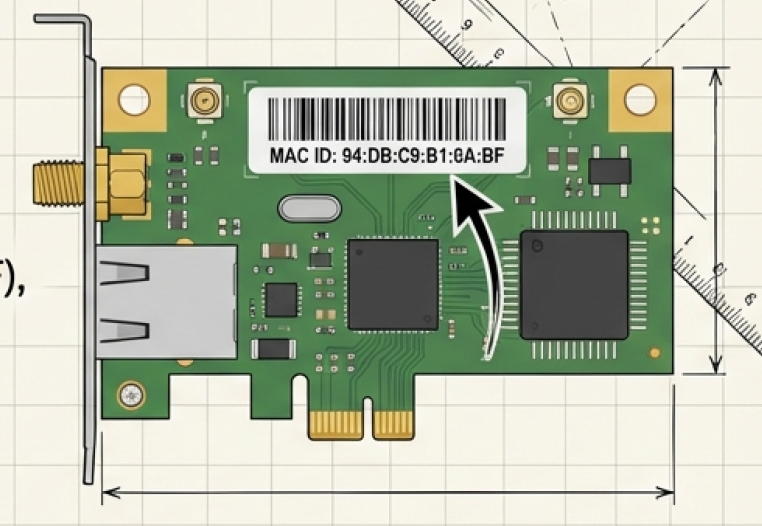
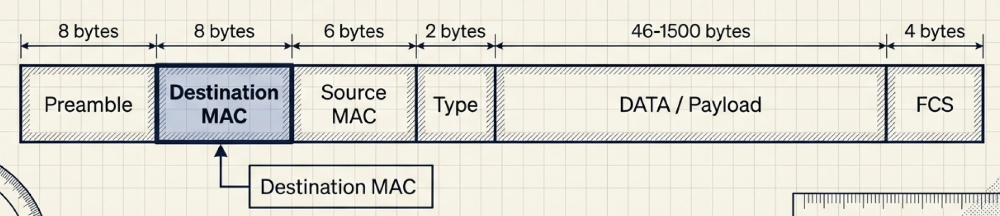
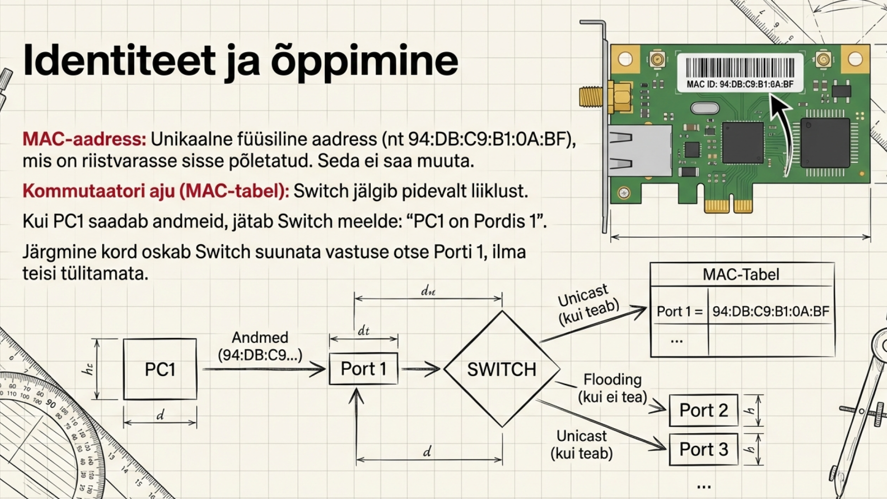

---
tags:
  - Ethernet
  - OSI
---

# Andmesidekiht

!!! abstract "Eesmärgid"
    Selle peatüki läbimise järel:

    - Oskan selgitada andmesidekihi (Layer 2) rolli OSI mudelis
    - Oskan kirjeldada MAC-aadressi struktuuri ja eristada seda IP-aadressist
    - Oskan selgitada Ethernet-kaadri ülesehitust
    - Oskan eristada unicast, broadcast ja multicast side tüüpe
    - Oskan kirjeldada, kuidas kommutaator õpib MAC-aadresse ja teeb edastamisotsuseid
    - Oskan selgitada, miks MAC-aadress on lokaalne ja IP-aadress globaalne

## Ethernet — lugu, mis muutis maailma

1973\. aastal tahtis **Bob Metcalfe** Xerox PARC laboris Californias lahendada üht lihtsat probleemi: kuidas jagada üht laserprinterit mitme arvuti vahel? Tema lahendus oli kirjutada memo pealkirjaga "Alto Aloha Network" — inspiratsiooniks seesama Hawaii ALOHAnet, millest juhtmevabade võrkude peatükis juttu oli. Ainult et Metcalfe pani raadiolainete asemel koaksiaalkaabli. Koos **David Boggsiga** ehitasid nad süsteemi, mis töötas kiirusega 2.94 Mbps, ja Metcalfe nimetas selle **Ethernet** — vana füüsikateoreetilise "eetri" järgi, mis pidi täitma kogu universumi.

Mis seejärel juhtus? Xerox hoidis Etherneti lukus. Metcalfe sai vihaseks, lahkus ja asutas oma firma **3Com**. Ta veenis kolme suurt — DEC, Intel ja Xerox — koos avatud standardi looma. 1985. aastal sündis **IEEE 802.3** ja igaüks võis Etherneti kasutada. IBM'i suletud Token Ring suri välja. Avatud Ethernet võitis — ja võidab siiani. Sellest 2.94 Mbps eksperimendist on saanud tehnoloogia, mis töötab tänapäeval kiirusega 400 Gbps.

Andmesidekiht (*Data Link Layer*, OSI kiht 2) on see koht, kus Ethernet elab. Mäletad OSI mudelit protokollide peatükist? Kiht 1 oli füüsiline — bitid kaablis. Kiht 2 on esimene, mis nendele bittidele tähenduse annab. Kui füüsiline kiht kannab tooreid bitte, siis andmesidekiht organiseerib need **kaadriteks** (*frames*), kleebib peale aadressid ja kontrollib, kas midagi läks teel katki. Mõtle sellest nii: füüsiline kiht on maantee, andmesidekiht on postiteenus — ta teab, kes saatis, kellele läheb ja kas pakk jõudis tervelt kohale.

## MAC-aadress — seadme "isikukood"

Igal võrguliidesel on **MAC-aadress** (*Media Access Control*) — 48-bitine (6 baiti) unikaalne identifikaator.[^ieee8023] See on nagu isikukood: antakse sünnil (tehasest) ja peaks olema unikaalne kogu maailmas. IP-aadress aga on nagu postiaadress — muutub, kui kolid uude võrku.

<figure markdown="span">
  
  <figcaption>Joonis 4.2. MAC-aadressi struktuur — OUI ja seadme ID (Talvik, 2025). Loodud tehisintellekti abil.</figcaption>
</figure>

```
AA:BB:CC:DD:EE:FF
└──┬──┘ └──┬──┘
   OUI      Seadme ID
  (tootja)  (unikaalne)
```

Esimesed 24 bitti on **OUI** (*Organizationally Unique Identifier*) — tootja tunnus. Viimased 24 bitti on tootja määratud järjenumber. Näiteks `00:50:56` on VMware, `B8:27:EB` on Raspberry Pi. Huvi korral saad ükskõik millise MAC-aadressi tootja tuvastada lehel [macvendors.com](https://macvendors.com/) — proovi oma telefoni või sülearvuti MAC-iga.

!!! tip "MAC-aadress pole tegelikult "igavene""
    Kuigi MAC-aadress on tehases riistvarasse kirjutatud, saab seda tarkvaraliselt muuta — ja seda tehakse üha rohkem. Miks? Sest kui su telefon kasutab igas kohvikus sama MAC-aadressi, saab kohviku ruuter sind **jälgida**: "see inimene käib siin iga teisipäev kell 8". Selepärast kasutavad iPhone ja Android (10+) iga WiFi-võrgu jaoks **juhuslikku MAC-aadressi** — privaatsuse huvides. Virtuaalmasinatel genereeritakse MAC samuti iga kord uus, sest nad pole päris riistvara ja neil polegi "tehase" aadressi.

    Nii et: IP muutub, sest ta ON mõeldud muutuma (kolid uude võrku → uus IP). MAC pidi olema püsiv, aga privaatsuse pärast muudetakse tänapäeval sedagi.

### MAC vs IP-aadress

| Omadus | MAC-aadress | IP-aadress |
|---|---|---|
| OSI kiht | 2 (andmeside) | 3 (võrgu) |
| Tüüp | Füüsiline, (enamasti) püsiv | Loogiline, muutuv |
| Ulatus | Ainult lokaalses segmendis | Globaalne (internet) |
| Määrab | Tootja (riistvara) | Administraator / DHCP (tarkvara) |
| Näide | `AA:BB:CC:DD:EE:FF` | `192.168.1.10` |

*Tabel 4.1. MAC- ja IP-aadresside võrdlus*

Miks vajatakse mõlemat? Sest nad teevad erinevat tööd. MAC-aadress toimetab kaadri **lokaalses segmendis** — su arvutist kommutaatorini ja sealt ruuterini. IP-aadress aga näitab **lõppsihtpunkti** — kuhu andmed tegelikult lähevad, läbi kogu interneti. Kaadri teekond on alati lokaalne; paketi teekond on globaalne.

## Ethernet-kaader — pakk koos aadressiga

Andmed liiguvad Layer 2-s **kaadritena** (*frames*). Iga kaader on nagu kiri ümbrikus: ümbrikul on saatja, saaja ja postmark, sees on tegelik sisu.

<figure markdown="span">
  
  <figcaption>Joonis 4.3. Ethernet-kaadri struktuur (Talvik, 2025). Loodud tehisintellekti abil.</figcaption>
</figure>

| Väli | Suurus | Kirjeldus |
|---|---|---|
| Preamble + SFD | 8 baiti | Sünkroniseerimine + "kaader algab nüüd!" |
| Siht-MAC | 6 baiti | Kuhu andmed lähevad |
| Lähte-MAC | 6 baiti | Kust andmed tulevad |
| Type/Length | 2 baiti | Mis protokoll sees on (0x0800 = IPv4, 0x0806 = ARP) |
| Data | 46–1500 baiti | Tegelikud andmed (Layer 3+ sisu) |
| FCS | 4 baiti | CRC kontrollsumma vigade tuvastamiseks |

*Tabel 4.2. Ethernet-kaadri väljad*

Miks on andmeväli minimaalselt 46 baiti? See on Etherneti ajalooline pärand — liiga lühike kaader ei jõuaks kollisiooni tuvastada enne, kui ta kaabli teise otsa jõuab. Kui andmeid on vähem kui 46 baiti, lisatakse täidisbaite (*padding*).

FCS (*Frame Check Sequence*) kasutab CRC algoritmi. Saatja arvutab kogu kaadri sisu põhjal kontrollsumma ja lisab selle kaadri lõppu. Vastuvõtja arvutab sama arvutuse uuesti — kui tulemus erineb, on kaader teel rikutud ja **visatakse ära**. CRC ainult tuvastab vigu, ei paranda neid. Vigade parandamine on ülemiste kihtide töö (TCP tegeleb sellega kiht 4 juures).

## Side tüübid — kellele kaader läheb?

Mitte kõik kaadrid ei lähe ühele konkreetsele seadmele. Vahel on vaja rääkida kõigiga korraga (broadcast), vahel ainult grupiga (multicast).

| Tüüp | Siht-MAC | Kirjeldus | Kasutus |
|---|---|---|---|
| Unicast | Konkreetne MAC | Üks-ühele | ~90% liiklusest (veebilehed, failid) |
| Broadcast | `FF:FF:FF:FF:FF:FF` | Üks-kõigile | ARP ("kes on 192.168.1.1?"), DHCP |
| Multicast | `01:00:5E:XX:XX:XX` | Üks-grupile | IPTV, videokonverentsid |

*Tabel 4.3. Ethernet side tüübid*

Igapäevatöös kohtad enamasti **unicast** liiklust — su brauser küsib veebilehe konkreetselt serverilt. Aga kui su arvuti esimest korda võrku ühendub, kasutab ta **broadcast** liiklust: "Hei, kas keegi jagab IP-aadresse?" (DHCP) ja "Kelle MAC-aadress kuulub IP-le 192.168.1.1?" (ARP). Broadcastiga on üks probleem: **kõik** segmendis olevad seadmed peavad selle kaadri vastu võtma ja töötlema, isegi kui see neid ei puuduta. Suures võrgus, kus sadu seadmeid pidevalt broadcastivad, tekib "broadcastitorm" ja kõik läheb aeglaseks.

!!! warning "Broadcast-domeenid"
    Broadcast ei läbi ruuterit — ruuter on broadcast-domeeni piir. Suuremates võrkudes kasutatakse VLAN-e, et jagada üks suur broadcast-domeen väiksemateks loogilisteks segmentideks. Sellest räägime hiljem.

## Kommutaator — "tark postkontor"

Kommutaator (*switch*) on Layer 2 seade ja andmesidekihi peamine tegija. Mäletad füüsilise kihi peatükist, kuidas hub saatis kõigile? Kommutaator on targem — ta teab, milline seade on millises pordis, ja saadab kaadri **ainult sinna, kuhu vaja**.

Aga kuidas ta teab, milline seade kus pordis on? Keegi ei ütle talle seda ette — ta **õpib** ise liiklusest.

### Õppimise protsess

Kommutaator alustab tühja **MAC-tabeliga** (*MAC address table* ehk *CAM table*). Iga sissetuleva kaadriga ta õpib ühe uue aadressi:

1. **PC1 saadab kaadri PC2-le.** Kommutaator loeb **lähte-MAC-i** ja salvestab: "PC1 MAC on port 1". Aga ta ei tea veel, kus PC2 on — nii et saadab kaadri **kõigile portidele** (*flooding*). See tundub ebatõhus, aga toimib ainult esimest korda.

2. **PC2 vastab PC1-le.** Kommutaator loeb PC2 **lähte-MAC-i** ja salvestab: "PC2 MAC on port 2". Nüüd teab ta mõlema asukohta.

3. **PC1 saadab uuesti PC2-le.** Seekord leiab kommutaator PC2 MAC-i tabelist ja saadab **ainult porti 2**. PC3, PC4, PC5 — keegi ei näe midagi. See on privaatsem ja kiirem kui hub.

<figure markdown="span">
  
  <figcaption>Joonis 4.4. Kommutaator õpib MAC-aadresse lähte-MAC väljast (Talvik, 2025). Loodud tehisintellekti abil.</figcaption>
</figure>

Cisco kommutaatoril saad MAC-tabelit vaadata käsuga:

```
Switch# show mac address-table
          Mac Address Table
-------------------------------------------
Vlan    Mac Address       Type        Ports
----    -----------       --------    -----
   1    AA:AA:AA:AA:AA:01 DYNAMIC     Fa0/1
   1    BB:BB:BB:BB:BB:02 DYNAMIC     Fa0/2
```

**DYNAMIC** tähendab, et kommutaator õppis selle aadressi ise liiklusest. Kirjed aeguvad tavaliselt 300 sekundi (5 minuti) pärast — kui seade selle aja jooksul midagi ei saada, kustutab kommutaator kirje tabelist ja järgmine kaader läheb jälle floodimisele.

## MAC-aadress on lokaalne

See on üks tähtsamaid asju kogu kursuses, nii et võta hetk.

Kujuta ette, et sa lähed Haapsalust Tallinnasse. Sa istud **taksosse** (taksojuht Jaan), sõidad Haapsalu bussijaamani. Seal istud **bussi** (bussijuht Mati), sõidad Tallinna bussijaama. Seal istud **trammi** (trammijuht Kati), sõidad lõpp-peatusse.

Sinu reisikorraldaja teab ainult kahte asja: sa lähed **Haapsalust Tallinnasse**. See ei muutu, ükskõik mitme sõidukiga sa teel oled. Aga iga etapil on erinev juht ja erinev sõiduk.

Võrgus on täpselt samamoodi:

- **IP-aadress** = su reis Haapsalust Tallinnasse. Algus ja lõpp ei muutu kogu tee jooksul.
- **MAC-aadress** = praegune sõiduk ja juht. Muutub iga etapiga.

Kui su arvuti saadab päringu Google'ile, jääb IP-aadress samaks (192.168.1.10 → 8.8.8.8) kogu tee jooksul. Aga igal hüppel (*hop*) eemaldab ruuter vana kaadri ja ehitab uue — uue lähte-MAC ja siht-MAC-iga. Su kodune ruuter paneb kaadri peale oma MAC-i, järgmine ruuter paneb oma, järgmine jälle oma. IP on reis, MAC on praegune sõiduk.

Miks see nii on? Sest MAC-aadress töötab ainult **ühes võrgusegmendis** — sinu arvutist lähima ruuterini. Ruuter on kahe võrgu piir. Tema ühel pool on su kodune võrk, teisel pool interneti järgmine lõik. Igal lõigul kehtivad oma MAC-aadressid.

!!! info "Uuri ise"
    - [MAC Address Lookup](https://macvendors.com/) — sisesta MAC-aadress ja saa teada tootja
    - [Wireshark: Ethernet kaadri analüüs](https://wiki.wireshark.org/Ethernet) — päris kaadri väljad läbi Wiresharki
    - [Sunny Classroom: Switch vs Hub](https://www.youtube.com/watch?v=Ofjsh_E4HFY) — animeeritud võrdlus MAC-tabeli õppimisest

---

## Kokkuvõte

Andmesidekiht on see, kus Ethernet elab — tehnoloogia, mis sündis 1973. aastal sellest, et Bob Metcalfe tahtis printerit jagada. Kihi ülesanne on organiseerida bitid kaadriteks, kleepida peale MAC-aadressid ja kontrollida CRC abil, kas andmed jõudsid tervelt kohale. MAC-aadress on 48-bitine identifikaator, mis kehtib ainult lokaalses segmendis — erinevalt IP-aadressist, mis on globaalne. Kommutaator õpib MAC-aadresse lähte-MAC väljast ja ehitab MAC-tabeli, mille abil saadab kaadrid ainult õigesse porti.

---

## Enesekontroll

??? question "1. Mis on MAC-aadressi OUI osa ja mida sellega teha saab?"
    Esimesed 24 bitti (3 baiti) MAC-aadressist identifitseerivad tootja. Näiteks `00:50:56` on VMware. OUI järgi saab tuvastada, mis tootja seade võrgus on — kasulik tõrkeotsingul.

??? question "2. Mis juhtub, kui kommutaator saab kaadri tundmatule siht-MAC-ile?"
    Kommutaator teeb *flooding*-u — saadab kaadri kõigile portidele peale selle, kust kaader tuli. Kui sihtseade vastab, õpib kommutaator tema MAC-i ja pordi ning edaspidi saadab ainult õigesse porti.

??? question "3. Mis vahe on unicast ja broadcast side tüübil?"
    Unicast saadab andmed ühele konkreetsele seadmele (konkreetne MAC). Broadcast saadab kõigile segmendis olevatele seadmetele (MAC: FF:FF:FF:FF:FF:FF). Broadcast'i kasutavad ARP ja DHCP.

??? question "4. Miks MAC-aadress muutub iga ruuteri juures, kuid IP-aadress jääb samaks?"
    MAC-aadress on mõeldud lokaalse segmendi edastamiseks — iga ruuter asendab lähte- ja siht-MAC-id oma segmendi jaoks. IP-aadress on globaalne identifikaator, mis näitab lõplikku saatjat ja vastuvõtjat kogu tee jooksul.

??? question "5. Mida teeb FCS väli Ethernet-kaadris?"
    FCS sisaldab CRC kontrollsummat. Saatja arvutab selle kaadri sisu põhjal, vastuvõtja kontrollib — kui tulemused erinevad, on kaader vigane ja visatakse ära. CRC tuvastab vigu, aga ei paranda neid.

??? question "6. Miks on Etherneti minimaalne kaadrisuurus 64 baiti?"
    See on ajalooline pärand kollisioonituvastusest — liiga lühike kaader ei jõuaks kollisiooni tuvastada enne, kui ta kaabli teise otsa jõuab. Kui andmeid on vähem kui 46 baiti, lisatakse täidisbaite (padding).

[^ieee8023]: IEEE 802.3 Working Group. (2022). *IEEE Standard for Ethernet*. IEEE. https://standards.ieee.org/ieee/802.3/10422/
