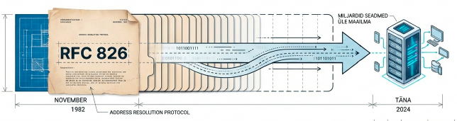
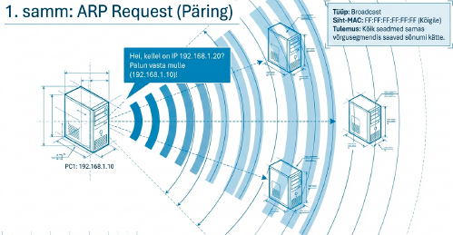
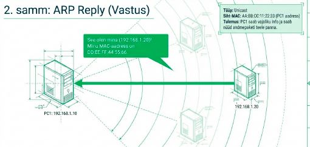
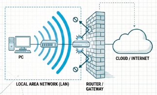
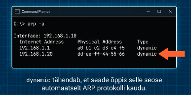
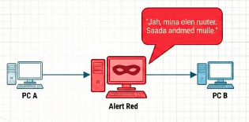
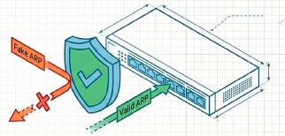

---
tags:
  - Ethernet
  - IPv4
---

# ARP — aadresside lahendamine

!!! abstract "Eesmärgid"
    Selle peatüki läbimise järel:

    - Oskan selgitada, miks ARP on vajalik (IP → MAC tõlkimine)
    - Oskan kirjeldada ARP-päringu ja -vastuse protsessi
    - Oskan lugeda ARP-tabelit käsuga `arp -a` ja `show arp`
    - Oskan selgitada, miks ARP töötab ainult samas võrgusegmendis

## Puuduv lüli: IP teab kuhu, aga mitte kellele

<figure markdown="span">
  
  <figcaption>Joonis 5.1. ARP protokolli ajalugu ja tähtsus (Talvik, 2025). Loodud tehisintellekti abil.</figcaption>
</figure>

Eelmises peatükis õppisime, et MAC-aadress ütleb "kellele praegu anda" ja IP-aadress ütleb "kuhu lõpuks jõuda". Aga üks küsimus jäi vastamata: kuidas arvuti **üldse teab**, milline MAC-aadress kuulub mingile IP-le?

Kui PC1 tahab saata paketi aadressile 192.168.1.20, siis ta peab teadma vastava seadme MAC-aadressi, et Ethernet-kaader õigesti koostada. IP-aadress on teada, aga MAC? Ei aimugi.

Selle lahendas 1982. aastal **David Plummer** MIT-ist — ta kirjutas ühe lehekülje pikkuse protokolli nimega **ARP** (*Address Resolution Protocol*).[^rfc826] Lihtne, elegantne ja kasutusel tänaseni. 42 aastat hiljem töötab su arvutis seesama protokoll, mille 20-aastane üliõpilane kunagi välja mõtles.

## Kuidas ARP töötab

ARP on kahe sõnumiga protokoll: **ARP Request** (päring) ja **ARP Reply** (vastus).

### ARP Request — "hei kõik, kes see on?"

Kui PC1 (192.168.1.10) tahab suhelda seadmega 192.168.1.20, aga ei tea selle MAC-aadressi, saadab ta **broadcast-kaadri** kogu võrku:

- Siht-MAC: `FF:FF:FF:FF:FF:FF` (kõigile)
- Sisu: "Kellel on IP 192.168.1.20? Palun vasta mulle, 192.168.1.10 (MAC: AA:BB:CC:11:22:33)"

Mäletad broadcast-aadressi andmesidekihi peatükist? See on täpselt see — kaader, mis jõuab kõigile samas segmendis. Kõik seadmed saavad selle, aga ainult see, kelle IP on 192.168.1.20, vastab.

<figure markdown="span">
  
  <figcaption>Joonis 5.2. ARP Request — broadcast-päring võrgus (Talvik, 2025). Loodud tehisintellekti abil.</figcaption>
</figure>

### ARP Reply — "mina olen, siin mu MAC"

Seade 192.168.1.20 saadab **unicast-vastuse** otse PC1-le:

- Siht-MAC: AA:BB:CC:11:22:33 (PC1 MAC — teab juba päringust)
- Sisu: "192.168.1.20 olen mina, mu MAC on DD:EE:FF:44:55:66"

Nüüd teab PC1 sihtkoha MAC-aadressi ja saab kaadri õigesti saata. Kogu protsess võtab millisekundeid.

<figure markdown="span">
  
  <figcaption>Joonis 5.3. ARP Reply — unicast-vastus pärijale (Talvik, 2025). Loodud tehisintellekti abil.</figcaption>
</figure>

!!! warning "ARP töötab ainult samas võrgus"
    ARP Request on broadcast ja broadcast ei läbi ruuterit. Kui sihtkoht on **teises võrgus**, teeb arvuti ARP-päringu hoopis **default gateway** (ruuteri) MAC-aadressi jaoks. Ruuter tegeleb edasi — sellest räägime järgmises peatükis.

<figure markdown="span">
  
  <figcaption>Joonis 5.4. ARP töötab ainult samas võrgusegmendis (Talvik, 2025). Loodud tehisintellekti abil.</figcaption>
</figure>

## ARP-tabel — "telefoniraamat"

Iga ARP-vastus salvestatakse **ARP-tabelisse** (*ARP cache*) — see on nagu telefoniraamat, kus IP-aadresside kõrval on MAC-aadressid. Järgmisel korral samale IP-le saates ei pea arvuti enam broadcast-päringut tegema.

ARP-tabeli kirjed aeguvad tavaliselt 2–5 minuti pärast. Miks? Seadmed vahetuvad, IP-aadresse jagatakse ümber, võrgukaarte vahetatakse. Aegumine tagab, et vanad seosed ei tekita probleeme.

**Proovi oma arvutis:**

```bash
arp -a
```
<figure markdown="span">
  
  <figcaption>Joonis 5.5. ARP-tabeli väljund käsuga arp -a (Talvik, 2025). Loodud tehisintellekti abil.</figcaption>
</figure>

**Cisco seadmes:**

```
Router# show arp
Protocol  Address      Age  Hardware Addr   Type  Interface
Internet  192.168.1.1  -    a0b1.c2d3.e4f5  ARPA  Gi0/0
Internet  192.168.1.20 5    ddee.ff44.5566  ARPA  Gi0/0
```

`dynamic` tähendab, et kirje õpiti ARP kaudu. `Age` näitab minuteid viimasest värskendusest. `-` tähendab seadme enda aadressi.

!!! tip "Praktiline katsetamine"
    Proovi: ava käsurida, tee `ping 192.168.1.1` (su default gateway) ja kohe pärast seda `arp -a`. Sa näed, et gateway MAC ilmus tabelisse. Enne pingi polnud seda seal.

## Gratuitous ARP — "teadaanne ilma küsimata"

Vahel saadab seade ARP Request **oma enda** IP-aadressi kohta — keegi ei küsinud, aga ta ütleb ise.[^rfc5227] Seda nimetatakse *Gratuitous ARP* ja sellel on kaks põhjust: teavitada teisi oma MAC-aadressist (näiteks pärast võrgukaardi vahetust) ja tuvastada IP-konflikte (kui keegi teine vastab, on sama IP juba kasutusel).

## ARP ja turvalisus

ARP loodi 1982. aastal — ajal, kui internet oli paar tuhat usaldusväärset teadlast. Autentimist pole: iga seade võib väita end olevat ükskõik milline IP-aadress.

<figure markdown="span">
  
  <figcaption>Joonis 5.6. ARP spoofing — man-in-the-middle rünnak (Talvik, 2025). Loodud tehisintellekti abil.</figcaption>
</figure>

See avab ukse **ARP spoofing** rünnakule: ründaja saadab võltsitud ARP Reply, väites et tema MAC kuulub gateway IP-le. Tulemus? Kogu võrgu liiklus hakkab läbima ründaja seadet — ta näeb kõike. See on üks lihtsamaid ja ohtlikumaid sisevõrgu rünnakuid.

!!! danger "Kaitse ARP spoofing vastu"
    Kaitseks kasutatakse **Dynamic ARP Inspection** (DAI) funktsiooni hallatavas kommutaatoris. DAI kontrollib ARP-vastuseid DHCP snooping tabeli vastu — kui MAC ei klapi, visatakse kaader ära.

<figure markdown="span">
  
  <figcaption>Joonis 5.7. Dynamic ARP Inspection (DAI) kaitsemehhanism (Talvik, 2025). Loodud tehisintellekti abil.</figcaption>
</figure>

!!! info "Uuri ise"
    - [ARP visualiseeritud](https://www.youtube.com/watch?v=A7nt2FGNjME) — Sunny Classroom ARP animatsioon
    - [Wireshark ARP filter](https://www.wireshark.org/docs/dfref/a/arp.html) — kuidas filtreerida ARP-liiklust Wiresharkis
    - [ARP spoofing demo](https://www.youtube.com/watch?v=A7G_xKKJrQE) — kuidas rünnak praktikas välja näeb

---

## Kokkuvõte

ARP seob IP-aadressi ja MAC-aadressi: broadcast päring, unicast vastus, tulemus salvestatakse ARP-tabelisse. Töötab ainult samas võrgusegmendis — teise võrgu jaoks tehakse ARP default gateway MAC-aadressi jaoks.

---

## Enesekontroll

??? question "1. Miks on ARP vajalik — miks ei piisa ainult IP-aadressist?"
    Ethernet-kaadri saatmiseks on vaja sihtkoha MAC-aadressi. IP-aadress üksi ei ütle, milline füüsiline seade võrgus seda aadressi kasutab. ARP seob need kaks aadressi.

??? question "2. Miks on ARP Request broadcast, aga ARP Reply unicast?"
    Saatja ei tea veel sihtkoha MAC-aadressi, seega peab küsima kõigilt (broadcast). Vastaja aga teab juba küsija MAC-aadressi (see oli päringus kirjas), seega saab vastata otse (unicast).

??? question "3. PC1 tahab saata paketi aadressile 10.0.0.5, aga PC1 on võrgus 192.168.1.0/24. Kelle MAC-aadressi ARP pärib?"
    Default gateway (ruuteri) MAC-aadressi. 10.0.0.5 on teises võrgus, ARP broadcast ei ületa ruuterit.

??? question "4. Mis on ARP spoofing ja kuidas selle vastu kaitsta?"
    Ründaja saadab võltsitud ARP Reply, väites et tema MAC kuulub gateway IP-le. Kogu liiklus suundub ründaja kaudu. Kaitseks kasutatakse Dynamic ARP Inspection (DAI) hallatavas kommutaatoris.

??? question "5. Miks ARP-tabeli kirjed aeguvad?"
    Seadmed vahetuvad, IP-aadresse jagatakse ümber, võrgukaarte vahetatakse. Aegumine tagab, et vanad seosed ei jää püsima ja ei tekita valesid marsruute.

[^rfc826]: Plummer, D. (1982). *An Ethernet Address Resolution Protocol*. RFC 826. https://datatracker.ietf.org/doc/html/rfc826
[^rfc5227]: Cheshire, S. (2008). *IPv4 Address Conflict Detection*. RFC 5227. https://datatracker.ietf.org/doc/html/rfc5227
