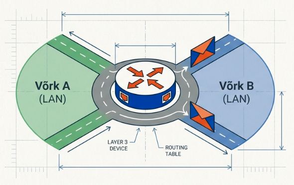
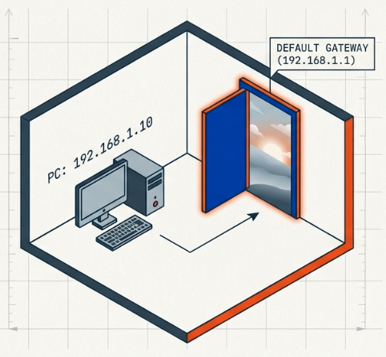
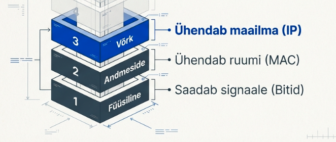
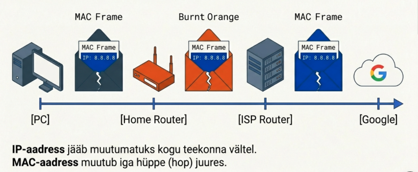

---
tags:
  - OSI
  - IPv4
  - Ruutimine
---

# Võrgukiht

!!! abstract "Eesmärgid"
    Selle peatüki läbimise järel:

    - Oskan selgitada, miks kommutaatorist ei piisa ja millal on vaja ruuterit
    - Oskan selgitada, mis on default gateway ja miks seda vajatakse
    - Oskan lugeda lihtsat marsruutimistabelit (`show ip route`)
    - Oskan selgitada paketi teekonda läbi mitme võrgu
    - Oskan eristada staatilist ja dünaamilist marsruutimist

## Miks kommutaatorist ei piisa

Eelmistes peatükkides nägime, kuidas kommutaator õpib MAC-aadresse ja kuidas ARP seob IP- ja MAC-aadressid. Aga kommutaator tunneb ainult **oma võrgu** seadmeid. Kui pakett peab jõudma teise võrku — teise linna, teise riiki, internetti — on vaja **ruuterit**.

Mõtle oma kooli peale: IT-osakond ja raamatupidamine on mõlemad oma kommutaatori küljes, aga erinevas võrgus. IT-arvuti tahab saata faili raamatupidamisse. Kommutaator vaatab siht-MAC-i ja kehitab õlgu — tal on ainult oma MAC-tabel, teistest võrkudest ei tea midagi. Vaja on seadet, mis **mõistab IP-aadresse** ja teab, kuhu erinevad võrgud jäävad.

## Ruuter — võrkude vaheline teejuht

Ruuter on Layer 3 seade, mis **ühendab erinevaid võrke**.[^rfc791] Igal ruuteri liidesel on oma IP-aadress ja iga liides kuulub erinevasse võrku. Mõtle ruuterist kui ristmikust — ta teab, kumba poole pakett keerama peab.

<figure markdown="span">
  
  <figcaption>Joonis 6.1. Ruuter võrkude vahelise teejuhina (Talvik, 2025). Loodud tehisintellekti abil.</figcaption>
</figure>

Nüüdseks oleme läbinud kolm võrguseadet kolmel OSI kihil: hub (kiht 1) kordistab signaale kõigile, kommutaator (kiht 2) saadab õigesse porti MAC-i järgi, ruuter (kiht 3) saadab õigesse võrku IP järgi. Iga kiht lisab tarkust.

Natuke ajalugu: 1969. aastal ühendas **ARPANET** USA ülikoolid ja sõjaväelaborid — alguses ainult neli sõlme. Probleem oli sama, mis täna: kuidas saata andmeid arvutist A arvutisse B, kui teel on mitu vahejaama? Lahendus oli **pakettide marsruutimine** — iga vaheseade vaatab sihtaadressi ja otsustab, kuhu edasi saata. See põhimõte ei ole 50+ aastaga muutunud.

## Default gateway — uks välismaailma

Default gateway on **ruuteri IP-aadress**, kuhu su arvuti saadab kõik paketid, mis ei kuulu oma võrku. Sisuliselt su arvuti ainus tee välismaailma.

<figure markdown="span">
  
  <figcaption>Joonis 6.2. Default gateway — su arvuti uks välismaailma (Talvik, 2025). Loodud tehisintellekti abil.</figcaption>
</figure>

Mõtle nii: sa elad Haapsalus. Tahad naabri juurde — kõnnid otse (sama võrk, kommutaator ajab asja ära). Aga Tallinnasse? Pead minema **bussijaama** (default gateway). Bussijaam ise ei ole su sihtkoht, aga ta teab, kuidas Tallinnasse saada.

```
PC1 konfiguratsioon:
  IP-aadress:      192.168.1.10
  Alamvõrgumask:    255.255.255.0
  Default gateway:  192.168.1.1   ← ruuteri aadress su võrgus
```

Kuidas arvuti otsustab? Ta teeb lihtsa arvutuse:

- PC1 pingib **192.168.1.50** → sama võrk (192.168.1.x) → saadab otse, kasutab ARP-i, et MAC-aadress teada saada
- PC1 pingib **10.0.0.1** → teine võrk → saadab **default gateway-le** (192.168.1.1), kes teab edasi

!!! warning "Ilma default gateway'ta"
    Kui su arvutil pole default gateway't seadistatud, saad suhelda ainult oma võrgus olevate seadmetega. Internet, teised võrgud — kõik on kättesaamatu. See on üks levinumaid põhjusi, miks "internet ei tööta".

## Marsruutimistabel — ruuteri "kaart"

<figure markdown="span">
  
  <figcaption>Joonis 6.3. Võrgukiht (Layer 3) OSI mudelis (Talvik, 2025). Loodud tehisintellekti abil.</figcaption>
</figure>

Ruuter ei tea kõiki maailma võrke peast — aga tal on **marsruutimistabel** (*routing table*). Sisuliselt kaart: "pakett läheb sinna → saada seda teed pidi".

```
Router# show ip route
C    192.168.1.0/24 is directly connected, Fa0/0
C    192.168.2.0/24 is directly connected, Fa0/1
S    10.0.0.0/8 [1/0] via 192.168.1.254
S*   0.0.0.0/0 [1/0] via 192.168.1.254
```

Mida see tähendab?

| Tähis | Tähendus | Kuidas tekkis |
|---|---|---|
| C | *Directly connected* — otse ühendatud võrk | Automaatselt, kui liides on aktiivne |
| S | *Static* — käsitsi lisatud marsruut | Administraator sisestas käsitsi |
| S* | *Default route* — vaikemarsruut | "Kui midagi muud ei sobi, saada siia" |

*Tabel 6.1. Marsruutimistabeli tähised*

Viimane rida `0.0.0.0/0` on eriline — see on **vaikemarsruut** (*default route*). See tähendab: "kui ükski teine rida tabelis ei sobi, saada pakett siia." See on ruuteri enda "default gateway" — täpselt sama loogika, mis su arvutil.

!!! tip "Praktiline katsetamine"
    Oma arvuti marsruutimistabelit saad vaadata käsuga `route print` (Windows) või `ip route` (Linux). Proovi — sa näed seal oma default gateway't ja ühendatud võrke.

## Staatiline vs dünaamiline marsruutimine

Seni nägime tabelis ainult **C** ja **S** marsruute. Käsitsi lisamine on **staatiline marsruutimine** — administraator sisestab iga marsruudi ise. Paaril ruuteril töötab hästi.

Aga ISP võrgus sadade ruuteritega? Kui ühendus katkeb, ei hakka keegi käsitsi marsruute ümber tegema. Selleks on **dünaamiline marsruutimine** — ruuterid räägivad omavahel ja jagavad automaatselt infot kättesaadavate võrkude kohta. Üks tee katkeb? Leiavad ise uue.

Tähised, mida näed marsruutimistabelis:

| Tähis | Marsruudi tüüp | Näide |
|---|---|---|
| C | Otse ühendatud | Ruuteri enda võrgud |
| S | Staatiline (käsitsi) | Administraator sisestas |
| O | OSPF (dünaamiline) | Ruuterid õppisid ise |
| D | EIGRP (dünaamiline) | Cisco ruuterid õppisid ise |

*Tabel 6.2. Marsruutimistabeli tähised — staatiline vs dünaamiline*

Dünaamilisi marsruutimisprotokolle (OSPF, EIGRP, BGP) käsitleme hiljem. Praegu piisab sellest: **staatiline** = käsitsi, **dünaamiline** = ruuterid õpivad ise.

## Paketi teekond — kogu pilt

Mäletad Haapsalu-Tallinna analoogiat? Sõiduk (MAC) vahetub, aga reis (IP) jääb samaks. Vaatame, kuidas see ruuteri vaatenurgast välja näeb.

<figure markdown="span">
  
  <figcaption>Joonis 6.4. Paketi teekond su arvutist Google'i serverini (Talvik, 2025). Loodud tehisintellekti abil.</figcaption>
</figure>

Su arvuti (192.168.1.10) tahab jõuda Google'i serverini (8.8.8.8):

1. **Su arvuti** vaatab: 8.8.8.8 ei ole minu võrgus → saadab paketi **default gateway-le** (192.168.1.1).

2. **Kodune ruuter** vaatab IP sihtaadressi: 8.8.8.8. Otsib marsruutimistabelist → vaikemarsruut ütleb: "saada ISP ruuterile". Ehitab uue kaadri ja saadab edasi.

3. **ISP ruuter** teeb sama — vaatab IP-d, otsib tabelist, saadab edasi.

4. See kordub iga ruuteri juures, kuni pakett jõuab **Google'i serverini**.

See ongi Layer 2 ja Layer 3 koostöö praktikas. Layer 3 (IP) ütleb "kuhu", Layer 2 (MAC + kaader) ütleb "kuidas sinna praegu jõuda". Just selles kihtide mõte ongi.

!!! info "Uuri ise"
    - [Traceroute visuaalselt](https://gsuite.tools/traceroute) — vaata reaalajas, läbi mitme ruuteri su paketid liiguvad
    - [How Routers Forward Packets](https://www.youtube.com/watch?v=AhOU2eOpmX0) — PowerCert animatsioon paketi teekonnast
    - [PeeringDB](https://www.peeringdb.com/) — vaata, kuidas ISP-d ja andmekeskused omavahel ühenduvad

---

## Kokkuvõte

Ruuter ühendab erinevaid võrke IP-aadresside ja marsruutimistabeli abil. Default gateway on su arvuti "bussijaam" — kõik paketid, mis ei kuulu oma võrku, lähevad sinna. Iga ruuter vaatab IP sihtaadressi, otsib tabelist parima tee ja ehitab uue Layer 2 kaadri. Staatiline marsruutimine = käsitsi, dünaamiline = ruuterid õpivad ise.

---

## Enesekontroll

??? question "1. Mis vahe on kommutaatoril ja ruuteril?"
    Kommutaator töötab Layer 2-s ja ühendab seadmeid samas võrgus MAC-aadresside abil. Ruuter töötab Layer 3-s ja ühendab erinevaid võrke IP-aadresside abil.

??? question "2. Mis on default gateway ja miks seda vajatakse?"
    Default gateway on ruuteri IP-aadress, kuhu arvuti saadab paketid, mis ei ole mõeldud oma võrgule. Ilma selleta saab arvuti suhelda ainult oma võrgus — internet ja teised võrgud on kättesaamatud.

??? question "3. Mida tähendab 'C' ja 'S*' marsruutimistabelis?"
    C tähendab *directly connected* — võrk on otse ruuteri liidesega ühendatud. S* on vaikemarsruut (*default route*) — "kui ükski teine rida ei sobi, saada siia". See on ruuteri enda default gateway.

??? question "4. Mida teeb ruuter, kui pakett saabub?"
    Ruuter eemaldab Layer 2 kaadri (MAC-päise), vaatab IP sihtaadressi, otsib marsruutimistabelist parima sobiva tee ja ehitab uue Layer 2 kaadri väljuva liidese MAC-aadressidega.

??? question "5. Mis vahe on staatilisel ja dünaamilisel marsruutimisel?"
    Staatiline: administraator sisestab marsruudid käsitsi. Sobib väikestesse võrkudesse. Dünaamiline: ruuterid õpivad marsruute automaatselt protokollide (OSPF, EIGRP, BGP) abil. Vajalik suurtes võrkudes, kus topoloogia muutub.

??? question "6. Miks on vaikemarsruut (0.0.0.0/0) oluline?"
    Ruuter ei saa teada kõiki maailma võrke. Vaikemarsruut on "kui midagi muud ei sobi, saada siia" — tavaliselt ISP ruuteri suunas. Ilma selleta ei oska ruuter tundmatuid sihtkohti kuhugi saata.

[^rfc791]: Postel, J. (1981). *Internet Protocol*. RFC 791. https://datatracker.ietf.org/doc/html/rfc791
