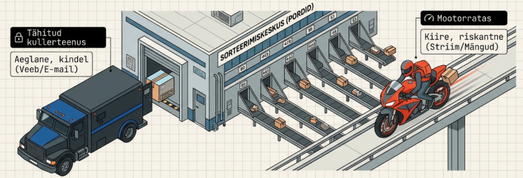
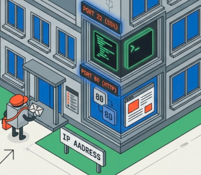
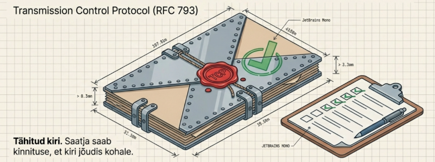
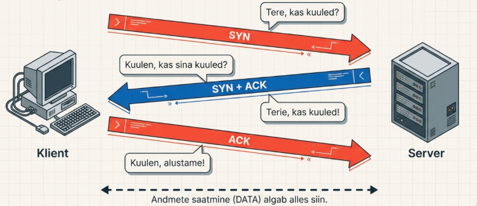
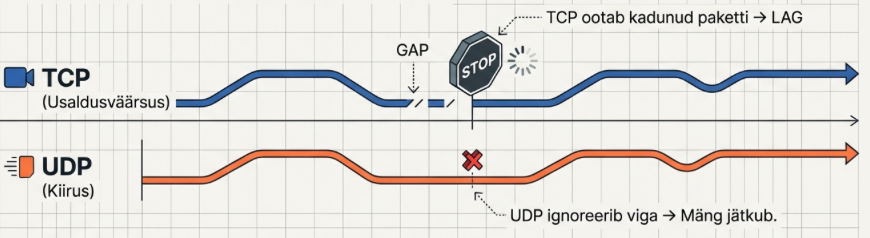

---
tags:
  - TCP/IP
  - OSI
---

# Transpordikiht

!!! abstract "Eesmärgid"
    Selle peatüki läbimise järel:

    - Oskan selgitada transpordikihi rolli ja pordinumbrite tähendust
    - Oskan kirjeldada TCP kolmekäigulist kätlust (3-way handshake)
    - Oskan põhjendada, millal kasutada TCP-d ja millal UDP-d
    - Oskan nimetada levinumaid pordinumbreid (22, 53, 80, 443)

## Probleem: üks IP, palju rakendusi

<figure markdown="span">
  
  <figcaption>Joonis 7.1. Transpordikiht — kuidas paketid õige rakenduseni jõuavad (Talvik, 2025). Loodud tehisintellekti abil.</figcaption>
</figure>

Eelmistes peatükkides jõudsime paketi õige arvutini — IP-aadress ütleb "milline arvuti" ja ruuter teab, kuidas sinna jõuda. Aga mõtle, mis su arvutis samal ajal toimub: brauser mängib YouTube'i, Discord jookseb taustal, Spotify striimib muusikat, e-posti klient kontrollib postkasti. Kõik kasutavad **sama IP-aadressi**.

Kuidas arvuti teab, et see pakett on YouTube'i jaoks, mitte e-maili jaoks?

1980ndate alguses seisid **Vint Cerf** ja **Bob Kahn** sama küsimuse ees. Lahendus: lisada igale paketile **pordi number** — "korteri number" arvuti sees. IP-aadress on maja aadress, port on korteri number. Ilma korteri numbrita jõuab kiri küll majja, aga keegi ei tea, kellele see kuulub.

## Pordid — kuidas see praktikas töötab

<figure markdown="span">
  
  <figcaption>Joonis 7.2. Pordinumbrid — rakenduste aadressid arvuti sees (Talvik, 2025). Loodud tehisintellekti abil.</figcaption>
</figure>

Kui avad brauseris `https://google.com`, juhtub taustal järgmine asi:

- Su brauser valib juhusliku **lähtepordi** (näiteks 52431)
- Sihtport on **443** (HTTPS standard)
- Pakett läheb teele: su IP:52431 → Google IP:443
- Google vastab: Google IP:443 → su IP:52431

Nii teab su arvuti, et vastus kuulub just sellele brauseri lehele, mitte Discordile ega Spotifyle — igaühel on oma lähteport.

| Vahemik | Nimetus | Kasutus |
|---|---|---|
| 0–1023 | Well-known ports | Standardsed teenused (HTTP, SSH, DNS) |
| 1024–49151 | Registered ports | Registreeritud rakendused |
| 49152–65535 | Dynamic/ephemeral | Ajutised pordid (klient valib automaatselt) |

*Tabel 7.1. Pordinumbrite vahemikud*

Need pordid peaksid IT-spetsialistil peas olema:

| Port | Protokoll | Teenus | Miks oluline |
|---|---|---|---|
| 22 | TCP | SSH | Turvaline kaughaldus — kasutad iga päev |
| 23 | TCP | Telnet | Ebaturvaline! Aga laboris kohtad |
| 53 | TCP/UDP | DNS | Kui see ei tööta, "internet on katki" |
| 67/68 | UDP | DHCP | IP-aadresside automaatne jagamine |
| 80 | TCP | HTTP | Veebilehed (krüpteerimata) |
| 443 | TCP | HTTPS | Veebilehed (krüpteeritud) — enamik tänapäeval |

*Tabel 7.2. Pordid, mida IT-spetsialist peab teadma*

!!! tip "Praktiline kontroll"
    Windowsis näed aktiivseid ühendusi ja porte käsuga `netstat -an`. Proovi — sa näed, kui palju ühendusi su arvutil samal ajal lahti on. Iga rida on üks "vestlus" mingi serveriga.

## TCP — "tähitud kiri"

<figure markdown="span">
  
  <figcaption>Joonis 7.3. TCP — usaldusväärne transport (Talvik, 2025). Loodud tehisintellekti abil.</figcaption>
</figure>

TCP (*Transmission Control Protocol*)[^rfc793] tagab, et **kõik** andmed jõuavad kohale, **õiges järjekorras** ja **vigadeta**. See on nagu tähitud kiri — saatja saab kinnituse, et kiri jõudis kohale. Kui ei jõudnud, saadetakse uuesti.

### 3-way handshake — tutvumine enne vestlust

<figure markdown="span">
  
  <figcaption>Joonis 7.4. TCP kolmekäiguline kätlus (Talvik, 2025). Loodud tehisintellekti abil.</figcaption>
</figure>

Enne kui TCP ühtegi andmebaiti saadab, "tutvuvad" klient ja server omavahel. See on nagu telefonikõne: enne rääkimist ütled "hallo", teine pool ütleb "hallo, kuulen" ja sina ütled "ok, räägime".

```
Klient → Server:  SYN       "Hei, räägime?"
Server → Klient:  SYN+ACK   "OK, räägime"
Klient → Server:  ACK       "Alustame"
```

See on **3-way handshake** — kolm paketti enne, kui ühtegi "päris" andmebaiti liigub. Tundub raiskamisena? Aga see tagab, et mõlemad pooled on valmis ja nõus.

!!! quote "IT-huumor, mis aitab meelde jätta"
    *"Kas kuulsite nalja UDP kohta? Võib-olla ei kuulnudki."* — sest UDP ei kontrolli, kas sõnum kohale jõudis.

    *"Ma räägiksin teile nalja TCP kohta, aga ma pean selle uuesti saatma, sest sa ei kinnitanud, et kuulsid."*

    *TCP kõnnib baari ja ütleb: “Ma tahaksin õlut.” Baarmen vastab: “Sa tahad õlut?” TCP ütleb: “Jah, ma tahan õlut.”"* — 3-way handshake isegi baaris.

Pärast ühenduse loomist nummerdab TCP iga segmendi. Vastuvõtja kinnitab igat ACK-ga. Kinnitust ei tule? TCP saadab uuesti. Segmendid tulevad vales järjekorras? TCP paneb õigesti kokku. Ühendus läbi? Mõlemad pooled teevad korrektse lõpetamise (FIN → ACK → FIN → ACK).

## UDP — "postkaart"

<figure markdown="span">
  
  <figcaption>Joonis 7.5. UDP — kiire, aga garantiita (Talvik, 2025). Loodud tehisintellekti abil.</figcaption>
</figure>

UDP (*User Datagram Protocol*)[^rfc768] on TCP vastand. Pole kätlust, pole kinnitusi, pole uuesti saatmist. Viskad paketi teele ja loodad parimat. Nagu postkaart — kiire, odav, aga garantiita.

Miks keegi seda kasutaks? Sest mõnikord on **kiirus tähtsam kui täpsus**. Räägid video kaudu sõbraga ja üks audiopakett kaob ära — kuuled ehk väikest "klõpsu", aga vestlus jätkub. Kui TCP saadaks kadunud paketi uuesti, peaks su kõrv ootama 200 ms — see on juba tuntav viivitus. Parem klõps kui kokutamine.

| | TCP | UDP |
|---|---|---|
| Ühendus | 3-way handshake enne andmeid | Pole — saadab kohe |
| Kinnitused | Iga segment kinnitatakse | Pole — "fire and forget" |
| Järjekord | Garanteeritud | Pole — paketid võivad tulla suvalises järjekorras |
| Kiirus | Aeglasem (overhead) | Kiirem (minimaalne overhead) |
| Päise suurus | 20+ baiti | 8 baiti |

*Tabel 7.3. TCP vs UDP võrdlus*

## Millal mida kasutada?

| TCP — täpsus loeb | UDP — kiirus loeb |
|---|---|
| Veebilehed (HTTP/HTTPS) | Live video ja audio striimimine |
| E-post (SMTP, IMAP) | Online-mängud (Fortnite, CS) |
| Failide allalaadimine | VoIP kõned ja videokoosolekud |
| SSH kaughaldus | DNS päringud |
| Andmebaasid | DHCP |

*Tabel 7.4. TCP ja UDP kasutusalad*

Pöialreegel: **üks puuduv bait rikub kõik** (fail, veebileht, e-kiri) → TCP. **Väike kadunud tükk ei häiri** (heli, video, mäng) → UDP.

!!! info "Uuri ise"
    - [TCP vs UDP meme versioon](https://www.obiikriationz.com/tcp-vs-udp-meme-version) — kui naljad ei aidanud, aitavad meemid
    - [TCP packet joke poster](https://www.redbubble.com/i/poster/Funny-network-engineer-TCP-packet-joke-by-ScienceIsFun/42037732.LVTDI) — klassikaline võrguinseneri nali posteril
    - [TCP 3-Way Handshake — Wireshark demo](https://www.youtube.com/watch?v=xMtP5ZB3wSk) — päris SYN/SYN-ACK/ACK paketid Wiresharkis
    - [UDP vs TCP — mis juhtub võrgumängus?](https://www.youtube.com/watch?v=uwoD5YsGACg) — miks Fortnite ja CS kasutavad UDP-d
    - [SpeedGuide.net Ports Database](https://www.speedguide.net/ports.php) — otsitav andmebaas kõigi pordinumbrite kohta

---

## Kokkuvõte

Transpordikiht lahendab probleemi "üks IP, palju rakendusi" — pordinumber on "korteri number" arvuti sees. TCP tagab usaldusväärse edastuse 3-way handshake ja kinnitustega. UDP pakub kiirust ilma garantiideta. Veebileht, e-post, failid → TCP. Video, mängud, VoIP → UDP.

---

## Enesekontroll

??? question "1. Mis on pordi roll transpordikihis?"
    Port identifitseerib konkreetse rakenduse arvutis. IP-aadress toob paketi õige arvutini, port toob selle õige rakenduseni. Nagu maja aadress (IP) ja korteri number (port).

??? question "2. Kirjelda TCP 3-way handshake protsessi."
    1) Klient saadab SYN ("tahan rääkida"). 2) Server vastab SYN+ACK ("kuulen, mina ka"). 3) Klient kinnitab ACK-ga ("ok, alustame"). Alles seejärel algab andmeedastus.

??? question "3. Miks kasutab DNS nii TCP-d kui UDP-d?"
    Tavapäringud kasutavad UDP-d (kiire, üks väike pakett). Tsoonitransfeerid serverite vahel kasutavad TCP-d (suured andmemahud, vajab usaldusväärsust).

??? question "4. Miks kasutab VoIP UDP-d, mitte TCP-d?"
    Reaalajasuhtluses on kiirus kriitilisem kui kadunud pakettide uuesti saatmine. Kui TCP saadaks kadunud paketi uuesti, tekiks viivitus — parem üks klõps kui pidev kokutamine.

??? question "5. Su brauser avab google.com. Milline on sihtport ja miks?"
    Sihtport on 443 (HTTPS). Su brauser valib juhusliku lähtepordi (nt 52431), et vastused jõuaksid tagasi just selle brauseri lehe juurde.

[^rfc793]: Postel, J. (1981). *Transmission Control Protocol*. RFC 793. https://datatracker.ietf.org/doc/html/rfc793

[^rfc768]: Postel, J. (1980). *User Datagram Protocol*. RFC 768. https://datatracker.ietf.org/doc/html/rfc768
