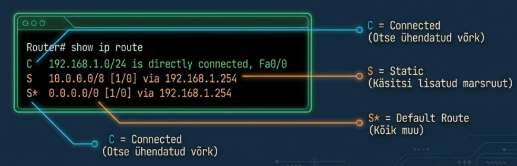

---
tags:
  - IPv4
  - Subnetting
---

# IPv4 adresseerimine

!!! abstract "Eesmärgid"
    Selle peatüki läbimise järel:

    - Oskan selgitada IPv4 aadressi ülesehitust (32 bitti, 4 oktetti)
    - Oskan eristada võrgu- ja hostiosa alamvõrgumaski abil
    - Oskan eristada avalikke ja privaatseid IP-aadresse
    - Oskan selgitada NAT-i otstarvet
    - Oskan selgitada, miks CIDR asendas klassipõhise adresseerimise

## 4,3 miljardit aadressi — ja ikka ei piisa

<figure markdown="span">
  
  <figcaption>Joonis 8.4. IPv4 aadressiruumi kaart (xkcd, 2006). CC BY-NC 2.5.</figcaption>
</figure>

Eelmistes peatükkides nägime, kuidas pakett jõuab õige arvutini: ruuter vaatab IP sihtaadressi ja otsib marsruutimistabelist tee. Aga kust need IP-aadressid tulevad ja kuidas nad ülesehitatud on?

1981\. aastal defineeris **Jon Postel** RFC 791-s IP-protokolli.[^rfc791] IPv4 aadress on **32 bitti** pikk, jagatud neljaks **oktetiks** (igaüks 8 bitti). Inimestele kuvatakse seda detsimaalformaadis:

```
Binaarne:    11000000.10101000.00000001.00001010
Detsimaalne: 192    . 168    . 1      . 10
```

Iga oktett saab väärtuse 0–255 (8 bitti = 256 kombinatsiooni). Kokku 2³² = **4,3 miljardit** unikaalset aadressi. 1981. aastal tundus see lõpmatu. Täna on maailmas üle 15 miljardi võrku ühendatud seadme ja viimased vabad IPv4 plokid jaotati välja juba **2011. aastal**. Vabad aadressid on muutunud kaubeldavaks ressursiks — organisatsioonid ostavad ja müüvad kasutamata plokke.

## Võrgu- ja hostiosa

Iga IP-aadress koosneb kahest osast. **Võrguosa** on nagu linn postiaadressis, **hostiosa** on nagu maja number.

Aga kuidas arvuti teab, kus üks lõpeb ja teine algab? Selleks on **alamvõrgumask** (*subnet mask*). Mask `255.255.255.0` ehk `/24` tähendab: esimesed 24 bitti on võrguosa, viimased 8 bitti hostiosa:

```
IP:    192.168.1  . 10
Mask:  255.255.255. 0
       └─ võrk ──┘  └ host
```

Sealt tuttav loogika: sihtaadress samas võrgus — saada otse. Teises võrgus — saada default gateway'le.

!!! tip "CIDR notatsioon"
    `/24` tähendab, et 24 bitti on võrguosa. See on sama mis mask `255.255.255.0`, aga lühem kirjutada. CIDR (*Classless Inter-Domain Routing*) notatsioon on tänapäeva standard ja sa kohtad seda igal pool.

## IP-aadresside klassid — ja miks nad ei tööta

1980ndatel jagati aadressid **klassidesse**. Idee tundus hea: suured organisatsioonid saavad suured plokid, väiksed väiksed.

| Klass | Esimene oktett | Vaikemask | Hoste võrgus |
|---|---|---|---|
| A | 1–126 | /8 | ~16.7 miljonit |
| B | 128–191 | /16 | ~65 000 |
| C | 192–223 | /24 | 254 |

*Tabel 8.1. IP-aadresside klassid*

Aga see osutus raiskavaks. Ülikool vajab 300 aadressi? Klass C annab 254 — liiga vähe. Klass B annab 65 000 — absurdne. Valik oli "liiga vähe" või "liiga palju".

1993\. aastal lahendati see **CIDR-iga** — nüüd saab maski pikkuse vabalt valida. Vajad 300 aadressi? Võta /23. Vajad 30? Võta /27. Klassid on sisuliselt ajalugu, aga CCNA eksamil ja vanemate seadmetega pead neid ikka tundma.

## Avalikud ja privaatsed IP-aadressid

1990ndate alguseks oli selge, et 4,3 miljardit aadressi ei kata nõudlust. RFC 1918 pakkus lihtsa lahenduse: reserveerime kolm vahemikku **sisevõrkude** jaoks.[^rfc1918] Need aadressid pole internetis marsruuditavad — sama `192.168.1.1` võib olla kasutusel tuhandetes koduvõrkudes korraga.

| Vahemik | CIDR | Kus kohtad |
|---|---|---|
| 10.0.0.0 – 10.255.255.255 | 10.0.0.0/8 | Suured ettevõtted, koolid |
| 172.16.0.0 – 172.31.255.255 | 172.16.0.0/12 | Harvem, aga olemas |
| 192.168.0.0 – 192.168.255.255 | 192.168.0.0/16 | Su kodune ruuter, iga WiFi |

*Tabel 8.2. Privaatsed IP-aadresside vahemikud (RFC 1918)*

**Avalikud** aadressid on globaalselt unikaalsed. Neid jaotab IANA, Euroopas **RIPE NCC** Amsterdamis. Eesti ISP-d — Telia, Elisa, Tele2 — saavad oma avalikud aadressid RIPE-lt.

### NAT — kuidas privaatne võrk internetti pääseb

Aga kui privaatseid aadresse ei marsruudita internetis, kuidas su kodus seadmed üldse netis käivad? Selleks on **NAT** (*Network Address Translation*) — su kodune ruuter asendab väljuval paketil privaatse aadressi oma avaliku IP-ga:

```
Su arvuti:  192.168.1.10  →  Ruuter (NAT)  →  Internet näeb: 84.50.12.34
Su telefon: 192.168.1.11  →  Ruuter (NAT)  →  Internet näeb: 84.50.12.34
``

20 seadet kodus, aga maailm näeb ainult ühte IP-d. NAT on põhjus, miks IPv4 nii kaua vastu pidas.

## Erilist tähendusega aadressid

<figure markdown="span">
  
  <figcaption>Joonis 8.3. Marsruutimistabel — ruuteri "kaart" (Talvik, 2025). Loodud tehisintellekti abil.</figcaption>
</figure>

Mõned IP-aadressid on reserveeritud — neid sa seadmetele määrata ei saa:

| Aadress | Tähendus | Miks oluline |
|---|---|---|
| 127.0.0.1 | **Localhost** — seade räägib iseendaga | Testimine: `ping 127.0.0.1` kontrollib TCP/IP stacki |
| 169.254.x.x | **APIPA** — DHCP ei vastanud | Näed seda? Võrguühendusega on midagi katki |
| 255.255.255.255 | **Broadcast** — kõigile segmendis | DHCP ja ARP kasutavad seda |
| 0.0.0.0 | Vaikemarsruut / määratlemata | Marsruutimistabelis "saada kõik siia" |

*Tabel 8.3. Erilist tähendusega IP-aadressid*

!!! warning "169.254 = probleem"
    Kui näed oma arvutil IP-aadressi `169.254.x.x`, siis DHCP server ei vastanud. Arvuti leidis ise ajutise aadressi, aga internetti ei ole. Kontrolli kaablit, WiFi-ühendust ja ruuterit.

!!! info "Uuri ise"
    - [Subnet Calculator](https://www.subnet-calculator.com/) — interaktiivne alamvõrgumaskide kalkulaator
    - [RIPE NCC: Kes omab IP-aadresse?](https://apps.db.ripe.net/db-web-ui/query) — otsing, kellele konkreetne IP kuulub
    - [IPv4 ammendumise statistika](https://www.potaroo.net/tools/ipv4/) — Geoff Hustoni reaalajas jälgitav graafik

---

## Kokkuvõte

IPv4 aadress on 32 bitti — võrgu- ja hostiosa piiri määrab alamvõrgumask. Klassid (A, B, C) asendas CIDR, mis lubab maski vabalt valida. Privaatseid aadresse kasutatakse sisevõrkudes ja NAT teisendab need avalikuks. 4,3 miljardit aadressi on ammendunud — pikaajaline lahendus on IPv6.

---

## Enesekontroll

??? question "1. Mitu bitti on IPv4 aadressis ja miks iga okteti max väärtus on 255?"
    32 bitti, 4 oktetti × 8 bitti. 8 bitti annab 2⁸ = 256 kombinatsiooni, ehk väärtused 0–255.

??? question "2. Mis on alamvõrgumaski ülesanne?"
    Mask määrab, mitu bitti on võrguosa ja mitu hostiosa. See aitab arvutil otsustada, kas sihtaadress on samas võrgus (saada otse) või teises (saada default gateway-le).

??? question "3. Miks klassipõhine adresseerimine asendati CIDR-iga?"
    Klassid raiskasid aadresse — valik oli ainult /8, /16 või /24. Organisatsioon, kes vajas 300 aadressi, pidi valima 254 (liiga vähe) või 65 000 (liiga palju). CIDR lubab maski vabalt valida.

??? question "4. Kas 10.5.3.1 on avalik või privaatne? Miks?"
    Privaatne. Kuulub vahemikku 10.0.0.0/8, mis on RFC 1918 järgi reserveeritud sisevõrkudele.

??? question "5. Mis on NAT ja miks seda vajatakse?"
    NAT teisendab privaatsed IP-aadressid avalikuks. Ilma selleta ei pääse sisevõrgu seadmed internetti, sest privaatseid aadresse ei marsruudita. NAT võimaldab paljudel seadmetel jagada ühte avalikku IP-d.

??? question "6. Mida tähendab IP-aadress 169.254.x.x?"
    APIPA — arvuti ei saanud DHCP serverilt aadressi ja määras endale automaatse ajutise. Internetti ei ole, võrguühenduses on viga.

[^rfc791]: Postel, J. (1981). *Internet Protocol*. RFC 791. https://datatracker.ietf.org/doc/html/rfc791

[^rfc1918]: Rekhter, Y. et al. (1996). *Address Allocation for Private Internets*. RFC 1918. https://datatracker.ietf.org/doc/html/rfc1918
