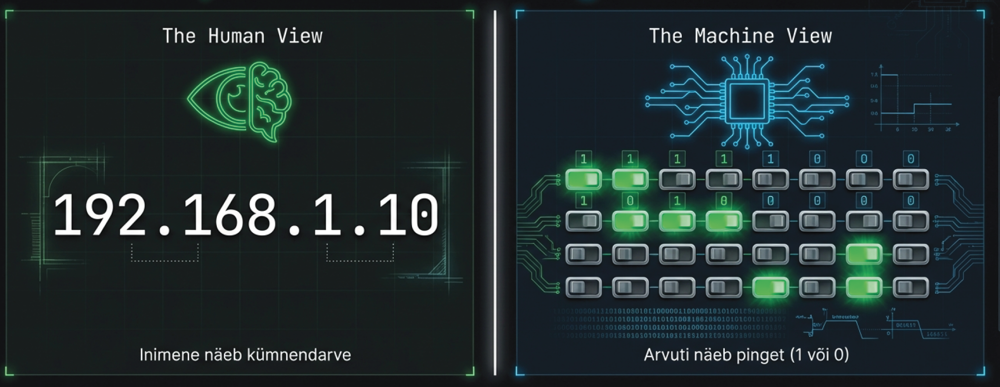
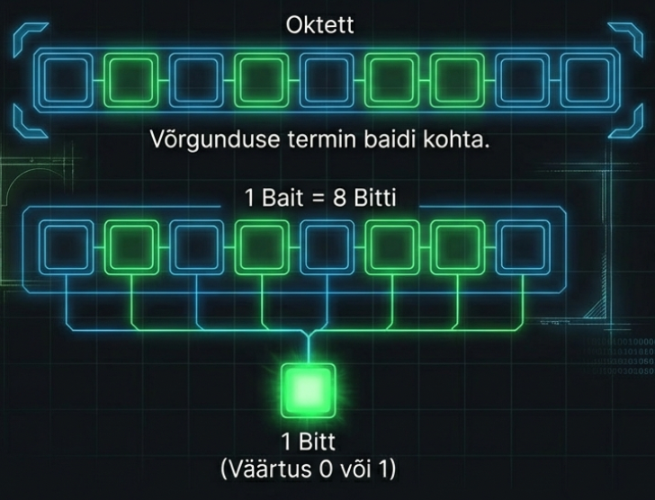
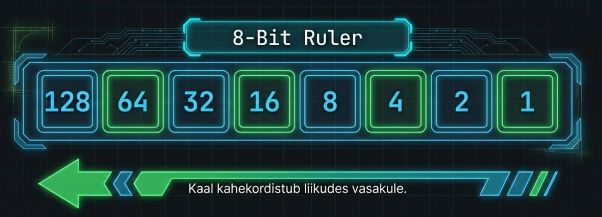
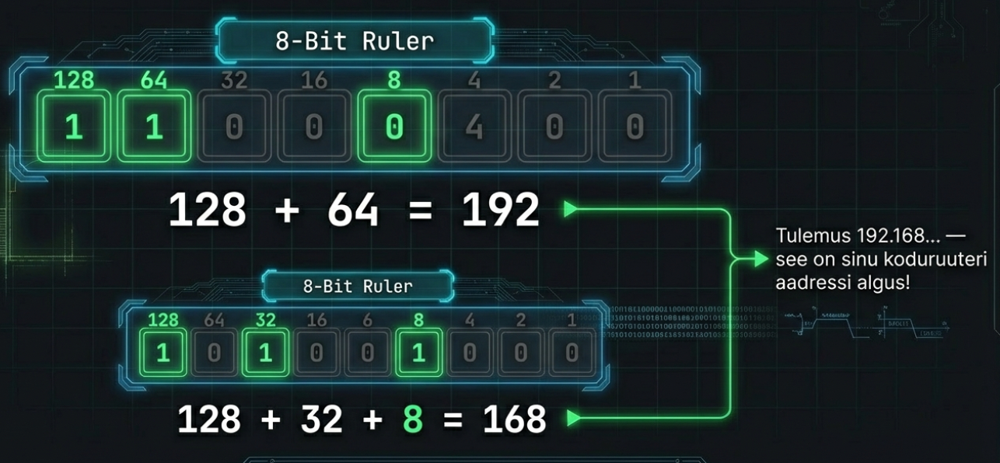
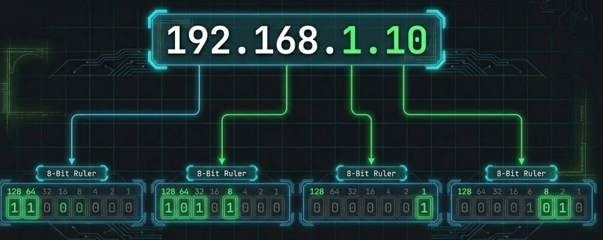
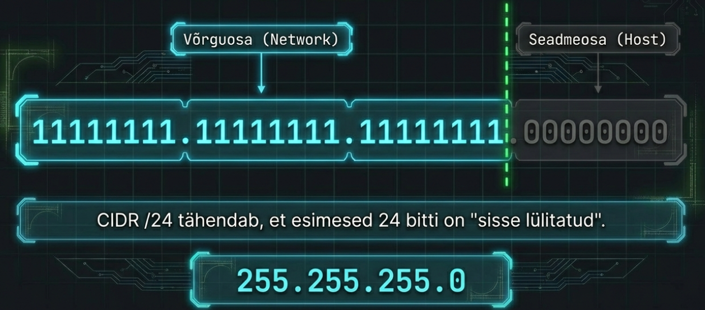

---
tags:
  - IPv4
  - Subnetting
---

# Kahendsüsteem

!!! abstract "Eesmärgid"
    Selle peatüki läbimise järel:

    - Oskan teisendada kahend- ja kümnendarve (nt 11000000 ↔ 192)
    - Oskan selgitada, kuidas bitt, bait ja oktett omavahel seostuvad
    - Oskan teisendada IP-aadresse ja alamvõrgumaske binaarsest detsimaalformaati
    - Oskan kasutada magic number meetodit alamvõrkude alguste leidmiseks

## Miks kahendsüsteem?

<figure markdown="span">
  
  <figcaption>Joonis 9.1. Inimene näeb kümnendarve, arvuti näeb pinget (Talvik, 2025). Loodud tehisintellekti abil.</figcaption>
</figure>

Eelmises peatükis nägime, et IP-aadress on 32 bitti ja alamvõrgumask määrab, mitu bitti on võrguosa. Aga kuidas arvuti tegelikult teab, et 192.168.1.10 maskiga /24 kuulub võrku 192.168.1.0? Ta teeb seda **binaarselt** — ja järgmises peatükis pead seda oskama ka sina.

Ok, aus olla — see peatükk on nagu korrutustabel. Ise pole eriti põnev, aga ilma selleta ei saa edasi. Hea uudis: kogu IP-matemaatika kasutab ainult 8 numbrit: **128, 64, 32, 16, 8, 4, 2, 1**. Õpi need ära ja ülejäänu tuleb iseenesest.

## Bitt, bait, oktett

<figure markdown="span">
  
  <figcaption>Joonis 9.2. Bitt, bait ja oktett — 1 bitt on 0 või 1, 8 bitti = 1 bait = 1 oktett (Talvik, 2025). Loodud tehisintellekti abil.</figcaption>
</figure>

Arvuti tunneb ainult kahte olekut: pinge on (1) või pinget pole (0). Üks selline 0 või 1 on **bitt** (*bit*) — kõige väiksem infoühik.

Üksiku bitiga saad öelda ainult "jah" või "ei". Aga pane **8 bitti** ritta ja saad **baidi** (*byte*) — 256 erinevat väärtust (0–255). Võrgunduses nimetatakse baiti tihti **oktetiks** (*octet*). IPv4 aadressis on 4 oktetti ehk 32 bitti.

## Kahend → kümnend

<figure markdown="span">
  
  <figcaption>Joonis 9.3. 8-Bit Ruler — bitipositsioonide kaalud kahekordistuvad paremalt vasakule (Talvik, 2025). Loodud tehisintellekti abil.</figcaption>
</figure>

Iga bitipositsioonil on kindel kaal, mis kahekordistub paremalt vasakule:

| Positsioon | 7 | 6 | 5 | 4 | 3 | 2 | 1 | 0 |
|---|---|---|---|---|---|---|---|---|
| **Kaal** | **128** | **64** | **32** | **16** | **8** | **4** | **2** | **1** |

*Tabel 9.1. Bitipositsioonide kaalud oktetis*

Reegel on lihtne: bitt on **1** — liidad kaalu. Bitt on **0** — jätad vahele.

<figure markdown="span">
  
  <figcaption>Joonis 9.4. Kahend → kümnend teisendamine — 11000000 = 192 ja 10101000 = 168 (Talvik, 2025). Loodud tehisintellekti abil.</figcaption>
</figure>

**Näide:** `11000000`

```
1    1    0    0    0    0    0    0
128 + 64 + -  + -  + -  + -  + -  + -  = 192
```

**Näide:** `10101000`

```
1    0    1    0    1    0    0    0
128 + -  + 32 + -  + 8  + -  + -  + -  = 168
```

Tuttav? 192 ja 168 — su koduruuteri aadressi algus!

## Kümnend → kahend

Vastupidi on sama lihtne. Alusta suurimast kaalust (128) ja liigu paremale. Iga kaalu juures küsi: "kas mahub?"

**Näide:** teisenda **200** binaarseks

```
200 ≥ 128? Jah → 1, jääk: 72
 72 ≥  64? Jah → 1, jääk: 8
  8 ≥  32? Ei  → 0
  8 ≥  16? Ei  → 0
  8 ≥   8? Jah → 1, jääk: 0
  0 ≥   4? Ei  → 0
  0 ≥   2? Ei  → 0
  0 ≥   1? Ei  → 0

Tulemus: 11001000
```

## IP-aadresside teisendamine

<figure markdown="span">
  
  <figcaption>Joonis 9.5. IP-aadress 192.168.1.10 jagatud neljaks oktetiks — iga oktett teisendatakse eraldi (Talvik, 2025). Loodud tehisintellekti abil.</figcaption>
</figure>

Nüüd paneme kõik kokku. IP-aadress on neli oktetti, igaüks teisendatakse eraldi — midagi keerulist siin pole:

```
IP:       192      . 168      . 1        . 10
Binaarne: 11000000 . 10101000 . 00000001 . 00001010
```

!!! tip "Kiire kontroll"
    Kui kõik 8 bitti on 1: 128+64+32+16+8+4+2+1 = **255**. Kui kõik on 0: **0**. Iga oktett jääb alati vahemikku 0–255.

## Alamvõrgumaskide teisendamine

<figure markdown="span">
  
  <figcaption>Joonis 9.6. Alamvõrgumask /24 — 24 ühte (võrguosa) ja 8 nulli (hostiosa) = 255.255.255.0 (Talvik, 2025). Loodud tehisintellekti abil.</figcaption>
</figure>

Alamvõrgumask on rida ühtesid, millele järgnevad nullid. Ühtede arv = CIDR number. Need maskid kohtad iga päev:

| CIDR | Binaarne mask | Detsimaalne mask |
|---|---|---|
| /8 | 11111111.00000000.00000000.00000000 | 255.0.0.0 |
| /16 | 11111111.11111111.00000000.00000000 | 255.255.0.0 |
| /24 | 11111111.11111111.11111111.00000000 | 255.255.255.0 |
| /25 | 11111111.11111111.11111111.10000000 | 255.255.255.128 |
| /26 | 11111111.11111111.11111111.11000000 | 255.255.255.192 |
| /27 | 11111111.11111111.11111111.11100000 | 255.255.255.224 |
| /28 | 11111111.11111111.11111111.11110000 | 255.255.255.240 |
| /29 | 11111111.11111111.11111111.11111000 | 255.255.255.248 |
| /30 | 11111111.11111111.11111111.11111100 | 255.255.255.252 |

*Tabel 9.2. Levinumad alamvõrgumaskid*

Näed mustrit? Viimase okteti väärtused on alati: 0, 128, 192, 224, 240, 248, 252, 254, 255. Õpi need pähe — järgmises peatükis pead neid kiiresti ära tundma.

## Magic number — kiire meetod alamvõrgustamiseks

Siin tuleb trikk, mis teeb su elu palju lihtsamaks. Seda nimetatakse **magic number** meetodiks.

Reegel: **256 − maski viimase olulise okteti väärtus = magic number**. See number on su võrkude "samm" — alamvõrgud algavad iga magic number'i kordsest.

**Näide:** mask /26 ehk 255.255.255.192

```
256 − 192 = 64 ← magic number
```

See tähendab, et alamvõrgud algavad iga 64 aadressi tagant:

```
192.168.1.0    (esimene alamvõrk)
192.168.1.64   (teine alamvõrk)
192.168.1.128  (kolmas alamvõrk)
192.168.1.192  (neljas alamvõrk)
```

**Näide:** mask /27 ehk 255.255.255.224

```
256 − 224 = 32 ← magic number

Alamvõrgud: .0, .32, .64, .96, .128, .160, .192, .224
```

**Näide:** mask /28 ehk 255.255.255.240

```
256 − 240 = 16 ← magic number

Alamvõrgud: .0, .16, .32, .48, .64, .80 ... .240
```

Üks lahutustehe ja sa tead kohe, kus alamvõrgud algavad. Järgmises peatükis kasutame seda kogu aeg.

!!! note "Uudishimulikele: IPv6 ja kahendsüsteem"
    IPv4 aadress on 32 bitti — aga IPv6 on **128 bitti**! IPv6 kasutab heksadetsimaalsüsteemi (alus 16), kus iga sümbol esindab 4 bitti. Näiteks: `2001:0db8:85a3::8a2e:0370:7334`. Kahendsüsteemi tundmine aitab ka IPv6 mõista, sest heksadetsimaalne on sisuliselt binaarse lühend. IPv6-st räägime põhjalikumalt hilisemates peatükkides.

!!! info "Uuri ise"
    - [Binary Game](https://learningcontent.cisco.com/games/binary/index.html) — Cisco interaktiivne mäng, mis teeb harjutamise lõbusaks
    - [Rapid Tables: Binary Converter](https://www.rapidtables.com/convert/number/binary-to-decimal.html) — kiire teisendaja oma vastuste kontrollimiseks
    - [Subnet Mask Cheat Sheet](https://www.aelius.com/njh/subnet_sheet.html) — alamvõrgumaskide tabel prindib hästi välja

---

## Kokkuvõte

Kogu IP-matemaatika põhineb kaheksal kaalul: 128, 64, 32, 16, 8, 4, 2, 1. Maskide viimase okteti väärtused (128, 192, 224, 240, 248, 252) õpi pähe. Magic number (256 − maski väärtus) on kiireim tee alamvõrkude alguste leidmiseks.

---

## Enesekontroll

??? question "1. Teisenda 11010110 kümnendarvuks."
    128 + 64 + 0 + 16 + 0 + 4 + 2 + 0 = **214**

??? question "2. Teisenda 172 kahendarvuks."
    172 = 128 + 32 + 8 + 4 = **10101100**

??? question "3. Mis on IP-aadress 10.0.0.1 binaarselt?"
    00001010.00000000.00000000.00000001

??? question "4. Mida tähendab mask /26 detsimaalformaadis?"
    255.255.255.192 (esimesed 26 bitti on 1, ülejäänud 6 bitti on 0).

??? question "5. Mida tähendab mask 255.255.255.240 CIDR formaadis?"
    /28. Binaarselt: 11111111.11111111.11111111.11110000 — kokku 28 ühte.

??? question "6. Mis on magic number maskile /27 ja millistest aadressidest alamvõrgud algavad?"
    256 − 224 = 32. Alamvõrgud algavad: .0, .32, .64, .96, .128, .160, .192, .224.
