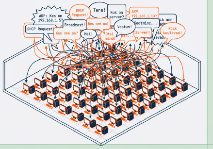
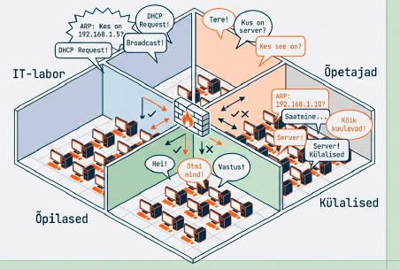
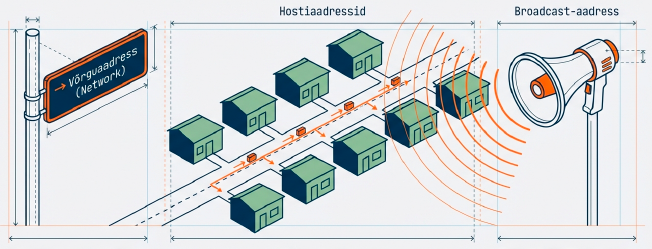
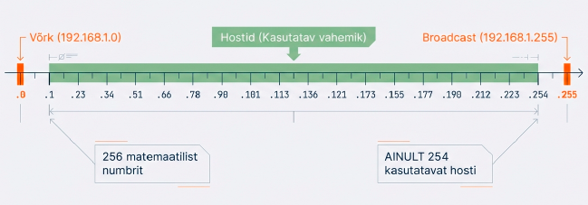
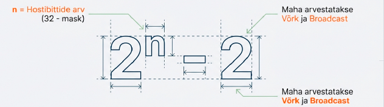
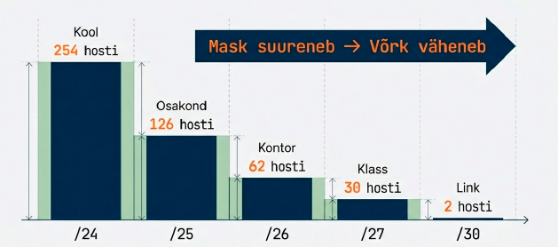
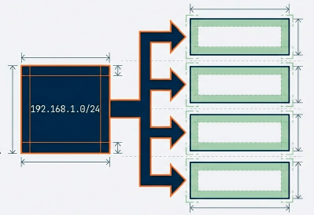
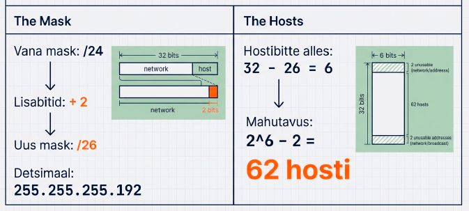
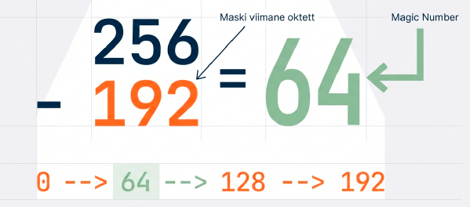
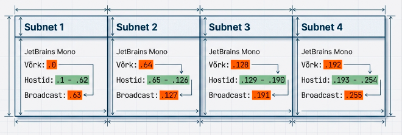

---
tags:
  - Subnetting
  - IPv4
---

# Alamvõrgustamine

!!! abstract "Eesmärgid"
    Selle peatüki läbimise järel:

    - Oskan selgitada, miks võrk tuleb alamvõrkudeks jagada
    - Oskan eristada võrguaadressi, broadcast-aadressi ja hostiaadresse
    - Oskan arvutada hostide arvu valemiga 2ⁿ − 2
    - Oskan jagada /24 võrgu alamvõrkudeks ja määrata iga alamvõrgu aadressivahemiku

## Miks mitte lihtsalt üks suur võrk?

<figure markdown="span">
  
  <figcaption>Joonis 10.1. Miks üks suur võrk ei tööta — broadcast-liiklus jõuab kõigini (Talvik, 2025). Loodud tehisintellekti abil.</figcaption>
</figure>

Eelmises peatükis õppisime kahendsüsteemi ja magic number meetodi — nüüd paneme need tööle.

Kujuta ette oma kooli: 200 arvutit, kõik ühes /24 võrgus (192.168.1.0/24). Iga kord, kui mõni arvuti küsib ARP-iga "kelle MAC kuulub sellele IP-le?", jõuab see küsimus **kõigi 200 arvutini**. Iga DHCP päring — kõigile. Iga broadcast — kõigile. Nagu klassiruum, kus 200 õpilast istuvad ühes toas ja iga kord, kui keegi küsib küsimuse, peavad kõik kuulama.

Lahendus? **Jaga suur võrk väiksemateks alamvõrkudeks** (*subnets*).[^rfc950] IT-labor ühte, õpetajate võrk teise, õpilaste WiFi kolmandasse, külalised neljandasse. Iga alamvõrk on eraldi broadcast-domeen — küsimus ühes "klassiruumis" ei häiri teisi.

Boonusena saad ka **turvalisuse**: tulemüür saab kontrollida liiklust alamvõrkude vahel. Õpilaste võrgust ei pääse õpetajate serveritesse, kui nii seadistada.

<figure markdown="span">
  
  <figcaption>Joonis 10.2. Alamvõrgustamise kolm sammu (Talvik, 2025). Loodud tehisintellekti abil.</figcaption>
</figure>

## Kolm aadressi, mida ei saa kellelegi anda

Enne kui hakkame võrke jagama, peab olema selge, et igas IP-võrgus on kolm erilist aadressi, mida sa seadmetele määrata ei saa. Need pole valikulised — need on alati olemas, igas võrgus ja igas alamvõrgus.

<figure markdown="span">
  
  <figcaption>Joonis 10.3. IP-aadressi kolm alustala — võrguaadress, hostiaadressid ja broadcast (Talvik, 2025). Loodud tehisintellekti abil.</figcaption>
</figure>

**Võrguaadress** — esimene aadress, kõik hostibittid on 0. Mõtle sellest kui tänava nimest ilma maja numbrita. Näiteks 192.168.1.**0** võrgus /24.

**Broadcast-aadress** — viimane aadress, kõik hostibittid on 1. Pakett sellele aadressile jõuab kõigile võrgu seadmetele korraga. Näiteks 192.168.1.**255** võrgus /24.

**Hostiaadressid** — kõik, mis jääb nende kahe vahele. Need ongi need, mida saad päriselt kasutada.

Vaatame, kuidas see konkreetselt välja näeb. Järgmine joonis näitab, kuidas IP-aadress jaguneb võrguosaks ja hostiosaks:

<figure markdown="span">
  
  <figcaption>Joonis 10.4. Alamvõrgu aadressi anatoomia — võrguosa, alamvõrguosa ja hostiosa (Talvik, 2025). Loodud tehisintellekti abil.</figcaption>
</figure>

Võtame tuttava näite — võrk `192.168.1.0/24`. Siin on /24 mask, mis tähendab, et esimesed 24 bitti on võrguosa ja viimased 8 bitti on hostiosa. Selle võrgu kolm erilist aadressi:

| Aadress | Tüüp |
|---|---|
| 192.168.1.0 | Võrguaadress (ei määrata) |
| 192.168.1.1 – 192.168.1.254 | Hostiaadressid (**254** tükki) |
| 192.168.1.255 | Broadcast-aadress (ei määrata) |

*Tabel 10.1. Aadresside jaotus /24 võrgus*

Seega /24 võrgus on 254 hosti, mitte 256 — kaks aadressi "lähevad kaduma". See kehtib alati, olenemata võrgu suurusest.

## Valem: 2ⁿ − 2

Nüüd on aeg õppida valem, mida läheb vaja iga kord, kui alamvõrkudega tööd teed. Kasutatavate hostide arvu arvutamine on ülilihtne: **n** = hostibittide arv (32 − mask). Lahuta 2 (võrguaadress ja broadcast) — ja ongi kõik.

<figure markdown="span">
  
  <figcaption>Joonis 10.5. Magic number arvutus — 256 − 192 = 64 (Talvik, 2025). Loodud tehisintellekti abil.</figcaption>
</figure>

Siin on tähtsamad maskid, mida päriselt kohtad. Pane tähele, kuidas mask ja hostide arv on pöördvõrdelises seoses — mida suurem mask, seda vähem hoste:

| Mask | Hostibittid (n) | 2ⁿ | Kasutatavad (2ⁿ − 2) | Näide kasutusest |
|---|---|---|---|---|
| /24 | 8 | 256 | 254 | Kogu kool |
| /25 | 7 | 128 | 126 | Suur osakond |
| /26 | 6 | 64 | 62 | Kontor |
| /27 | 5 | 32 | 30 | Klassiruum |
| /28 | 4 | 16 | 14 | Väike labor |
| /29 | 3 | 8 | 6 | Serveriruum |
| /30 | 2 | 4 | 2 | Punkt-punkt ühendus (ruuter-ruuter) |

*Tabel 10.2. Maskide ja hostide arvu seos*

Seda tabelit tasub pähe õppida — CCNA eksamil pole aega iga kord nullist arvutama hakata.

!!! tip "Mida suurem mask, seda väiksem võrk"
    /24 = 254 hosti, /25 = 126, /26 = 62. Mask kasvab → hostibitte vähemaks → võrk väiksem. Nagu tänava jagamine lühemateks lõikudeks.

Järgmine joonis näitab seda seost visuaalselt — iga bitti võrra suurem mask poolitab võrgu:

<figure markdown="span">
  
  <figcaption>Joonis 10.6. Maski suurus määrab hostide arvu (Talvik, 2025). Loodud tehisintellekti abil.</figcaption>
</figure>

## Alamvõrgustamise näide samm-sammult

Teooria on tehtud — nüüd läheme päriselt arvutama. Teeme ühe konkreetse ülesande alguselõpuni läbi.

**Ülesanne:** Jaga 192.168.1.0/24 neljaks võrdseks alamvõrguks.

<figure markdown="span">
  
  <figcaption>Joonis 10.7. Ülesanne — jaga /24 võrk neljaks alamvõrguks (Talvik, 2025). Loodud tehisintellekti abil.</figcaption>
</figure>

Alustame küsimustega. Mitu alamvõrku tahame? 4. Mitu lisabitti selleks vaja? 2² = 4, seega **2 bitti**. See tähendab, et uus mask on /24 + 2 = **/26** (255.255.255.192). Iga alamvõrku jääb 6 hostibitti, mis annab 2⁶ − 2 = **62** kasutatavat hosti.

<figure markdown="span">
  
  <figcaption>Joonis 10.8. Uue maski arvutamine — /24 + 2 = /26 (Talvik, 2025). Loodud tehisintellekti abil.</figcaption>
</figure>

Nüüd tuleb mängu magic number eelmisest peatükist: 256 − 192 = **64**. See ütleb meile, et alamvõrgud algavad iga 64 aadressi tagant — .0, .64, .128, .192. Paneme kõik tabelisse:

| Alamvõrk | Võrguaadress | Esimene host | Viimane host | Broadcast |
|---|---|---|---|---|
| 1 | 192.168.1.0/26 | .1 | .62 | .63 |
| 2 | 192.168.1.64/26 | .65 | .126 | .127 |
| 3 | 192.168.1.128/26 | .129 | .190 | .191 |
| 4 | 192.168.1.192/26 | .193 | .254 | .255 |

*Tabel 10.3. 192.168.1.0/24 jagamine neljaks /26 alamvõrguks*

Näed mustrit? Iga alamvõrgu broadcast on järgmise alamvõrgu võrguaadress miinus 1. Esimene host = võrguaadress + 1, viimane host = broadcast − 1. See muster kehtib alati ja selle äratundmine teeb sind kiireks. Järgmine joonis näitab, kuidas magic number meetod visuaalselt töötab:

<figure markdown="span">
  
  <figcaption>Joonis 10.9. Magic number meetod — 256 − maski väärtus (Talvik, 2025). Loodud tehisintellekti abil.</figcaption>
</figure>

!!! warning "Levinud viga"
    Ära aja segamini: 192.168.1.**63** on esimese alamvõrgu broadcast, mitte teine kasutatav host. Ja 192.168.1.**64** on teise alamvõrgu võrguaadress, mitte viimane host esimeses. Need piirid on absoluutsed.

## Kuidas kiiresti lahendada

Kogu alamvõrgustamine taandub tegelikult kolmele sammule. Esiteks arvuta **magic number**: 256 − maski viimase okteti väärtus. Teiseks leia **alamvõrkude algused**: 0, magic number, 2 × magic number, 3 × magic number ja nii edasi. Kolmandaks täida **iga alamvõrgu sees**: võrguaadress → +1 esimene host → broadcast −1 viimane host → broadcast.

See ongi kõik. Tõsiselt — rohkem polegi vaja. Harjuta, kuni tuleb automaatselt. CCNA eksamil peab see olema kiire ja peast, kalkulaatorit ei anta.

<figure markdown="span">
  
  <figcaption>Joonis 10.10. Alamvõrgustamise tulemus — neli /26 alamvõrku (Talvik, 2025). Loodud tehisintellekti abil.</figcaption>
</figure>

!!! info "Uuri ise"
    - [Subnetting Practice](https://subnettingpractice.com/) — lõpmatu harjutuste generaator vastustega
    - [Visual Subnet Calculator](https://www.davidc.net/sites/default/subnets/subnets.html) — visuaalne kalkulaator, mis näitab alamvõrke graafiliselt

---

## Kokkuvõte

Alamvõrgustamine jagab suure võrgu väiksemateks broadcast-domeenideks — parem jõudlus ja turvalisus. Võrguaadress on esimene, broadcast viimane, kõik vahepeal on hostiaadressid. Hoste: 2ⁿ − 2. Magic number (256 − maski väärtus) annab alamvõrkude sammu — ülejäänu on aritmeetika.

---

## Enesekontroll

??? question "1. Miks ei saa võrguaadressi ja broadcast-aadressi seadmetele määrata?"
    Võrguaadress identifitseerib võrku ennast (kasutatakse marsruutimistabelites). Broadcast-aadress on mõeldud kõigile võrgu seadmetele korraga. Kumbki ei saa olla konkreetse seadme aadress.

??? question "2. Mitu kasutatavat hosti on /27 võrgus?"
    Hostibitte: 32 − 27 = 5. Kasutatavaid hoste: 2⁵ − 2 = **30**.

??? question "3. Jaga 10.0.0.0/24 kaheks võrdseks alamvõrguks."
    Uus mask: /25 (255.255.255.128). Magic number: 256 − 128 = 128. Alamvõrk 1: 10.0.0.0/25 (hostid .1–.126, broadcast .127). Alamvõrk 2: 10.0.0.128/25 (hostid .129–.254, broadcast .255).

??? question "4. Võrgus 172.16.5.0/26 — mis on broadcast-aadress ja mitu hosti mahub?"
    Magic number: 256 − 192 = 64. Võrk algab .0, broadcast on .63. Hoste: 2⁶ − 2 = 62.

??? question "5. Mis alamvõrku kuulub aadress 192.168.1.200/26?"
    Magic number: 64. Alamvõrgud: .0, .64, .128, .192. Aadress 200 langeb vahemikku 192–255, seega alamvõrk on 192.168.1.192/26 (broadcast .255).

[^rfc950]: Mogul, J. & Postel, J. (1985). *Internet Standard Subnetting Procedure*. RFC 950. https://datatracker.ietf.org/doc/html/rfc950