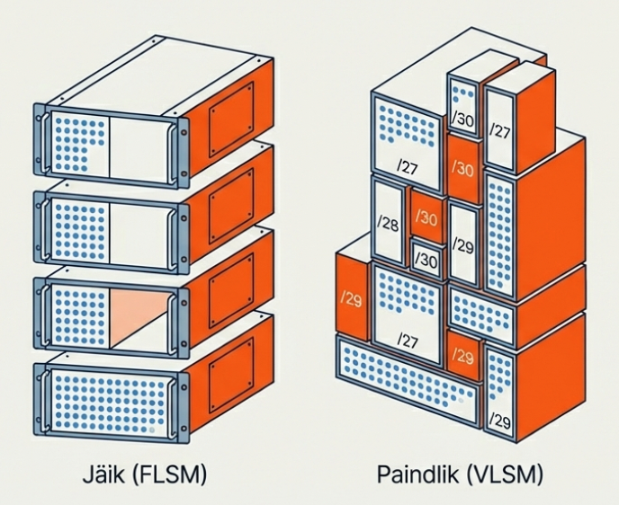
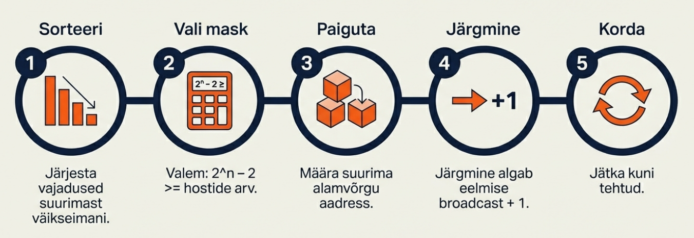
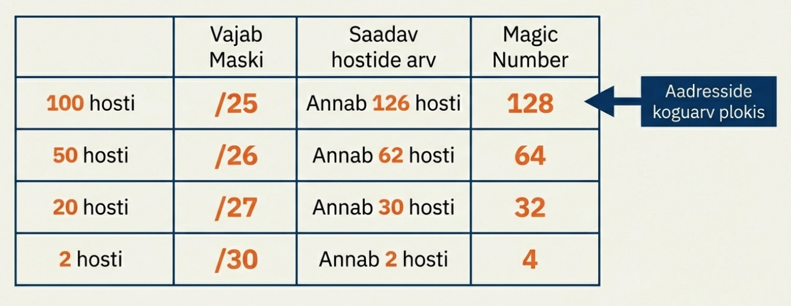
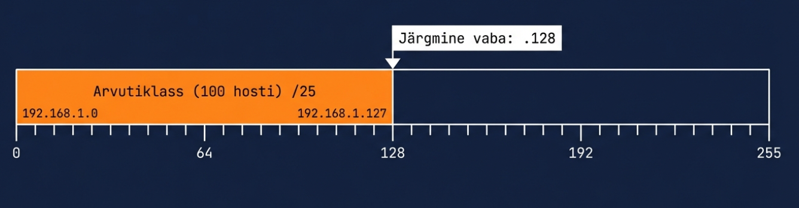
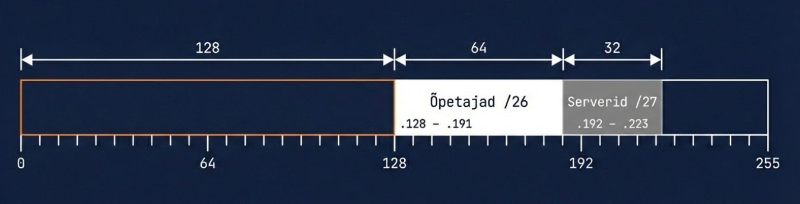
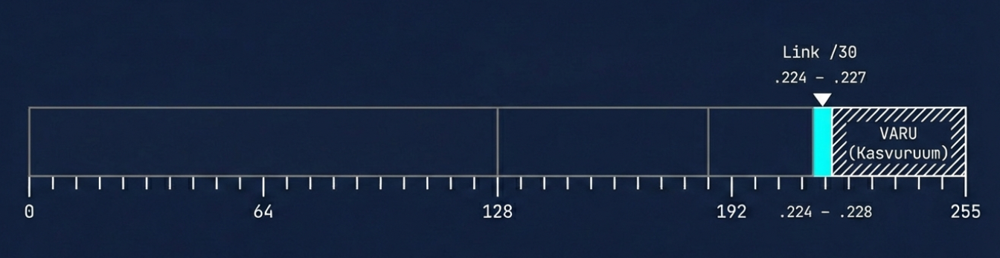
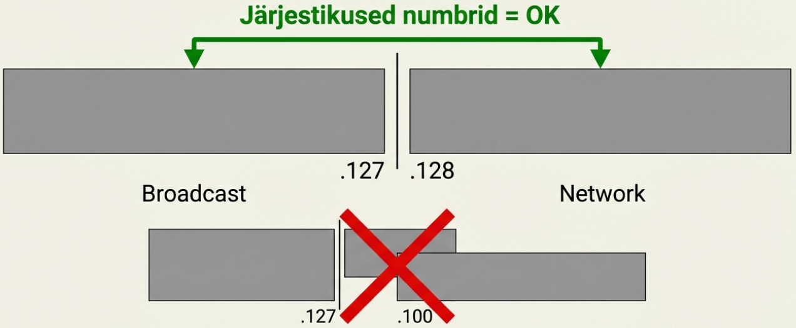
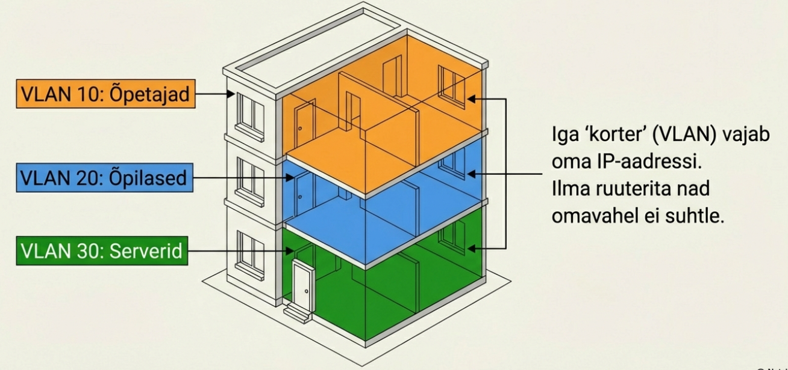

---
tags:
  - Subnetting
  - IPv4
---

# VLSM

!!! abstract "Eesmärgid"
    Selle peatüki läbimise järel:

    - Oskan selgitada, miks VLSM on efektiivsem kui võrdne alamvõrgustamine
    - Oskan planeerida võrke VLSM meetodiga (suurimast alustades)
    - Oskan arvutada erinevate maskidega alamvõrke ühes adressiruumis
    - Oskan selgitada, mis on VLAN ja miks iga VLAN vajab oma alamvõrku

## Võrdne jagamine ei toimi päriselus

Eelmises peatükis jagasime võrgu neljaks võrdseks /26 alamvõrguks, igaühes 62 hosti. Kena ja korralik. Aga päriselus? Päriselus pole osakonnad kunagi võrdse suurusega.

<figure markdown="span">
  
  <figcaption>Joonis 11.1. Jäik (FLSM) vs paindlik (VLSM) alamvõrgustamine — VLSM kohandab iga ploki suuruse vajaduse järgi (Talvik, 2025). Loodud tehisintellekti abil.</figcaption>
</figure>

Mõtle oma kooli peale: arvutiklassis on 30 õpilast, õpetajate toas 10 arvutit, serverite ruumis 5 seadet ja kahe ruuteri vahel on punkt-punkt link, mis vajab ainult 2 aadressi. Kui annad igale osakonnale /26 (62 hosti), siis serveriruum ja ruuteri link raiskavad kokku üle 120 aadressi, mida keegi ei kasuta. Ja kui arvutiklass vajab rohkem kui 62 — ei mahu üldse.

## VLSM — erinevad maskid ühes võrgus

Varasemal ajal oli alamvõrgustamine jäik: kogu võrk kasutas **ühte maski**. Ettevõttel oli /16 võrk, ta jagas selle /24-teks ja iga alamvõrk sai 254 hosti — olenemata sellest, kas seal oli 200 arvutit või 2 ruuterit. 1987. aastal pakkus RFC 1009 välja idee, et ruuterid võiksid toetada erinevaid maske samas võrgus. Päriselt läks VLSM käima alles 1990ndatel, kui OSPF ja teised dünaamilised marsruutimisprotokollid seda toetama hakkasid. Vana RIP v1 ei osanud maskiinfot edastada — see oli takistuseks aastaid.

VLSM (*Variable Length Subnet Mask*) lubab kasutada **erinevaid maske** erinevate alamvõrkude jaoks samas adressiruumis.[^rfc1878] Suuremale osakonnale suurem võrk, väiksemale väiksem. Tänapäeval on see standard — iga võrguadministraator kasutab VLSM-i igapäevaselt, isegi kui ta seda nime pidi ei ütle.

### Kuldreegel: alusta suurimast

VLSM-i planeerimisel on üks reegel, mida ei tohi rikkuda: **alusta alati suurimast vajadusest**. Miks? Sest suured alamvõrgud vajavad pidevaid aadressiplokke. Kui paigutad esmalt väikesed alamvõrgud, tekivad aadressiruumi "augud" ja suurele võrgule ei pruugi järjestikust ruumi jätkuda. See on nagu parklas — kui pargid esmalt kõik väikeautod laiali, siis bussile ei jää enam ühtegi kohta.

### VLSM samm-sammult

Kogu VLSM planeerimine taandub viiele sammule. Ära lase end hirmutada — kui oled eelmises peatükis alamvõrgustamist harjutanud, on see lihtsalt sama asi, ainult et iga plokk on erineva suurusega.

<figure markdown="span">
  
  <figcaption>Joonis 11.2. VLSM töövoog — viis sammu sorteerimisel paigutamiseni (Talvik, 2025). Loodud tehisintellekti abil.</figcaption>
</figure>

Esiteks **sorteeri** vajadused suurimast väikseimani — see on kõige tähtsam samm. Siis **vali** igale sobiv mask (2ⁿ − 2 ≥ vajalik hostide arv). Seejärel **paiguta** suurim alamvõrk esimesena ja iga järgmine algab eelmise broadcast-aadressi järel (+1). Korda, kuni kõik on paigutatud.

Vaatame seda ühe konkreetse näite peal läbi.

### Näide: kooli võrk

Kujuta ette, et oled just tööle saanud oma kooli IT-osakonda ja ülemus ütleb: "Meil on 192.168.1.0/24 ja vaja jagada." Arvutiklassis on 100 arvutit, õpetajate toas 50, serverite ruumis 20 ja kahe ruuteri vahel on punkt-punkt link, mis vajab 2 aadressi.

Esimene samm: sorteerime suurimast väikseimani — 100, 50, 20, 2. Nüüd valime igale sobiva maski. Mäletad magic number meetodit eelmisest peatükist? Siin läheb seda vaja.

<figure markdown="span">
  
  <figcaption>Joonis 11.3. Maski valik — iga vajaduse jaoks sobiv mask ja magic number (Talvik, 2025). Loodud tehisintellekti abil.</figcaption>
</figure>

Arvutiklass vajab 100 hosti — /25 annab 126, see sobib. Õpetajad vajavad 50 — /26 annab 62, piisab. Serverid vajavad 20 — /27 annab 30, küllalt. Ruuteri link vajab ainult 2 — /30 annab täpselt 2. Magic numberid: /25 → 128, /26 → 64, /27 → 32, /30 → 4.

Nüüd hakkame paigutama. Arvutiklass on suurim, seega tema läheb esimeseks — algab .0 ja lõpeb .127 (magic number 128). Õpetajad algavad kohe järgmisena .128 pealt ja lõpevad .191 juures. Serverid saavad .192 kuni .223. Ja ruuteri link mahub .224 kuni .227.

| Osakond | Vajadus | Mask | Hoste | Võrguaadress | Vahemik | Broadcast |
|---|---|---|---|---|---|---|
| Arvutiklass | 100 | /25 | 126 | 192.168.1.0/25 | .1–.126 | .127 |
| Õpetajad | 50 | /26 | 62 | 192.168.1.128/26 | .129–.190 | .191 |
| Serverid | 20 | /27 | 30 | 192.168.1.192/27 | .193–.222 | .223 |
| Ruuteri link | 2 | /30 | 2 | 192.168.1.224/30 | .225–.226 | .227 |

*Tabel 11.1. VLSM näite lahendus*

Vaatame seda samm-sammult visuaalselt. Kõigepealt hõivab arvutiklass esimese poole kogu /24 ruumist — aadressid .0 kuni .127:

<figure markdown="span">
  
  <figcaption>Joonis 11.4. Esimene paigutus — arvutiklass /25 hõivab .0–.127 (Talvik, 2025). Loodud tehisintellekti abil.</figcaption>
</figure>

Järgmisena tulevad õpetajad ja serverid. Pane tähele, kuidas iga plokk algab täpselt sealt, kus eelmine lõppes — broadcast + 1. Õpetajad saavad .128–.191, serverid .192–.223:

<figure markdown="span">
  
  <figcaption>Joonis 11.5. Teine ja kolmas paigutus — õpetajad /26 ja serverid /27 (Talvik, 2025). Loodud tehisintellekti abil.</figcaption>
</figure>

Ja lõpuks ruuteri link — kõigest 4 aadressi, millest 2 on kasutatavad. Aga vaata, mis juhtus: pärast .227 jäid aadressid .228–.255 vabaks. See pole raiskamine — see on **kasvuruum**. Kui kooli tuleb juurde uus labor või uus osakond, on aadresse olemas.

<figure markdown="span">
  
  <figcaption>Joonis 11.6. Neljas paigutus — ruuteri link /30 ja ülejäänud kasvuruum (Talvik, 2025). Loodud tehisintellekti abil.</figcaption>
</figure>

!!! warning "Kontrolli alati!"
    Pärast planeerimist kontrolli, et alamvõrgud ei kattuks. Kui esimene lõpeb .127 ja teine algab .128 — on kõik korras. Kui esimene lõpeb .127 ja teine algab .100 — on probleem.

Lihtne visuaalne kontroll aitab vigu leida — kui numbrid jätkuvad järjest, on kõik korras. Kui kuskil on ülelappumine, näed seda kohe:

<figure markdown="span">
  
  <figcaption>Joonis 11.7. Kattuvuse kontroll — järjestikused numbrid on OK, kattuvad on viga (Talvik, 2025). Loodud tehisintellekti abil.</figcaption>
</figure>

## VLAN — miks see siia kuulub

VLAN (*Virtual LAN*) on teema, mida käsitleme põhjalikumalt hiljem, aga alamvõrgustamisega on see otseselt seotud — seepärast räägime sellest juba praegu.

VLAN jagab ühe füüsilise kommutaatori mitmeks **virtuaalseks võrguks**. Koolis võib üks ja sama kommutaator teenindada nii õpetajaid, õpilasi kui külalisi — aga iga grupp on eraldi VLAN-is ega näe teiste liiklust. Mõtle sellest kui korrusmajast: kõik elavad samas majas, aga igaühel on oma korter lukuga uksega.

Ja siin tuleb seos alamvõrgustamisega: **iga VLAN vajab oma IP-alamvõrku**. Kolm VLAN-i koolis? Kolm alamvõrku. Ja kuna üks VLAN on 30 seadmega ja teine ainult 5-ga, on VLSM täpselt see tööriist, mis aitab need efektiivselt paigutada — iga VLAN saab täpselt nii suure alamvõrgu kui vaja.

<figure markdown="span">
  
  <figcaption>Joonis 11.8. Iga VLAN vajab oma IP-alamvõrku — nagu korrusmaja, kus igal korteril on oma aadress (Talvik, 2025). Loodud tehisintellekti abil.</figcaption>
</figure>

Aga üks oluline asi: VLAN-id on vaikimisi täielikult isoleeritud. Kui õpetaja tahab pääseda serverite VLAN-is olevale printerile, vajab ta ruuterit nende kahe VLAN-i vahel. Seda nimetatakse *inter-VLAN routing* ja ilma selleta on VLAN-id nagu eraldi majad — uksed lukus, võtmeid pole. See on sageli tahtlik: külaliste WiFi ei tohi pääseda õpetajate serveritesse.

!!! info "Uuri ise"
    - [Subnetting Practice — VLSM](https://subnettingpractice.com/vlsm.html) — VLSM harjutuste generaator
    - [Packet Tracer](https://www.netacad.com/courses/packet-tracer) — Cisco tasuta võrgusimulaator, kus saad VLAN-e ja VLSM-i päriselt harjutada

---

## Kokkuvõte

VLSM laseb kasutada erinevaid maske samas adressiruumis — suur osakond saab suure võrgu, ruuteri link väikese. Planeerimisel alusta alati suurimast ja liigu järjest edasi. Iga VLAN vajab oma alamvõrku ja VLAN-ide vaheline suhtlus vajab ruuterit.

---

## Enesekontroll

??? question "1. Miks on VLSM efektiivsem kui võrdne alamvõrgustamine?"
    Võrdne jagamine annab kõigile sama suuruse, raiskades aadresse seal, kus vajadus on väiksem. VLSM kohandab iga alamvõrgu suuruse tegeliku vajaduse järgi.

??? question "2. Miks peab VLSM-i planeerimisel alustama suurimast vajadusest?"
    Suured alamvõrgud vajavad pidevaid aadressiplokke. Kui paigutada esmalt väikesed, võib suurele enam piisavat järjestikust ruumi ei jätku.

??? question "3. Jaga 10.0.0.0/24: osakond A vajab 60, osakond B 25, link 2 hosti."
    A: 10.0.0.0/26 (62 hosti, .1–.62, broadcast .63). B: 10.0.0.64/27 (30 hosti, .65–.94, broadcast .95). Link: 10.0.0.96/30 (2 hosti, .97–.98, broadcast .99).

??? question "4. Miks vajab iga VLAN oma IP-alamvõrku?"
    VLAN on eraldi broadcast-domeen (Layer 2). Selleks et VLAN-ide vahelised seadmed saaksid suhelda (Layer 3), vajab iga VLAN oma IP-vahemikku ja ruuterit nende vahel.

[^rfc1878]: Pummill, T. & Manning, B. (1995). *Variable Length Subnet Table For IPv4*. RFC 1878. https://datatracker.ietf.org/doc/html/rfc1878
