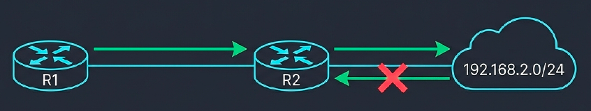
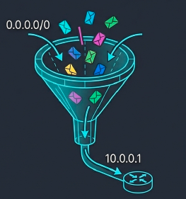
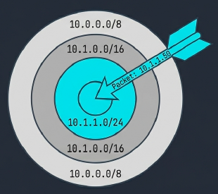
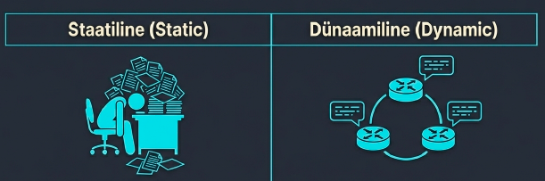
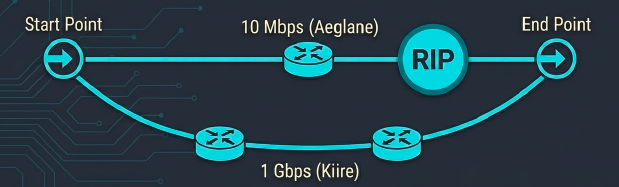
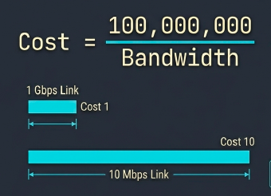

---
tags:
  - Ruutimine
  - CCNA
---

# Marsruutimine

<figure markdown="span">
  
  <figcaption>Joonis 12.1. Staatiline marsruutimine — ruuter suunab pakette käsitsi määratud teede alusel (Talvik, 2025). Loodud tehisintellekti abil.</figcaption>
</figure>

!!! abstract "Eesmärgid"
    Selle peatüki läbimise järel:

    - Oskan selgitada marsruutimise põhimõtet ja routing table'i rolli
    - Oskan lugeda routing table'i kirjeid (C, L, S, S*)
    - Oskan selgitada staatiliste marsruutide ja default route'i lisamist
    - Oskan selgitada longest prefix match põhimõtet
    - Oskan võrrelda staatilist ja dünaamilist marsruutimist (RIP, OSPF, EIGRP)
    - Oskan selgitada Administrative Distance ja metric mõisteid

## Mis on marsruutimine?

Eelmises peatükis nägime, kuidas [võrgukiht](06_vorgukiht.md) kasutab IP-aadresse ja kuidas ruuter ühendab erinevaid võrke. Aga kuidas ruuter tegelikult **otsustab**, kuhu pakett saata? Selleks ongi marsruutimine.

Marsruutimine (*routing*) on protsess, mille käigus ruuter loeb paketi päisest sihtkoha IP-aadressi, otsib oma **marsruutimistabelist** sobiva kirje ja saadab paketi õigest liidesest välja. Iga ruuter teel teeb sama otsuse — nagu teatepulka andmine jooksus, kus iga jooksja teab ainult oma lõiku.

Mõtle postiljonist: ta ei pea teadma iga maja asukohta kogu riigis. Piisab, kui ta teab, mis suunas on Tallinn, mis suunas Tartu. Täpsustamine toimub samm-sammult — iga vahepeatus toob paketi lähemale. Internet töötab täpselt samamoodi: iga pakett läbib teel kümneid ruutereid ja igaüks teeb ühe otsuse.[^rfc791]

## Marsruutimistabel — ruuteri „kaart"

Marsruutimistabel (*routing table*) on ruuteri „kaart" — seal on kirjas kõik võrgud, mida ruuter teab, ja kuidas nendesse jõuda. Ilma selleta oleks ruuter nagu postiljon ilma aadressiraamatata.

Vaatame päris marsruutimistabelit:

```text
R1# show ip route

Gateway of last resort is 10.0.0.1 to network 0.0.0.0

     10.0.0.0/8 is variably subnetted, 2 subnets, 2 masks
C       10.0.0.0/30 is directly connected, Serial0/0/0
L       10.0.0.2/32 is directly connected, Serial0/0/0

     192.168.1.0/24 is variably subnetted, 2 subnets, 2 masks
C       192.168.1.0/24 is directly connected, GigabitEthernet0/0
L       192.168.1.1/32 is directly connected, GigabitEthernet0/0

S    192.168.3.0/24 [1/0] via 10.0.0.1
S*   0.0.0.0/0 [1/0] via 10.0.0.1
```

Esmapilgul tundub keeruline, aga tegelikult on see lihtne. Iga rida ütleb: „Seda võrku tean ja sinna saab nii." Vaatame kirjete tüüpe.

### Routing table koodid

| Kood | Tähendus | Kuidas tekib |
|---|---|---|
| **C** | Connected | Automaatselt, kui liidesel on IP ja `no shutdown` |
| **L** | Local | Liidese enda IP (/32 mask) |
| **S** | Static | Administraator lisab käsitsi (`ip route`) |
| **S*** | Static default | Default route (0.0.0.0/0) |

*Tabel 12.1. Routing table koodid (staatiline marsruutimine)*

### Kirje lugemine

Iga kirje sisaldab kolme olulist osa — kuidas seda lugeda?

```text
S    192.168.3.0/24 [1/0] via 10.0.0.1
│    │               │       │
│    Sihtvõrk+mask   │       Next-hop aadress
Tüüp (Static)    [AD/metric]
```

Esimene täht ütleb, kust kirje pärineb. Sihtvõrk ja mask ütlevad, milliste aadresside jaoks see kirje kehtib. Nurksulgudes on kaks numbrit: **AD** (*Administrative Distance*) näitab, kui usaldusväärne on allikas, ja **metric** näitab tee „hinda" protokolli sees. Lõpus on **next-hop** — järgmise ruuteri aadress, kuhu pakett saata.

## Connected routes — automaatsed kirjed

Connected routes on kõige lihtsamad — need tekivad **automaatselt**, kui liidesele konfigureeritakse IP-aadress ja liides lülitatakse sisse. Ruuter teab neid võrke, sest tema enda „jalg" on seal.

```text
R1(config)# interface GigabitEthernet0/0
R1(config-if)# ip address 192.168.1.1 255.255.255.0
R1(config-if)# no shutdown
```

Tulemuseks tekivad kaks kirjet:

```text
C    192.168.1.0/24 is directly connected, GigabitEthernet0/0
L    192.168.1.1/32 is directly connected, GigabitEthernet0/0
```

**C** ütleb: „Kogu 192.168.1.0/24 võrk on mul otse ühendatud." **L** ütleb: „192.168.1.1 on konkreetselt minu enda aadress." Connected routes on kogu marsruutimise alus — kõik muu ehitatakse nende peale.

## Staatilised marsruudid — käsitsi lisamine

Connected routes katavad ainult otse ühendatud võrke. Aga mis saab kaugematest võrkudest? Nendest ei tea ruuter midagi — keegi peab talle ütlema.

Kujuta ette, et R1 on kontor Haapsalus ja R2 on kontor Tallinnas. R1 teab oma kohalikku võrku (192.168.1.0/24) ja näeb linki R2 poole. Aga Tallinna kontori võrku (192.168.2.0/24)? Sellest pole tal aimugi, kuni me ise ütleme.

```text
R1(config)# ip route 192.168.2.0 255.255.255.0 10.0.0.2
```

See käsk tähendab: „Paketid, mis lähevad võrku 192.168.2.0/24, saada aadressile 10.0.0.2 — tema teab edasi." Nüüd ilmub routing table-sse **S**-kirje.

!!! warning "Marsruudid peavad olema mõlemas suunas"
    See on algajate levinuim viga: seadistad marsruudi ainult ühel ruuteril. R1 teab teed R2 võrku ja saadab paketi kohale. Aga R2 ei tea, kuidas vastus tagasi saata! Ping läheb välja, aga `Reply` ei tule. Mõlemal ruuteril peavad olema marsruudid **mõlemas suunas**.

Marsruudi eemaldamiseks lisa käsu ette `no`:

```text
R1(config)# no ip route 192.168.2.0 255.255.255.0 10.0.0.2
```

<figure markdown="span">
  
  <figcaption>Joonis 12.2. Default route — „catch-all" marsruut tundmatute võrkude jaoks (Talvik, 2025). Loodud tehisintellekti abil.</figcaption>
</figure>

## Default route — „ükskõik kuhu, saada sinna"

Mis siis, kui ruuter saab paketi aadressile, mida ta üldse ei tunne? Vaikimisi hävitab ta selle ja saadab saatjale ICMP *Destination Unreachable* teate. Aga on parem variant — **default route**.

Default route on „catch-all" marsruut, mis katab **kõik** võrgud, mida ruuter ei tea. Aadress `0.0.0.0/0` tähendab sõna otseses mõttes „kõik, mis mujale ei sobi".

```text
R1(config)# ip route 0.0.0.0 0.0.0.0 10.0.0.1
```

Routing table-s ilmub see nii:

```text
Gateway of last resort is 10.0.0.1 to network 0.0.0.0
S*   0.0.0.0/0 [1/0] via 10.0.0.1
```

Mõtle sellest kui bussijaamast — sa ei pea teadma, kuidas iga linna jõuda. Piisab, kui tead, kus on bussijaam. Bussijaam (default gateway / next-hop ruuter) juba teab edasi.

Default route on eriti kasulik **stub-võrkudes** — võrkudes, millel on ainult üks väljapääs. Näiteks kontori kogu internetiliiklus läheb nagunii ühe ISP ruuteri kaudu — milleks siis iga internetivõrku eraldi kirjutada?

<figure markdown="span">
  
  <figcaption>Joonis 12.3. Longest prefix match — ruuter valib alati täpseima kirje (Talvik, 2025). Loodud tehisintellekti abil.</figcaption>
</figure>

## Longest prefix match — täpseim võidab

Aga mis juhtub, kui routing table-s on **mitu kirjet**, mis kõik sobivad? Kujuta ette, et routing table sisaldab kolme marsruuti:

```text
S    10.0.0.0/8 via 192.168.1.1
S    10.1.0.0/16 via 192.168.1.2
S    10.1.1.0/24 via 192.168.1.3
```

Saabub pakett aadressile **10.1.1.50**. Kõik kolm kirjet sobivad! Kuidas ruuter valib?

Vastus on lihtne: ruuter valib alati **kõige pikima maskiga** — kõige täpsema — kirje. /24 tähendab, et 24 bitti peavad klappima, ja see on täpsem kui /16 (16 bitti) või /8 (8 bitti). Seega valib ruuter `10.1.1.0/24 via 192.168.1.3`.

Seda nimetatakse **longest prefix match** ja see on marsruutimise üks olulisemaid põhimõtteid. Mõtle sellest kui aadressist: „Eesti" sobib, „Eesti, Läänemaa" on täpsem, „Eesti, Läänemaa, Haapsalu, Kooli 7" on kõige täpsem. Postiljon kasutab alati täpsemat aadressi.

Kui ühtegi vastet ei leita ja default route puudub, hävitab ruuter paketi ja saadab ICMP *Destination Unreachable* teate.

---

## Dünaamiline marsruutimine

<figure markdown="span">
  
  <figcaption>Joonis 12.4. Võrgu skaleerumine — miks staatiline marsruutimine suurtes võrkudes ei toimi (Talvik, 2025). Loodud tehisintellekti abil.</figcaption>
</figure>

### Miks mitte ainult staatilised marsruudid?

Staatiline marsruutimine töötab hästi väikestes võrkudes — kaks-kolm ruuterit, paar alamvõrku. Aga kujuta ette ettevõtet 50 kontoriga, 200 alamvõrguga. See tähendaks **tuhandeid** käsitsi lisatud marsruute. Ja kui üks link läheb katki? Administraator peab käsitsi kõik ümber tegema. Öösel. Kell kolm.

Dünaamilise marsruutimise puhul ruuterid „räägivad" omavahel ja jagavad infot **automaatselt**. Uus võrk lisandub → info levib kõigile. Link katki → ruuterid leiavad ise uue tee. See on nagu vahe paberkaardi ja GPS-i vahel — GPS suunab automaatselt ümber, kui tee on kinni.

Vaatame kolme olulisemat protokolli.

<figure markdown="span">
  
  <figcaption>Joonis 12.5. RIP — distantsvektorprotokoll, mis loeb hop-e (Talvik, 2025). Loodud tehisintellekti abil.</figcaption>
</figure>

### RIP — Routing Information Protocol

RIP on vanim ja lihtsaim dünaamiline marsruutimisprotokoll, pärit juba 1988. aastast.[^rfc2453] Ta kuulub **distantsvektorprotokollide** hulka — see tähendab, et iga ruuter teab ainult „kui kaugel" mingi võrk on ja „mis suunas", aga ei näe kogu pilti. Seda on kirjeldatud ka kui „kuulujuttude levitamist" — naaber räägib oma naabrile, mida on teistelt kuulnud.

RIP kasutab **hop count** meetrikat — ta loeb lihtsalt, mitu ruuterit on teel. Üks hop = üks ruuter. Lihtne, aga sellel on suur puudus.

| Omadus | Väärtus |
|---|---|
| Tüüp | Distance-vector |
| Metric | Hop count |
| Max hop | 15 |
| Konvergents | Aeglane (minutid) |
| Uuendus | Kogu tabel iga 30 sek |

*Tabel 12.2. RIP omadused*

Põhikonfiguratsioon on lihtne — ütled ruuterile, millised võrgud kuulutada:

```text
Router(config)# router rip
Router(config-router)# version 2
Router(config-router)# network 192.168.1.0
Router(config-router)# no auto-summary
```

`version 2` on oluline, sest RIPv1 ei toeta [alamvõrgumaske](10_alamvorgustamine.md) — ta ei erista /24 ja /16 võrke. `no auto-summary` takistab võrkude automaatset koondamist, mis tekitaks probleeme [VLSM](11_vlsm.md)-iga.

!!! warning "RIP ei arvesta lingi kiirust"
    RIP valib alati vähem hop-e — isegi kui 2-hop tee on 10 Mbps ja 3-hop tee on 10 Gbps. Kiirem tee jääb kasutamata! See on RIP-i suurim puudus ja põhjus, miks päris ettevõtted kasutavad OSPF-i.

<figure markdown="span">
  
  <figcaption>Joonis 12.6. OSPF — lingi-oleku protokoll, mis arvutab lühima tee (Talvik, 2025). Loodud tehisintellekti abil.</figcaption>
</figure>

### OSPF — Open Shortest Path First

Kui RIP on nagu kuulujutt, siis OSPF on nagu satelliitkaart — iga ruuter ehitab **kogu võrgust täieliku kaardi** ja arvutab lühima tee Dijkstra algoritmiga.[^rfc2328] Seetõttu nimetatakse seda **lingi-oleku** (*link-state*) protokolliks.

OSPF kasutab **cost** meetrikat, mis põhineb lingi kiirusel. Valem on lihtne: `cost = 100 000 000 / bandwidth`. See tähendab, et kiirem link on alati odavam.

| Omadus | Väärtus |
|---|---|
| Tüüp | Link-state |
| Metric | Cost (100 000 000 / bandwidth) |
| Max hop | Piiramatu |
| Konvergents | Kiire (sekundid) |
| Standard | Avatud (kõik tootjad) |

*Tabel 12.3. OSPF omadused*

OSPF cost-i näited — mida kiirem link, seda väiksem cost:

| Lingi kiirus | Cost |
|---|---|
| 10 Mbps | 10 |
| 100 Mbps | 1 |
| 1 Gbps | 1 |

*Tabel 12.4. OSPF cost väärtused*

!!! info "Miks on 100 Mbps ja 1 Gbps cost sama?"
    Vaikimisi referentskiirus on 100 Mbps. Kõik, mis on kiirem, saab cost = 1. Seda saab muuta käsuga `auto-cost reference-bandwidth`, aga see läheb juba CCNA edasijõudnud teemade alla.

Põhikonfiguratsioon erineb RIP-ist kahe asja poolest: lisandub **protsessi ID** ja kasutatakse **wildcard maski** (alamvõrgumaski peegelpilt):

```text
Router(config)# router ospf 1
Router(config-router)# network 192.168.1.0 0.0.0.255 area 0
```

`0.0.0.255` on wildcard mask — arvuta nii: 255 − iga oktett. Alamvõrgumask `255.255.255.0` → wildcard `0.0.0.255`. Kõik OSPF ruuterid peavad kuuluma vähemalt **area 0**-sse (backbone area).

Erinevalt RIP-ist ei saada OSPF perioodiliselt tervet marsruutimistabelit, vaid ainult **muudatuste teateid** — kui midagi muutub, saadetakse kiiresti üks teade. See on palju efektiivsem ja kiirem.

### EIGRP — Enhanced Interior Gateway Routing Protocol

EIGRP on Cisco loodud protokoll, mis ühendab mõlema eelmise parimad omadused.[^rfc7868] Ametlikult nimetatakse seda **hübriidprotokolliks**. EIGRP kasutab bandwidth ja delay meetrikat ning hoiab meeles **varuteid** — kui peamine tee katkeb, lülitub ta varulahendusele sekunditega, ilma kogu võrku ümber arvutamata.

| Omadus | Väärtus |
|---|---|
| Tüüp | Hybrid |
| Metric | Bandwidth + Delay |
| Max hop | 255 |
| Konvergents | Väga kiire (< 1 sek) |
| Standard | Cisco (osaliselt avatud) |

*Tabel 12.5. EIGRP omadused*

```text
Router(config)# router eigrp 100
Router(config-router)# network 192.168.1.0
Router(config-router)# no auto-summary
```

### Kolme protokolli võrdlus

Millal mida kasutada? Lihtne reegel: RIP on õppimiseks, OSPF on ettevõtetele, EIGRP on Cisco-spetsiifiline aga väga kiire.

| Omadus | RIP | OSPF | EIGRP |
|---|---|---|---|
| Metric | Hop count | Cost (bandwidth) | Bandwidth + Delay |
| Max hop | 15 | Piiramatu | 255 |
| Konvergents | Minutid | Sekundid | < 1 sekund |
| Standard | Avatud | Avatud | Cisco |
| Kasutus | Õppetöö | Ettevõtted, ISP-d | Cisco võrgud |
| Routing table kood | **R** | **O** | **D** |

*Tabel 12.6. Dünaamiliste protokollide võrdlus*

## Administrative Distance ja metric

Nüüd keerulisem küsimus: mis juhtub, kui **erinevad allikad** teavad sama võrku? Näiteks staatiline marsruut ütleb „192.168.3.0 on sealpool" ja OSPF ütleb sama, aga teist teed. Keda usaldada?

### AD — allikate usaldusväärsus

Selleks on **Administrative Distance** — iga allika jaoks fikseeritud usaldusnumber. Mida madalam, seda rohkem usaldatud. Connected (otse ühendatud) on alati number 1, sest oma silmaga näed — see võrk on tõesti siin.

| Allikas | AD |
|---|---|
| Connected | 0 |
| Static | 1 |
| EIGRP | 90 |
| OSPF | 110 |
| RIP | 120 |

*Tabel 12.7. Administrative Distance väärtused*

Kui OSPF (AD=110) ja RIP (AD=120) mõlemad teavad sama võrku, võidab OSPF, sest 110 < 120. See on nagu usaldushierarhia: oma silmad > kaart > naabri soovitus > kuulujutt.

### Metric — tee hind protokolli sees

Kui mitu marsruuti tulevad **samast protokollist**, siis AD on sama. Sel juhul võrreldakse **meetrikat** — tee „hinda". Madalam metric = parem tee.

Näide: kaks OSPF marsruuti samasse võrku — üks cost 10, teine cost 25. Ruuter valib cost 10, sest odavam tee on parem.

### Routing table koodid koos dünaamilistega

Nüüd tunned kõiki koode, mis routing table-s ette tulevad:

| Kood | Protokoll |
|---|---|
| C | Connected |
| S | Static |
| R | RIP |
| O | OSPF |
| D | EIGRP |

*Tabel 12.8. Routing table koodid*

Vaatame näidet, kus kõik koos:

```text
C    192.168.1.0/24 is directly connected, G0/0
S    192.168.2.0/24 [1/0] via 10.0.0.2
O    192.168.3.0/24 [110/20] via 10.0.0.3
D    192.168.4.0/24 [90/156160] via 10.0.0.4
```

Nurksulgudes on alati `[AD/metric]` — esimene number ütleb, kust info tuli, teine ütleb, kui „kallis" tee on.

## Staatiline vs dünaamiline — millal mida?

| | Staatiline | Dünaamiline |
|---|---|---|
| Sobib | Väikesed võrgud, stub-võrgud | Suured võrgud, keerukad topoloogiad |
| Töökoormus | Palju käsitsi tööd | Automaatne |
| Taastumine | Käsitsi ümberseadistamine | Automaatne, sekunditega |
| Kontroll | Täielik — sa otsustad iga tee | Vähem kontrolli, protokoll otsustab |
| Näide | Koduruuter → ISP | Ülikooli kampusvõrk |

*Tabel 12.9. Staatilise ja dünaamilise marsruutimise võrdlus*

Praktikas kasutatakse tihti mõlemat koos: dünaamiline protokoll haldab sisesuhtlust ja staatiline default route suunab kõik muu internetti.

!!! info "Uuri ise"
    - [Open Shortest Path First visualised](https://www.youtube.com/watch?v=kfvJ8QVJscc) — OSPF tööpõhimõte animatsioon
    - [Looking Glass serverid](https://www.bgp4.as/looking-glasses) — vaata päris ISP-de marsruutimistabeleid reaalajas
    - [BGP Stream](https://bgpstream.crosswork.cisco.com/) — BGP marsruudimuutused reaalajas — näe, kuidas Internet „hingab"

---

## Kokkuvõte

Marsruutimine on protsess, kus ruuter valib pakettidele parima tee marsruutimistabeli põhjal. Connected routes tekivad automaatselt, kui liidesele antakse IP-aadress. Staatilised marsruudid lisab administraator käsuga `ip route` ja need peavad olema mõlemas suunas. Default route (0.0.0.0/0) katab kõik tundmatud võrgud — eriti kasulik stub-võrkudes. Longest prefix match tagab, et ruuter valib alati täpseima kirje.

Dünaamilised protokollid automatiseerivad marsruutide levitamist: RIP loeb hop-e ja on lihtne aga aeglane, OSPF arvutab lühima tee lingi kiiruse põhjal ja on ettevõtete standard, EIGRP on Cisco hübriidprotokoll, mis taastub kõige kiiremini. Ruuter valib esmalt madalama AD-ga allika, seejärel madalama meetrikaga tee.

---

## Enesekontroll

??? question "1. Mida tähendab routing table'i kood C ja kuidas see kirje tekib?"
    C = Connected, otse ühendatud võrk. Tekib automaatselt, kui liidesele konfigureeritakse IP-aadress ja liides lülitatakse sisse käsuga `no shutdown`.

??? question "2. Miks peavad staatilised marsruudid olema konfigureeritud mõlemas suunas?"
    Marsruutimine on ühesuunaline — R1 teab teed võrku B, aga R2 ei tea automaatselt teed võrku A. Ilma tagasisuunas marsruudita läheb pakett kohale, aga vastus ei tule tagasi.

??? question "3. Mis on longest prefix match? Miks valib ruuter /24 marsruudi /8 asemel?"
    Ruuter valib alati pikima maskiga (täpseima) kirje. /24 tähendab, et 24 bitti peavad klapima — see on täpsem kui /8 (8 bitti). Mõtle sellest kui aadressist: „Haapsalu, Kooli 7" on täpsem kui lihtsalt „Eesti".

??? question "4. Miks valib ruuter OSPF marsruudi RIP-i asemel, kui mõlemad teavad sama võrku?"
    OSPF Administrative Distance on 110, RIP-il 120. Madalam AD = rohkem usaldatud. 110 < 120, seega valitakse OSPF. See on nagu usaldushierarhia — oma silmad (connected, AD=0) on usaldusväärsemad kui naabri soovitus (OSPF) või kuulujutt (RIP).

??? question "5. Nimeta üks olukord, kus staatiline marsruutimine on parem kui dünaamiline."
    Stub-võrk (ühe väljapääsuga), kus kogu liiklus läheb nagunii sama teed. Default route on lihtsam ja efektiivsem kui dünaamilise protokolli käivitamine. Näiteks koduruuter — kogu internetiliiklus läheb nagunii ISP-le.

[^rfc791]: Postel, J. (1981). *Internet Protocol*. RFC 791. https://datatracker.ietf.org/doc/html/rfc791
[^rfc2328]: Moy, J. (1998). *OSPF Version 2*. RFC 2328. https://datatracker.ietf.org/doc/html/rfc2328
[^rfc2453]: Malkin, G. (1998). *RIP Version 2*. RFC 2453. https://datatracker.ietf.org/doc/html/rfc2453
[^rfc7868]: Savage, D. et al. (2016). *Cisco's Enhanced Interior Gateway Routing Protocol (EIGRP)*. RFC 7868. https://datatracker.ietf.org/doc/html/rfc7868
