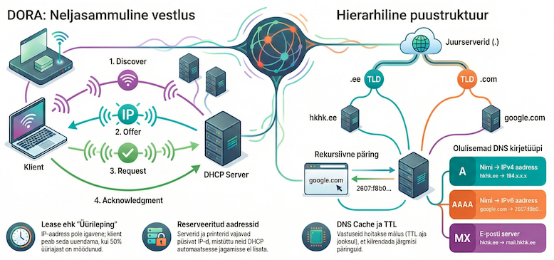

---
tags:
  - TCP/IP
  - CCNA
---

# DHCP ja DNS

!!! abstract "Eesmärgid"
    Selle peatüki läbimise järel:

    - Oskan selgitada DHCP rolli ja eeliseid staatilise konfigureerimise ees
    - Oskan kirjeldada DORA protsessi nelja sammu
    - Oskan selgitada DHCP lease mõistet ja uuendamise mehhanismi
    - Oskan selgitada DNS rolli ja hierarhilist ülesehitust
    - Oskan eristada A, AAAA, CNAME ja MX kirjetüüpe
    - Oskan kirjeldada DNS päringu kulgu (rekursiivne päring)
    - Oskan kasutada käsku `nslookup` DNS testimiseks

## Kaks probleemi, mida lahendada

<figure markdown="span">
  
  <figcaption>Joonis 13.1. DHCP ja DNS koostöö — automaatne aadressimine ja nimelahendus (Talvik, 2025). Loodud tehisintellekti abil.</figcaption>
</figure>

Varasemates peatükkides seadistasime igale seadmele IP-aadressi, alamvõrgumaski ja default gateway käsitsi. Laboris kolme arvutiga see töötab — aga 500 seadmega koolis mitte. Ja ka teine probleem: keegi ei taha meeles pidada, et Google on `142.250.74.142`. Me tahame kirjutada `google.com`.

Need kaks probleemi lahendavad **DHCP** (automaatne IP-seadistus) ja **DNS** (nimed → numbrid).

## DHCP — automaatne võrguseadistus

### Enne DHCP-d: BOOTP ja käsitsi töö

1985\. aastal kasutati **BOOTP** protokolli — iga seadme MAC-aadress ja IP-aadress tuli serveri konfiguratsiooni käsitsi kirja panna. Uus arvuti? Administraator lisab rea. Arvuti vahetub? Administraator muudab rida. 500 seadmega võrgus oli see täiskohaga töö.

1993\. aastal ilmunud **DHCP** (*Dynamic Host Configuration Protocol*)[^rfc2131] lahendas selle: server jagab aadresse **dünaamiliselt** — esimene vaba aadress läheb esimesele küsijale. Administraator seadistab ainult vahemiku ja reeglistiku, ülejäänu toimub automaatselt.

### DORA — neli sammu IP-aadressi saamiseks

Kui ühendad arvuti võrku, toimub taustal neljasammuline "vestlus". Nime annab sammude esitähed: **D**iscover, **O**ffer, **R**equest, **A**cknowledgment.

```
Klient (IP puudub)                    DHCP Server (192.168.1.1)
        │                                       │
        │──── 1. Discover (broadcast) ─────────→│  "Kas keegi jagab IP-d?"
        │                                       │
        │←─── 2. Offer (unicast) ──────────────│  "Pakun 192.168.1.50, lease 8h"
        │                                       │
        │──── 3. Request (broadcast) ──────────→│  "Tahan seda IP-d!"
        │                                       │
        │←─── 4. Ack (unicast) ────────────────│  "Kinnitatud, see on sinu"
        │                                       │
     [seadistab võrgukaardi — valmis]
```

**Discover** — kliendil pole veel IP-aadressi ega teadmist, kas võrgus üldse DHCP server on. Ta saadab broadcast-kaadri (siht-MAC: `FF:FF:FF:FF:FF:FF`, siht-IP: `255.255.255.255`). See on nagu häält tõstes küsida tühjal tänaval: "On siin kedagi?"

**Offer** — DHCP server vastab pakkumisega: IP-aadress, mask, gateway, DNS-server ja lease aeg.

**Request** — klient kinnitab pakkumise **broadcast**-sõnumiga. Miks broadcast? Sest kui võrgus on mitu DHCP serverit, peavad teised teadma, et klient valis just selle serveri pakkumise.

**Acknowledgment** — server kinnitab lõplikult. Klient seadistab võrguliidese — IP, mask, gateway, DNS — ja on valmis.

### Lease — IP-aadressi "üürileping"

DHCP ei anna IP-aadressi igaveseks — see on "üürileping" (*lease*). Tüüpiliselt 8 tundi kuni 7 päeva. Miks? Sest inimesed tulevad ja lähevad. Kooli WiFi-s läheb õpilane pärast tunde ära — tema IP vabaneb ja hommikul saab keegi teine selle.

Klient ei oota, kuni lease lõpeb:

- **50%** lease-st möödas → proovib uuendada sama serveriga (unicast)
- **87.5%** möödas → proovib suvalise serveriga (broadcast)
- **100%** → kaotab IP ja alustab uuesti DORA-ga

Praktikas, kui seade on pidevalt võrgus, kasutab ta sama IP-aadressi kuid ja aastaid — server pikendab automaatselt.

### Excluded addresses — ära jaga kõike

Mõned IP-aadressid ei tohi kunagi DHCP kaudu välja minna:

| Vahemik | Otstarve |
|---|---|
| .1 – .10 | Ruuterid, kommutaatorid (vajavad püsivat IP-d) |
| .11 – .30 | Serverid |
| .31 – .49 | Printerid, IP-kaamerad |
| .50 – .200 | DHCP pool (tavalised kliendid) |
| .201 – .254 | Reserv tulevikuks |

*Tabel 13.1. Tüüpiline IP-aadresside jaotus /24 võrgus*

!!! warning "IP-aadressi konflikt"
    Kui kaks seadet saavad sama IP, muutub mõlema ühendus ebastabiilseks — töötab mõne sekundi, siis katkeb, siis tuleb tagasi. Administraatori õudusunenägu. Sellepärast: excluded addresses seadista alati enne DHCP pooli.

---

## DNS — Domain Name System

### Interneti "telefoniraamat"

1983\. aastal oli internet kasvanud mõnesajani hostini ja iga arvuti nimi oli kirjas ühes failis nimega **HOSTS.TXT**, mida hallati Stanford'i ülikoolis. Iga kord, kui keegi lisas uue arvuti, pidi keegi selle faili uuendama ja kõik teised pidid uue versiooni alla laadima. See ei skaleerunud.

**Paul Mockapetris** pakkus 1983. aastal välja **DNS** (*Domain Name System*)[^rfc1035] — hajutatud, hierarhilise süsteemi, kus iga server vastutab oma tüki eest. Keegi ei tea kõike, aga kõik koos teavad kõike. See on üks interneti elegantsemaid lahendusi ja töötab tänaseni peaaegu muutumatul kujul.

### DNS hierarhia

DNS on organiseeritud puustruktuurina:

```
                    . (juur)
                   / | \
               .com  .ee  .org
               /       \
          google     hkhk
          /    \        \
       www    mail     www
```

Tipus on 13 **juurserveri** komplekti (*root servers*), sealt hargnevad tippdomeenid (*TLD* — .com, .ee, .org), sealt domeenid ja alamdomeenid.

!!! note "Eesti .ee domeen"
    .ee tippdomeeni haldab **Eesti Interneti Sihtasutus** (EIS). Iga .ee domeeni registreerimine läheb läbi nende. Kokku on .ee domeene üle 130 000.

### DNS kirjetüübid

| Tüüp | Otstarve | Näide |
|---|---|---|
| **A** | Nimi → IPv4 aadress | `hkhk.ee` → `194.x.x.x` |
| **AAAA** | Nimi → IPv6 aadress | `google.com` → `2607:f8b0:...` |
| **CNAME** | Alias teisele nimele | `www.hkhk.ee` → `hkhk.ee` |
| **MX** | E-posti server | `hkhk.ee` → `mail.hkhk.ee` |
| **NS** | Nimeserver | `ee` → `ns.telia.ee` |

*Tabel 13.2. DNS kirjetüübid*

### Rekursiivne päring — kuidas DNS vastuse leiab

Kui sisestad brauserisse `www.hkhk.ee`:

1. Su arvuti küsib **lokaalselt DNS-serverilt** (mille DHCP andis): "Mis on www.hkhk.ee IP?"
2. Lokaalne DNS ei tea → küsib **juurserverilt**: "Kes teab .ee domeene?"
3. Juurserver vastab: ".ee serverid on need [aadressid]"
4. Lokaalne DNS küsib **.ee serverilt**: "Kes teab hkhk.ee?"
5. .ee server vastab: "hkhk.ee nimeserver on see [aadress]"
6. Lokaalne DNS küsib **hkhk.ee nimeserverilt**: "Mis on www.hkhk.ee IP?"
7. hkhk.ee server vastab: "194.x.x.x"
8. Lokaalne DNS edastab vastuse su arvutile

Iga server teab ainult järgmist sammu, mitte kogu vastust. See on nagu tee küsimine võõras linnas — iga inimene juhatab sind järgmise inimeseni, kes teab rohkem.

### DNS cache ja TTL

Kogu seda päringuahelat ei korrata iga kord. DNS-server salvestab vastused **cache**-i. **TTL** (*Time To Live*) määrab, kui kaua vastust meeles hoida — tüüpiliselt 5 minutist kuni 24 tunnini. Sellepärast, kui vahetad oma veebilehe serverit, võib kuni 24 tundi minna, enne kui kõik kasutajad näevad uut versiooni.

### DNS testimine — nslookup

`nslookup` küsib DNS-serverilt nime IP-aadressi:

```bash
nslookup hkhk.ee
```

```
Server:  dns.telia.ee
Address: 195.80.96.86

Non-authoritative answer:
Name:    hkhk.ee
Address: 194.x.x.x
```

`Non-authoritative answer` tähendab, et vastus tuli cache-st, mitte otse hkhk.ee nimeserverist. `Non-existent domain` → kas nimi on vale või DNS-server ei tööta.

!!! tip "Proovi ise"
    Käsurealt: `nslookup hkhk.ee 8.8.8.8` — see küsib Google'i DNS-serverilt. Kui su tavapärane DNS ei tööta, aga Google'i oma töötab, on probleem su ISP DNS-serveris.

---

## DHCP ja DNS koos

DHCP annab seadmele neli asja: IP-aadressi, alamvõrgumaski, default gateway ja **DNS-serveri aadressi**. Alles DNS-serveri teades saab seade nimesid lahendama hakata. Ilma DHCP-ta tuleb kõik käsitsi. Ilma DNS-ta pead numbreid meeles pidama. Koos tagavad need, et lülitad arvuti sisse ja kõik töötab.

!!! info "Uuri ise"
    - [DHCP DORA — Wireshark demo](https://www.youtube.com/watch?v=0bMRMXrXbMY) — päris DORA paketid Wiresharkis
    - [How DNS Works](https://howdns.works/) — interaktiivne koomiks DNS hierarhiast
    - [EIS — Eesti Interneti Sihtasutus](https://www.internet.ee/) — .ee domeenide haldaja
    - [Google Public DNS](https://dns.google/) — Google'i tasuta DNS (8.8.8.8)

---

## Kokkuvõte

DHCP (1993, BOOTP järglane) jagab automaatselt IP-aadresse, maske, gateway ja DNS-serveri aadresse. DORA protsess võtab alla sekundi. Lease mehhanism tagab, et aadressid vabanevad. DNS (1983, Paul Mockapetris) tõlgib domeeninimedelt IP-aadressideks, kasutades hierarhilist puustruktuuri — juurserverist tippdomeeni kaudu autoritatiivse vastuseni. Eestis haldab .ee domeeni EIS. Koos tagavad DHCP ja DNS, et seade saab võrguga ühenduda ilma käsitsi seadistamiseta.

---

## Enesekontroll

??? question "1. Mida tähendab DORA ja mida iga samm teeb?"
    Discover — klient otsib serverit (broadcast). Offer — server pakub IP-d. Request — klient kinnitab (broadcast). Ack — server kinnitab. Pärast seda on kliendil töötav võrguühendus.

??? question "2. Miks on Discover ja Request broadcast-sõnumid?"
    Discover: klient ei tea, kas ja kus DHCP server on. Request: kui võrgus on mitu serverit, peavad teised teadma, et klient valis konkreetse pakkumise.

??? question "3. Mis juhtub, kui DHCP on olemas, aga DNS-server ei tööta?"
    IP-aadress ja võrguühendus töötavad (ping IP-aadressile toimib), aga nimede lahendamine ei toimi. `google.com` ei avane, aga `ping 142.250.74.142` töötab.

??? question "4. Kuidas DNS päring liigub juurserverist vastuseni?"
    Lokaalne DNS küsib juurserverilt (.ee serverite aadressid), siis .ee serverilt (hkhk.ee nimeserveri aadress), siis hkhk.ee nimeserverilt (lõplik IP). Iga server teab ainult järgmist sammu.

??? question "5. Miks serverid ja printerid ei kasuta tavaliselt DHCP-d?"
    Need vajavad püsivat IP-d, et teenused ja kasutajad saaksid neid alati leida. Kui printeri IP muutuks, ei teaks keegi kuhu printida.

??? question "6. Su kolleeg ütleb: 'Internet ei tööta.' Kuidas nslookup aitab tõrkeotsingusse?"
    `nslookup google.com` — kui vastus tuleb, on DNS korras ja probleem on mujal. Kui vastust pole, proovi `nslookup google.com 8.8.8.8` — kui see töötab, on su ISP DNS-server maas, mitte internet.

[^rfc2131]: Droms, R. (1997). *Dynamic Host Configuration Protocol*. RFC 2131. https://datatracker.ietf.org/doc/html/rfc2131

[^rfc1035]: Mockapetris, P. (1987). *Domain Names — Implementation and Specification*. RFC 1035. https://datatracker.ietf.org/doc/html/rfc1035
