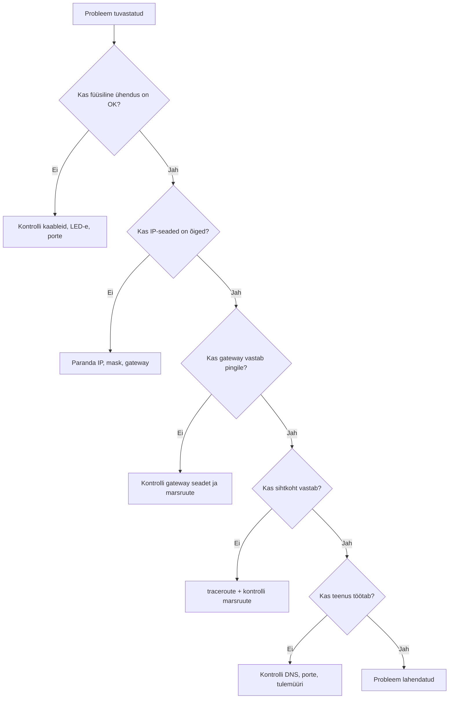

---
tags:
  - CCNA
  - TCP/IP
---

# Tõrkeotsing

!!! abstract "Eesmärgid"
    Selle peatüki läbimise järel:

    - Oskan rakendada süstemaatilist tõrkeotsingu metoodikat (alt üles, ülevalt alla)
    - Oskan kasutada peamisi tõrkeotsingu käske (ping, traceroute, ipconfig, nslookup, show-käsud)
    - Oskan tuvastada levinumaid võrguprobleeme kihtide kaupa
    - Oskan koostada tõrkeotsingu plaani ja dokumenteerida tulemusi

## Miks süstemaatiline lähenemine?

Kui võrk ei tööta, on kiusatus hakata juhuslikult kaableid vahetama ja seadeid muutma. See on halb mõte — võid probleemi hullemaks teha ja kaotad ülevaate, mida juba proovisid.

Parem on läheneda **süstemaatiliselt**: alusta kindlast kohast, testi kiht-kihilt ja dokumenteeri tulemusi.

## OSI mudel kui tõrkeotsingu raamistik

OSI mudeli kihid annavad loogilise raamistiku:

| Kiht | Mida kontrollida | Tüüpilised probleemid |
|---|---|---|
| 1 – Füüsiline | Kaablid, pordid, LED-id | Lahti kaabel, vale kaablitüüp, defektne port |
| 2 – Andmeside | MAC, kommutaator, VLAN | Vale VLAN, duplex mismatch, STP blokeering |
| 3 – Võrk | IP, mask, gateway, routing | Vale IP/mask, puuduv marsruut, vale gateway |
| 4 – Transport | Pordid, TCP/UDP | Tulemüür blokeerib, teenus ei kuula |
| 7 – Rakendus | DNS, DHCP, HTTP | Vale DNS, aegunud lease, teenus maas |

*Tabel 14.1. Tõrkeotsing OSI kihtide kaupa*

### Alt üles (bottom-up)

Alusta Layer 1-st ja liigu ülespoole. Kõige levinum meetod — kõigepealt kontrolli füüsilist ühendust, siis IP-seadeid, siis marsruutimist, siis teenuseid.

### Ülevalt alla (top-down)

Alusta rakendusest ja liigu alla. Kasulik, kui probleem on selgelt rakenduse tasemel (nt „veebiserver ei vasta").

### Jaga ja valitse (divide-and-conquer)

Alusta sealt, kus probleem tõenäoliselt on. Kogemustega tuleb intuitsioon, millist kihti esmalt kontrollida.

## Peamised tõrkeotsingu käsud

### ping — kas sihtkoht vastab?

`ping` saadab ICMP Echo Request ja ootab Echo Reply.[^rfc792] See testib Layer 3 ühenduvust.

```bash
ping 192.168.1.1
```

| Tulemus | Mida tähendab |
|---|---|
| Reply from ... | Ühendus töötab |
| Request timed out | Pakett ei jõudnud kohale või vastus ei tulnud tagasi |
| Destination host unreachable | Ruuter ei tea teed sihtkoha võrku |

*Tabel 14.2. ping tulemuste tõlgendamine*

!!! tip "Testi järjekorras"
    1. `ping 127.0.0.1` — oma TCP/IP stack töötab?
    2. `ping [oma IP]` — oma liides töötab?
    3. `ping [gateway]` — default gateway kättesaadav?
    4. `ping [sihtkoht]` — lõppsihtkoht kättesaadav?

    Kui mõni samm ebaõnnestub, oled probleemi lokaliseerinud.

### traceroute / tracert — kus pakett takerdub?

`traceroute` (Linux/Cisco) / `tracert` (Windows) näitab paketi teekonda hop-by-hop.

```bash
tracert 8.8.8.8
```

```text
  1    1 ms    192.168.1.1       ← gateway
  2    5 ms    10.0.0.1          ← ISP ruuter
  3    12 ms   8.8.8.8           ← sihtkoht
```

Kui mõni hop näitab `* * *` (tähti) või suuri viivitusi, on probleem seal.

### ipconfig / ifconfig — seadmete konfiguratsioon

**Windows:**

```bash
ipconfig
```

```text
IPv4 Address:     192.168.1.50
Subnet Mask:      255.255.255.0
Default Gateway:  192.168.1.1
```

**Detailne info (sh DNS ja DHCP):**

```bash
ipconfig /all
```

**IP uuendamine:**

```bash
ipconfig /release
ipconfig /renew
```

### nslookup — kas DNS töötab?

```bash
nslookup google.com
```

Kui vastab „Non-existent domain" — DNS ei lahenda nime. Kontrolli DNS-serveri seadet (`ipconfig /all`) ja DNS-serveri kättesaadavust (`ping [DNS-server]`).

### Cisco show-käsud

| Käsk | Mida näitab |
|---|---|
| `show ip interface brief` | Liideste IP-d ja olek (up/down) |
| `show ip route` | Routing table |
| `show running-config` | Aktiivne konfiguratsioon |
| `show arp` | ARP-tabel |
| `show vlan brief` | VLAN-ide seaded |

*Tabel 14.3. Peamised Cisco show-käsud tõrkeotsinguks*

```text
Router# show ip interface brief

Interface         IP-Address      OK?  Method  Status  Protocol
Gi0/0             192.168.1.1     YES  manual  up      up
Gi0/1             unassigned      YES  unset   down    down
Serial0/0/0       10.0.0.2        YES  manual  up      up
```

**Status down** — füüsiline probleem (kaabel, port). **Protocol down** — konfiguratsiooniprobleem.

## Levinumad probleemid kihtide kaupa

### Layer 1 — füüsiline kiht

- Kaabel lahti või defektne
- Vale kaablitüüp (straight-through vs crossover)
- Port väljas (LED ei põle)
- Liides `administratively down` (unustatud `no shutdown`)

**Kontroll:** LED-id, kaabli vahetus, `show ip interface brief` (status down).

### Layer 2 — andmesidekiht

- Duplex mismatch (half vs full)
- Vale VLAN konfiguratsioon
- Spanning Tree blokeerib porti
- MAC-aadresside tabeli probleem

**Kontroll:** `show interfaces`, `show vlan brief`, `show spanning-tree`.

### Layer 3 — võrgukiht

- Vale IP-aadress või mask
- Vale või puuduv default gateway
- Puuduv marsruut routing table-s
- Marsruut ainult ühes suunas

**Kontroll:** `ipconfig`, `ping gateway`, `show ip route`, `traceroute`.

!!! warning "Sage viga: ühesuunaline marsruut"
    Ping läheb kohale, aga vastus ei tule tagasi. Põhjus: tagasisuunas puudub marsruut. Kontrolli mõlema ruuteri routing table-t.

### Layer 4 — transpordikiht

- Tulemüür blokeerib porti
- Teenus ei kuula õigel pordil
- Vale pordinumber konfiguratsioonis

**Kontroll:** `netstat -an` (kas teenus kuulab?), tulemüüri reeglid.

### Layer 7 — rakenduskiht

- DNS ei lahenda nimesid
- DHCP lease aegunud
- Teenus (HTTP, SSH) maas
- Vale URL / konfiguratsioon

**Kontroll:** `nslookup`, `ipconfig /renew`, brauseri veateated.

## Tõrkeotsingu töövoog



## Dokumenteerimine

Professionaalne tõrkeotsing tähendab **dokumenteerimist**:

- Mis oli probleem (sümptomid)?
- Milliseid teste tegid?
- Mis oli juurpõhjus?
- Kuidas lahendasid?
- Kuidas vältida tulevikus?

See aitab nii ennast kui kolleege — sama probleem ei pea kunagi algusest lahendama hakkama.

!!! info "Uuri ise"
    - [Cisco Systems: Network Troubleshooting](https://www.netacad.com/) — Cisco NetAcad CCNA tõrkeotsingu juhised[^cisco-troubleshoot]
    - [Downdetector](https://downdetector.com/) — reaalajas kaart, kus teenused on maas — tõrkeotsing globaalsel tasemel
    - [Is It Down Right Now?](https://www.isitdownrightnow.com/) — kontrolli, kas probleem on sinu võrgus või teenuse poolel
    - [ThousandEyes Internet Outages Map](https://www.thousandeyes.com/outages/) — globaalsed interneti katkestused kaardil

---

## Kokkuvõte

Tõrkeotsing nõuab süstemaatilist lähenemist — alusta kindlast kohast ja liigu kiht-kihilt. `ping` testib Layer 3 ühenduvust, `traceroute` näitab, kus pakett takerdub, `ipconfig` näitab seadme konfiguratsiooni ja `nslookup` testib DNS-i. Cisco `show`-käsud annavad ülevaate seadme olekust. Levinumad probleemid on füüsilised (lahti kaabel), konfiguratsiooni (vale IP/mask/gateway) ja marsruutimise (puuduv marsruut) vead. Dokumenteeri alati oma tõrkeotsingu protsess.

---

## Enesekontroll

??? question "1. Miks on süstemaatiline lähenemine parem kui juhuslik proovimine?"
    Juhuslik proovimine võib probleemi hullemaks teha ja kaotad ülevaate, mida juba testisid. Süstemaatiline lähenemine (kiht-kihilt) lokaliseerib probleemi efektiivselt ja tagab, et midagi ei jää vahele.

??? question "2. Kui ping gateway-le töötab, aga ping sihtkoha IP-le mitte — mis kihi probleem see on?"
    Layer 3 (võrgukiht) — tõenäoliselt puudub marsruut sihtkoha võrku. Kasuta `traceroute`, et leida, kus pakett takerdub, ja kontrolli vahepealsete ruuterite routing table-t.

??? question "3. Mis vahe on Status down ja Protocol down väljundis show ip interface brief?"
    Status down = füüsiline probleem (kaabel lahti, port defektne). Protocol down = konfiguratsiooniprobleem (vale encapsulation, teine pool ei vasta).

??? question "4. Kasutaja teatab: „Internet ei tööta." Mis järjekorras testid?"
    1) `ping 127.0.0.1` — TCP/IP stack. 2) `ping [oma IP]` — liides. 3) `ipconfig` — õige IP/mask/gateway? 4) `ping [gateway]` — gateway kättesaadav? 5) `ping 8.8.8.8` — internet? 6) `nslookup google.com` — DNS? Esimene ebaõnnestuv samm lokaliseerib probleemi.

??? question "5. Miks nslookup google.com ei tööta, kuigi ping 8.8.8.8 töötab?"
    IP-tasemel ühendus töötab (Layer 3 OK), aga DNS ei lahenda nimesid. Kontrolli DNS-serveri seadet (`ipconfig /all`) ja DNS-serveri kättesaadavust (`ping [DNS-server]`). Probleem on Layer 7 (DNS teenus).

[^rfc792]: Postel, J. (1981). *Internet Control Message Protocol*. RFC 792. https://datatracker.ietf.org/doc/html/rfc792
[^cisco-troubleshoot]: Cisco Systems. (2023). *Network Troubleshooting*. Cisco NetAcad CCNA. https://www.netacad.com/
